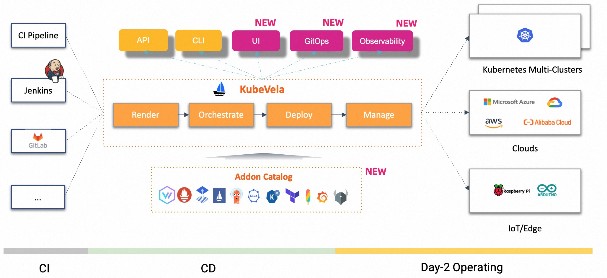

今天，**阿里云云原生应用平台总经理丁宇在云栖大会隆重发布了 KubeVela 的全新升级！本次升级是 KubeVela 从应用交付到应用管理不断量变形成的一次质变，同时也开创了业界基于可扩展模型构建交付和管理一体化应用平台的先河**。

<!--truncate-->

# 背景

随着云原生时代的到来，开发者为了构建符合云原生的应用架构，不得不面对大量云和基础设施的复杂 API ，不仅使用难度大、学习门槛高，还会因为直接操作底层基础设施产生很大的稳定性风险。 Kubernetes 很好的帮助基础设施提供了统一的 API 集成界面，但是其定位是“为平台构建者提供的平台”，所以对于上层应用开发者而言就缺失了这样一层“以应用为中心”的使用界面。**开放应用模型（ OAM） 应运而生，它由阿里和微软在 2019 年联合发布，汇集了两家企业在云原生应用开发中的大量实践经验，为构建云原生时代的应用平台提供了理论依据**。

OAM 模型一经发布，便受到了包括 Oracle、腾讯、字节、第四范式在内的大量企业欢迎和采纳。但是对于更多的企业而言，OAM 只是一个理论模型，缺乏可以直接使用的实践平台，难以落地。于是，阿里云的工程师联合社区采纳 OAM 的企业，基于大家的共同实践，一起构建了开箱即用的 OAM 实现引擎，KubeVela 便诞生了。

# 标准可扩展的应用交付引擎

**KubeVela 于 2020 年 11 月正式发布，并始终坚持以灵活可扩展、关注点分离为设计原则，目标是将云原生技术组件和企业级应用连接在一起，帮助企业内的开发者快速获得易于上手、安全可靠的软件交付和管理体验。**开源仅不到一年的时间，便具备了多集群统一编排、基础设施无关、应用交付工作流等核心特性，受到社区用户广泛的喜爱，并于 2021 年 6 月正式加入 CNCF 基金会。

如今，**KubeVela 已被招商银行、字节跳动、理想汽车、Shein 在内的 300 多家海内外企业采用，整个 OAM 和 KubeVela 社区包含了数十个生态项目，累计获得了 8000 多个 star，收到了来自全球数十个国家 300 多名开发者的大量贡献**。

图1 KubeVela 的统一应用交付

KubeVela 很好地帮助企业构建了统一的应用交付能力，通过 KubeVela 的统一架构，企业可以在一份配置文件中同时交付微服务容器、云数据库、前端静态页面，以及他们内部自定义的扩展，完成多样化工作负载的编排和运维管理。业务应用的开发者在交付过程中也不再需要关心 Kubernetes 资源的版本差异，又或者是不同云盘规格的差别。针对这一层统一的应用描述，KubeVela 提供了完善的版本管理、灰度发布、CI/CD 对接、多集群管理等功能，大大降低了企业内部使用云原生技术的门槛。

随着社区的不断发展，越来越多的企业将 KubeVela 作为内部 PaaS 平台的核心引擎使用，基于 KubeVela 上层的统一模型和插件扩展机制，开发了一系列包括安全、可观测性、GitOps 等高级特性。**社区也涌现了一大批包括招商银行、Napptive、京东云在内的核心贡献者，为 KubeVela 生态贡献了大量新特性和插件，将 KubeVela 的边界逐渐从应用交付延伸到应用管理。**

# 再升级：交付和管理一体化

今天，**阿里云云原生应用平台总经理丁宇在云栖大会隆重发布了 KubeVela 的全新升级！本次升级是 KubeVela 从应用交付到应用管理不断量变形成的一次质变，同时也开创了业界基于可扩展模型构建交付和管理一体化应用平台的先河**。本次升级主要面向四大核心方向：

1. **资源状态可视化**。从应用首次部署到后续的持续交付，KubeVela 将整个应用资源的交付流程和拓扑结构透明可视化，并自动生成包含 100 多个核心指标的可观测性大盘，帮助开发者自助式定位问题。更为重要的是，资源可视化能力可以轻松接入用户的自定义资源，满足用户的自定义可观测配置需求，实现在多集群层面的统一可观测。
2. **平台能力插件化**。KubeVela 不仅建成了灵活可扩展、自助式安装的平台能力插件中心，还构建了 50 多款开箱即用的插件。这些插件包含了云资源、GitOps、可观测性、FinOps、IoT 等多种场景，帮助业务开发者灵活构建面向不同场景的解决方案，并通过社区的实践经验大幅简化使用者的心智负担。
3. **交付流程自动化**。KubeVela 声明式工作流体系不仅具备操作系统资源的能力，还加入了条件判断、参数传递、分支并发等大量高级特性，每一个流程均可以通过配置语言编程扩展。包括多集群灰度发布、CI/CD 对接、安全合规接入在内的 10 多个场景化工作流帮助开发者轻松完成自助式应用编排。
4. **环境管理统一化**。你再也不需要为了安装 KubeVela 提前准备一个 Kubernetes 集群了，KubeVela 提供了在开发者本地或者虚拟机上自助式一键离线化安装整套控制平面的工具，结合多集群交付和管理能力，帮助开发者实现开发、测试、生产的全流程多环境统一管理。

 
图2 应用交付和管理一体化的应用平台

# 版本功能深入解读

自 2021 年 4 月 KubeVela 正式发布 1.0 版本以来，OAM 模型也被 KubeVela 不断验证并逐渐趋于稳定，KubeVela 历次版本迭代始终能够保证 API 向前兼容，对应 OAM 模型的 0.3.1 版本。按照 SemVer 对版本命名的国际惯例，本次发布的版本号为 1.6 （ [https://github.com/kubevela/kubevela/releases/tag/v1.6.0](https://github.com/kubevela/kubevela/releases/tag/v1.6.0) )。虽然版本号只向前递增了 0.1，但是本次发布是从 1.2 版本发布一年多以来 KubeVela 面向应用管理能力的整体呈现。接下来，我们对核心功能逐一展开深入的解读。

## 资源可视化成为一等公民

基于 OAM 模型的理念，可扩展与抽象是 KubeVela 的两大核心特征。但是往往抽象就代表黑盒化，用户一旦遇到问题难以排查，也无法看到资源交付的进展和状态，更是难以管理。而在本次发布中，我们在可扩展性的基础上完美的解决了资源可视化的问题。对于 Kubernetes 的原生资源，KubeVela 会自动发现，并帮助用户构建资源拓扑图。而对于用户自己扩展的自定义资源，则可以通过描述一份资源关联关系的配置，来自动化生成拓扑图。

**这也意味着资源可视化在 KubeVela 体系中成为了一等公民，对于应用包含的任意工作负载，KubeVela 均可以完整的描绘拓扑关系、查看底层容器事件和日志、得到整体的交付健康状态**。如下图所示就是 KubeVela 的资源拓扑图。

图3 VelaUX 资源可视化过程

> VelaUX 文档：[https://kubevela.net/docs/reference/addons/velaux](https://kubevela.net/docs/reference/addons/velaux)

不仅如此，**KubeVela 针对命令行用户也提供了一个类似 “top” 的交互界面，可以方便的查看交付的资源状态，充分满足不同开发者的使用习惯**！

 
图4 vela top 命令行操作示意图

> Vela top 命令行操作文档： [https://kubevela.net/docs/tutorials/vela-top](https://kubevela.net/docs/tutorials/vela-top)

## 天然支持应用级可观测

“可观测性”是应用管理的重中之重，KubeVela 本次发布也对可观测性能力做了全面的提升。具体包含三个部分：可观测基础设施搭建、面向应用的可观测、可观测即代码。

> KubeVela 可观测能力文档： [https://kubevela.net/docs/platform-engineers/operations/observability](https://kubevela.net/docs/platform-engineers/operations/observability)

### 可观测基础设施

对于不具备可观测性基础设施的用户而言，KubeVela 的插件体系可以帮你一键创建整个可观测软件栈。如下图所示，不仅包含了 Promethus、Grafana 这些常见的可观测服务，还包含 mysql-exporter 等面向业务场景的指标和日志采集。插件完成安装后就可以自动化看到平台内置的各项大盘，快速构建应用平台的可观测。

图5 开箱即用的可观测插件

对于已经具备可观测服务的用户来说**，KubeVela 也支持你将已经部署好的 Promethus 和 Grafana 服务通过标准 API 的方式集成进来使用，当然也包括你自建或者云厂商提供的稳定、可靠且不限容量的可观测服务**，如阿里云的 ARMS 产品。

### 面向应用的可观测

KubeVela 的一大特点就是通过一个顶层应用描述（YAML）来驱动完整的应用交付，可观测性能力自然也不例外。对于应用而言，其使用体验就是选用日志或者指标对应的运维特征，KubeVela 控制器便会自动为其生成对应的监控大盘。

图6 面向应用的可观测

用户入口是面向应用的整体大盘，可以看到应用中的组件状态、版本信息、以及生成的资源，也包含了各类子资源对应的大盘链接，可以按需下钻看到更详细的信息。**你可以方便的站在应用的视角了解资源的全貌，无论是 Kubernetes 原生资源还是自定义资源**。

### 可观测即代码（Observability as Code）

支撑应用可观测底层的能力则全部通过 IaC （Infrastructure as Code）的方式完成，**这也意味着 KubeVela 打通了从指标（含日志）采集、解析、富化、存储、数据源注册，一直到大盘可视化全链路的 IaC 化**。
如下所示是一个通过 IaC 的方式创建 Grafana 大盘的示意图，该 IaC 模块提供了创建大盘 “create-dashboard” 这样的动作。类似的包括创建数据源、导入大盘等，这些常规动作 KubeVela 社区已经完整内置，你无需学习其中的细节便可以直接使用。如果你想要做一些自定义，也完全可以类似的通过 IaC 的方式编排你的流程，为你的平台自定义可观测能力。

图7 可观测性即代码

## 多环境流水线统一管理

对于应用管理而言，开发、测试与生产不同环境管理也是难题之一。KubeVela 统一的应用模型不仅可以交付应用，也可以对环境做初始化，并且天然支持管理多集群，可以一键完成不同集群的基础设施组件安装。在 1.4 版本中我们便发布了 [VelaD 项目](https://github.com/kubevela/velad)，可以不依赖 Kubernetes，在本地机器中一键拉起 KubeVela 的完整环境。开发人员可以在本地（或虚拟机）快速构建、验证应用，获得与生产一致的环境。而对不同环境的管理，也在本次发布中得到补齐。

本次发布加入了独立的流水线能力，相较于 KubeVela 本身具备的应用级工作流，独立的流水线具有以下特性：

1. 它可以管理多个 KubeVela 应用，跨多个环境创建。
2. 它不绑定应用，可以独立使用，如针对一组资源做扩缩容，针对一个应用做面向流程的灰度发布，批量执行一组运维操作。
3. 它是一次性的，不对资源做管理，及时删除流水线也不会删除创建出来的资源。
4. 它与应用流水线的执行引擎是同源的，这也完全继承了 KubeVela 轻量级工作流的特性，相较于传统的基于容器的 CI 流水线，KubeVela 的流水线在执行各类资源操作时不依赖容器、无需额外的计算资源。

如下图所示，使用过程中我们可以获得内置的流水线模板，填写环境上下文参数，然后快速执行。而下面的例子就是通过流水线开启了多个 KuberVela 平台插件，插件背后就是 KubeVela 应用。

图8 KubeVela 流水线 UI 示意图

## 集成并管理配置

配置管理也是应用管理的一大核心，KubeVela 的配置管理主要帮助用户实现应用间配置的共享，并与第三方外部系统做配置集成，实现配置的统一管理。例如连接容器镜像仓库、Helm 仓库、第三方云服务（如上文提到的 ARMS 可观测套件）等外部系统。

KubeVela 配置管理以 Kubernetes 的 Secret API 作为配置数据的载体，围绕的应用的使用按需进行多集群分发。应用可通过 Kubernetes 常用的挂载 Secret 的方式读取配置，并对接权限体系。不仅如此，如果业务应用支持从 Nacos 等第三方配置管理平台读取配置，你也可以在定义配置模版时指定将配置内容输出到 Nacos 等服务，从而复用 Nacos 等注册中心的配置分发能力。

另外，你不仅可以从 UI/CLI 进行配置管理操作，也可以在应用工作流，流水线中进行配置读取和写入等操作。结合着流水线的数据传递能力和动作编排能力，实现应用间配置共享、配置自动化注入等更丰富的场景。

图9 配置管理示意图

# KubeVela 的生态和未来

KubeVela 的此次升级在原先的应用交付基础上增加了大量应用管理的能力，是面向“**帮助应用开发者获得易用、可靠、安全的软件开发体验**”目标前进的一大步。在 KubeVela 的实践下，我们也在不断印证并完善 OAM 模型， 在这里，我们也想给大家分享一个好消息，信通院基于 OAM 发布的行业标准[《云计算开放应用架构》](https://hbba.sacinfo.org.cn/stdDetail/ab5a3dddbd231450bc641ae93fb28294cc467e0f60d3e254322549db47c503f3)也已正式出版，开放下载！

如今的 KubeVela 已经不仅仅是一个基于 Kubernetes 的控制器，而是一个拥有众多生态项目的平台。从底层基础设施对接，到上层面向用户的使用界面，再到可扩展的生态集成，KubeVela 正在快速生长，兑现 OAM 发布之初的美好愿景 —— “让应用的交付和管理更简单、安全、可靠”！。

图10 KubeVela 的工具生态

未来，KubeVela 社区将不断丰富开箱即用的系统插件，丰富面向场景的应用交付和管理解决方案，并将社区实践逐渐沉淀为OAM 应用标准，建成一个开发、统一、标准化云原生应用生态。
