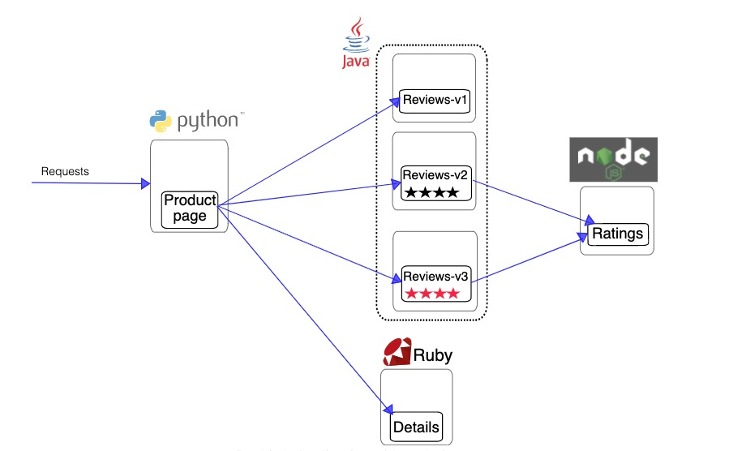

本文将会介绍 KubeVela 基于 [Istio](https://istio.io/latest/) 实现经典微服务场景 [bookinfo](https://istio.io/latest/docs/examples/bookinfo/?ie=utf-8&hl=en&docs-search=Canary) 的金丝雀发布功能。 

## 准备工作

开启 Istio 集群插件
```shell
vela addon enable istio
```

因为后面的例子运行在 default namespace，需要为 default namespace 打上 Istio 自动注入 sidecar 的标签。

```shell
kubectl label namespace default istio-injection=enabled
```

## 初次部署

执行下面的命令，部署 bookinfo 应用。

```shell
kubectl apply -f https://github.com/oam-dev/kubevela/blob/master/docs/examples/canary-rollout-use-case/first-deploy.yaml
```

该应用的组件架构和访问关系如下所示：



该应用包含四个组件，每个组件均配置了一个暴露端口 (expose) 运维特征用来在集群内暴露服务。 

productpage 组件还配置了一个 网关入口 (istio-gateway) 的运维特征，从而让该组件接收进入集群的流量。这个运维特征通过设置 `gateway:ingressgateway` 来使用 Istio 的默认网关实现，设置 `hosts: "*"` 来指定携带任意 host 信息的请求均可进入网关。
```shell
...
    - name: productpage
      type: webservice
      properties:
          image: docker.io/istio/examples-bookinfo-productpage-v1:1.16.2
          port: 9080

      traits:
          - type: expose
            properties:
              port:
                - 9080

          - type: istio-gateway
            properties:
              hosts:
                - "*"
              gateway: ingressgateway
              match:
                - exact: /productpage
                - prefix: /static
                - exact: /login
                - prefix: /api/v1/products
              port: 9080
...
```

你可以通过执行下面的命令将网关的端口映射到本地。
```shell
kubectl port-forward service/istio-ingressgateway -n istio-system 19082:80
```
通过浏览器访问 `127.0.0.1:19082` 将会看到下面的页面。


## 金丝雀发布

接下来我们以 `reviews` 组件为例，模拟一次金丝雀发布的完整过程，及先升级一部分组件实例，同时调整流量，以此达到渐进式灰度发布的目的。

执行下面的命令，来更新应用。
```shell
kubectl apply -f https://github.com/oam-dev/kubevela/blob/master/docs/examples/canary-rollout-use-case/rollout-v2.yaml
```
这次操作更新了 reviews 组件的镜像，从之前的 v2 升级到了 v3。同时 reviews 组件的灰度发布 (Rollout) 运维特征指定了，升级的目标实例个数为 2 个，分两个批次升级，每批升级 1 个实例。

此外还为该组件新增加了一个金丝雀流量发布 (canary-traffic) 运维特征。
```shell
...
- name: reviews
      type: webservice
      properties:
        image: docker.io/istio/examples-bookinfo-reviews-v3:1.16.2
        port: 9080
        volumes:
          - name: wlp-output
            type: emptyDir
            mountPath: /opt/ibm/wlp/output
          - name: tmp
            type: emptyDir
            mountPath: /tmp


      traits:
        - type: expose
          properties:
            port:
              - 9080

        - type: rollout
          properties:
            targetSize: 2
            rolloutBatches:
              - replicas: 1
              - replicas: 1
              
        - type: canary-traffic
          properties:
            port: 9080
...
```

这次更新还为应用新增了一个升级的执行工作流，该工作流包含三个步骤。

第一步通过指定 `batchPartition` 等于 0 设置只升级第一批次的实例。并通过 `traffic.weightedTargets` 将 10% 的流量切换到新版本的实例上面。

完成第一步之后，执行第二步工作流会进入暂停状态，等待用户校验服务状态。

工作流的第三步是完成剩下实例的升级，并将全部流量切换致新的组件版本上。

```shell
...
  workflow:
    steps:
      - name: rollout-1st-batch
        type: canary-rollout
        properties:
          # just upgrade first batch of component
          batchPartition: 0
          traffic:
            weightedTargets:
              - revision: reviews-v1
                weight: 90 # 90% shift to new version
              - revision: reviews-v2
                weight: 10 # 10% shift to new version

      # give user time to verify part of traffic shifting to newRevision
      - name: manual-approval
        type: suspend

      - name: rollout-rest
        type: canary-rollout
        properties:
          # upgrade all batches of component
          batchPartition: 1
          traffic:
            weightedTargets:
              - revision: reviews-v2
                weight: 100 # 100% shift to new version
...
```

更新完成之后，再在浏览器多次访问之前的网址。发现有大概10%的概率会看到下面这个新的页面，


可见新版本的页面由之前的黑色五角星变成了红色五角星

### 继续完成全量发布

如果在人工校验时，发现服务符合预期，需要继续执行工作流，完成全量发布。你可以通过执行下面的命令完成这一操作。

```shell
vela workflow reumse book-info
```

在浏览器上继续多次访问网页，会发现五角星将一直是红色的。

### 终止发布工作流并回滚

如果在人工校验时，发现服务不符合预期，需要终止预先定义好的发布工作流，并将流量和实例切换回之前的版本。你可以通过执行下面的命令完成这一操作。

```shell
kubectl apply -f https://github.com/oam-dev/kubevela/blob/master/docs/examples/canary-rollout-use-case/revert-in-middle.yaml
```

这次更新删除了之前定义好的工作流, 来终止执行工作流。

并通过修改灰度发布运维特征的 `targetRevision` 指向之前的组件版本 `reviews-v1`。此外，这次更新还删除了组件的金丝雀流量发布 (canary-traffic) 运维特征，将全部流量打到同一个组件版本上 `reviews-v1`。

```shell
...
    - name: reviews
      type: webservice
      properties:
        image: docker.io/istio/examples-bookinfo-reviews-v3:1.16.2
        port: 9080
        volumes:
          - name: wlp-output
            type: emptyDir
            mountPath: /opt/ibm/wlp/output
          - name: tmp
            type: emptyDir
            mountPath: /tmp


      traits:
        - type: expose
          properties:
            port:
              - 9080

        - type: rollout
          properties:
            targetRevision: reviews-v1
            batchPartition: 1
            targetSize: 2
            # This means to rollout two more replicas in two batches.
            rolloutBatches:
              - replicas: 2
...
```

在浏览器上继续访问网址，会发现五角星又变回到了黑色。

