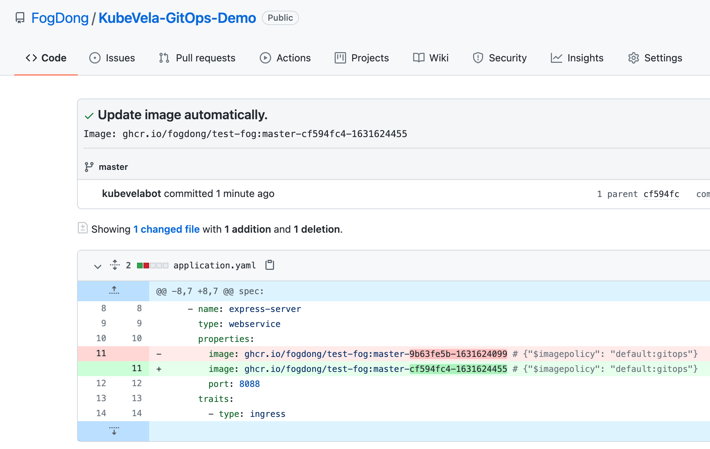

GitOps 通过实现持续交付，使开发人员可以通过直接更改 Git 仓库中的代码来自动部署应用，在提高部署生产力的同时也通过分支回滚等能力提高了可靠性。 KubeVela 作为一个应用交付系统，同样可以支持 GitOps 能力，本节将介绍如何使用 KubeVela 完成 GitOps 自动部署。

## 准备代码仓库

首先，准备一个 Git 仓库，里面含有一个 `Application` 配置文件，一些源代码以及对应的 Dockerfile。

代码的实现逻辑非常简单，会启动一个服务，并显示对应的 Version 版本。而在 `Application` 当中，我们会通过一个 `webservice` 类型的组件启动该服务，并添加一个 `ingress` 的运维特征以方便访问：

```yaml
apiVersion: core.oam.dev/v1beta1
kind: Application
metadata:
  name: first-vela-workflow
  namespace: default
spec:
  components:
    - name: test-server
      type: webservice
      properties:
        # 在创建完自动部署文件后，将 `default:gitops` 替换为其 namespace 和 name
        image: <your image> # {"$imagepolicy": "default:gitops"}
        port: 8088
      traits:
        - type: ingress
          properties:
            domain: testsvc.example.com
            http:
              /: 8088
```

我们希望用户改动代码进行提交后，自动构建出镜像并推送到镜像仓库。这一步 CI 可以通过集成 GitHub Actions、Jenkins 或者其他 CI 工具来实现。在本例中，我们通过借助 GitHub Actions 来完成持续集成。具体的代码文件及配置可参考 [示例仓库](https://github.com/oam-dev/samples/tree/master/9.GitOps_Demo)。

## 配置秘钥信息

在新的镜像推送到镜像仓库后，KubeVela 会识别到新的镜像，并更新仓库及集群中的 `Application` 配置文件。因此，我们需要一个含有 Git 信息的 Secret，使 KubeVela 向 Git 仓库进行提交。

```yaml
apiVersion: v1
kind: Secret
metadata:
  name: my-secret
type: kubernetes.io/basic-auth
stringData:
  username: <your username>
  password: <your password>
```

## 编写自动部署配置文件

完成了上述基础配置后，我们可以在本地新建一个自动部署配置文件，关联对应的 Git 仓库以及镜像仓库信息：

```yaml
apiVersion: core.oam.dev/v1beta1
kind: Application
metadata:
  name: git-app
spec:
  components:
  - name: gitops
    type: kustomize
    properties:
      repoType: git
      # 将此处替换成你的 git 仓库地址
      url: <your github repo address>
      # 关联 git secret
      secretRef: my-secret
      # 自动拉取配置的时间间隔
      pullInterval: 1m
      git:
        # 指定监听的 branch
        branch: master
      # 指定监听的路径
      path: .
      imageRepository:
        # 镜像地址
        image: <your image>
        # 如果这是一个私有的镜像仓库，可以通过 `kubectl create secret docker-registry` 创建对应的镜像秘钥并相关联
        # secretRef: imagesecret
        filterTags:
          # 可对镜像 tag 进行过滤
          pattern: '^master-[a-f0-9]+-(?P<ts>[0-9]+)'
          extract: '$ts'
        # 通过 policy 筛选出最新的镜像 Tag 并用于更新
        policy:
          numerical:
            order: asc
```

将上述文件部署到集群中后，查看集群中的应用，可以看到，应用 `git-app` 自动拉取了 Git 仓库中的应用配置并部署到了集群中：

```shell
$ vela ls

APP                	COMPONENT     	TYPE      	TRAITS 	PHASE  	HEALTHY	STATUS	CREATED-TIME
first-vela-workflow	test-server	    webservice	ingress	running	healthy	      	2021-09-10 11:23:34 +0800 CST
git-app            	gitops        	kustomize 	       	running	healthy	      	2021-09-10 11:23:32 +0800 CST
```

通过 `curl` 对应的 `Ingress`，可以看到目前的版本是 0.1.5

```shell 
$ curl -H "Host:testsvc.example.com" http://<your-ip>
Version: 0.1.5
```

## 修改代码

完成首次部署后，我们可以通过修改 Git 仓库中的代码，来完成自动部署。

将代码文件中的 `Version` 改为 `0.1.6`:

```go
const VERSION = "0.1.6"

func main() {
	http.HandleFunc("/", func(w http.ResponseWriter, r *http.Request) {
		_, _ = fmt.Fprintf(w, "Version: %s\n", VERSION)
	})
	if err := http.ListenAndServe(":8088", nil); err != nil {
		println(err.Error())
	}
}
```

提交该改动至代码仓库，可以看到，我们配置的 CI 流水线开始构建镜像并推送至镜像仓库。

而 KubeVela 会通过监听镜像仓库，根据最新的镜像 Tag 来更新代码仓库中的 `Application`。此时，可以看到代码仓库中有一条来自 `kubevelabot` 的提交，提交信息为 `Update image automatically.`



> 值得注意的是，来自 `kubevelabot` 的提交不会再次触发流水线导致重复构建，因为我们在 CI 配置的时候，将来自 KubeVela 的提交过滤掉了。
> 
> ```shell
> jobs:
>  publish:
>    if: "!contains(github.event.head_commit.message, 'Update image automatically')"
> ```

重新查看集群中的应用，可以看到经过一段时间后，`Application` 的镜像已经被更新。通过 `curl` 对应的 `Ingress` 查看当前版本：

```shell 
$ curl -H "Host:testsvc.example.com" http://<your-ip>
Version: 0.1.6
```

版本已被成功更新！至此，我们完成了从变更代码，到自动部署至集群的全部操作。

KubeVela 会通过你配置的 `interval` 时间间隔，来每隔一段时间分别从代码仓库及镜像仓库中获取最新信息：
* 当 Git 仓库中的配置文件被更新时，KubeVela 将根据最新的配置更新集群中的应用。
* 当镜像仓库中多了新的 Tag 时，KubeVela 将根据你配置的 policy 规则，筛选出最新的镜像 Tag，并更新到 Git 仓库中。而当代码仓库中的文件被更新后，KubeVela 将重复第一步，更新集群中的文件，从而达到了自动部署的效果。

通过与 GitOps 的集成，KubeVela 可以帮助用户加速部署应用，更为简洁地完成持续部署。