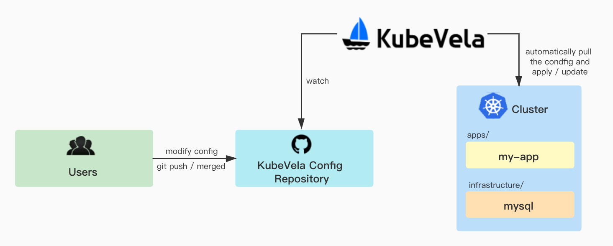
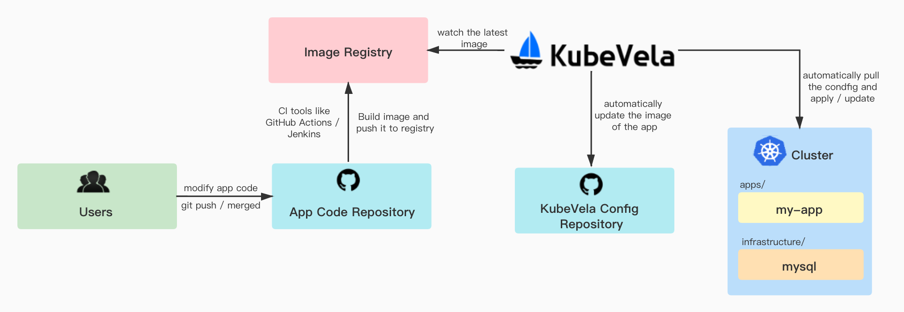

本案例将介绍如何在 GitOps 场景下使用 KubeVela，并介绍这样做的好处是什么。

## 简介

GitOps 是一种现代化的持续交付手段，它允许开发人员通过直接更改 Git 仓库中的代码和配置来自动部署应用，在提高部署生产力的同时也通过分支回滚等能力提高了可靠性。其具体的好处可以查看[这篇文章](https://www.weave.works/blog/what-is-gitops-really)，本文将不再赘述。

KubeVela 作为一个声明式的应用交付控制平面，天然就可以以 GitOps 的方式进行使用，并且这样做会在 GitOps 的基础上为用户提供更多的益处和端到端的体验，包括：
- 应用交付工作流（CD 流水线）
  - 即：KubeVela 支持在 GitOps 模式中描述过程式的应用交付，而不只是简单的声明终态；
- 处理部署过程中的各种依赖关系和拓扑结构；
- 在现有各种 GitOps 工具的语义之上提供统一的上层抽象，简化应用交付与管理过程；
- 统一进行云服务的声明、部署和服务绑定；
- 提供开箱即用的交付策略（金丝雀、蓝绿发布等）；
- 提供开箱即用的混合云/多云部署策略（放置规则、集群过滤规则等）；
- 在多环境交付中提供 Kustomize 风格的 Patch 来描述部署差异，而无需学习任何 Kustomize 本身的细节；
- …… 以及更多。

在本文中，我们主要讲解直接使用 KubeVela 在 GitOps 模式下进行交付的步骤。

交付的模式有以下两种，我们将分别介绍：

1. 面向平台管理员/运维人员的交付，用户可以通过直接更新仓库中的 KubeVela 配置文件，从而更新集群中的应用。
2. 面向终端开发者的交付，用户通过更新应用代码仓库中的代码，从而更新集群中的应用。

> 提示：你也可以通过类似的步骤使用 ArgoCD 等 GitOps 工具来间接使用 KubeVela，细节的操作文档我们会在后续发布中提供。

## 面向平台管理员/运维人员的交付



如图所示，对于平台管理员/运维人员而言，只需要准备一个 KubeVela Git 配置仓库并部署 KubeVela 配置文件，后续对于应用及基础设施的配置变动，便可通过直接更新 Git 配置仓库来完成，使得每一次配置变更可追踪。

### 准备配置仓库

> 具体的配置可参考 [示例仓库](https://github.com/oam-dev/samples/tree/master/9.GitOps_Demo)。

配置仓库的目录结构如下:

* `clusters/` 中包含集群中的 KubeVela 配置，用户需要将 `clusters/` 中的文件手动部署到集群中后，KubeVela 便能自动监听配置仓库中的文件变动且自动更新集群中的配置。
* `apps/` 目录中包含应用的配置。会被 `clusters/` 中的 `apps.yaml` 自动监听变化。
* `infrastructure/` 中包含一些基础架构工具，如 MySQL 数据库。会被 `clusters/` 中的 ` infra.yaml` 自动监听变化。


```shell
├── apps
│   └── my-app.yaml
├── clusters
│   ├── apps.yaml
│   └── infra.yaml
└── infrastructure
    └── mysql.yaml
```

> KubeVela 建议使用如上的目录结构管理你的 GitOps 仓库。`clusters/` 中存放相关的 KubeVela 配置并需要被手动部署到集群中，`apps/` 和 `infrastructure/` 中分别存放你的应用和基础配置。应用相关的配置可以通过运维特征绑定在应用上，通过把应用和基础配置分开，能够更为合理的管理你的部署环境，隔离应用的变动影响。

#### `clusters/` 目录

首先，我们来看下 clusters 目录。

`apps.yaml` 与 `infra.yaml` 几乎保持一致，只不过监听的文件目录有所区别。
将两个文件手动部署到集群中后，KubeVela 将自动监听 `infrastructure/` 以及 `apps/` 目录下的配置文件并定期更新同步。

```yaml
apiVersion: core.oam.dev/v1beta1
kind: Application
metadata:
  name: infra
spec:
  components:
  - name: database-config
    type: kustomize
    properties:
      repoType: git
      # 将此处替换成你需要监听的 git 配置仓库地址
      url: https://github.com/FogDong/KubeVela-GitOps-Infra-Demo
      # 如果是私有仓库，还需要关联 git secret
      # secretRef: git-secret
      # 自动拉取配置的时间间隔，由于基础设施的变动性较小，此处设置为十分钟
      pullInterval: 10m
      git:
        # 监听变动的分支
        branch: main
      # 监听变动的路径，指向仓库中 infrastructure 目录下的文件
      path: ./infrastructure
```

#### `apps/` 目录

`apps/` 目录中存放着应用配置文件，这是一个配置了数据库信息以及 Ingress 的简单应用。 该应用将连接到一个 MySQL 数据库，并简单地启动服务。在默认的服务路径下，会显示当前版本号。在 `/db` 路径下，会列出当前数据库中的信息。

```yaml
apiVersion: core.oam.dev/v1beta1
kind: Application
metadata:
  name: my-app
  namespace: default
spec:
  components:
    - name: my-server
      type: webservice
      properties:
        image: ghcr.io/fogdong/test-fog:master-cba5605f-1632714412
        port: 8088
        env:
          - name: DB_HOST
            value: mysql-cluster-mysql.default.svc.cluster.local:3306
          - name: DB_PASSWORD
            valueFrom:
              secretKeyRef:
                name: mysql-secret
                key: ROOT_PASSWORD
      traits:
        - type: ingress
          properties:
            domain: testsvc.example.com
            http:
              /: 8088
```

#### `infrastructure/` 目录

`infrastructure/` 目录下存放一些基础设施的配置。此处我们使用 [mysql controller](https://github.com/bitpoke/mysql-operator) 来部署了一个 MySQL 集群。

> 注意，请确保你的集群中有一个 secret，并通过 `ROOT_PASSWORD` 声明了 MySQL 密码。

```yaml
apiVersion: core.oam.dev/v1beta1
kind: Application
metadata:
  name: mysql
  namespace: default
spec:
  components:
    - name: mysql-controller
      type: helm
      properties:
        repoType: helm
        url: https://presslabs.github.io/charts
        chart: mysql-operator
        version: "0.4.0"
    - name: mysql-cluster
      type: raw
      properties:
        apiVersion: mysql.presslabs.org/v1alpha1
        kind: MysqlCluster
        metadata:
          name: mysql-cluster
        spec:
          replicas: 1
          # 关联 secret 名称
          secretName: mysql-secret
  
  workflow:
    steps:
      - name: deploy-operator
        type: apply-component
        properties:
          component: mysql-controller
      - name: deploy-mysql
        type: apply-component
        properties:
          component: mysql-cluster
```

#### 部署 `clusters/` 目录下的文件

在集群中部署 `infra.yaml`，可以看到它自动在集群中拉起了 `infrastructure` 目录下的 MySQL 部署文件：

```shell
kubectl apply -f clusters/infra.yaml
```

```shell
$ vela ls

APP   	COMPONENT       	TYPE      	TRAITS 	PHASE  	HEALTHY	STATUS	CREATED-TIME
infra 	database-config 	kustomize 	       	running	healthy	      	2021-09-26 20:48:09 +0800 CST
mysql 	mysql-controller	helm      	       	running	healthy	      	2021-09-26 20:48:11 +0800 CST
└─  	mysql-cluster   	raw       	       	running	healthy	      	2021-09-26 20:48:11 +0800 CST
```

在集群中部署 `apps.yaml`，可以看到它自动拉起了 `apps/staging` 目录下的应用部署文件：

```shell
kubectl apply -f clusters/apps.yaml
```

```shell
APP   	COMPONENT       	TYPE      	TRAITS 	PHASE  	HEALTHY	STATUS	CREATED-TIME
apps  	apps            	kustomize 	       	running	healthy	      	2021-09-27 16:55:53 +0800 CST
infra 	database-config 	kustomize 	       	running	healthy	      	2021-09-26 20:48:09 +0800 CST
my-app	my-server       	webservice	ingress	running	healthy	      	2021-09-27 16:55:55 +0800 CST
mysql 	mysql-controller	helm      	       	running	healthy	      	2021-09-26 20:48:11 +0800 CST
└─  	mysql-cluster   	raw       	       	running	healthy	      	2021-09-26 20:48:11 +0800 CST
```

通过 curl 应用的 Ingress，可以看到目前的版本是 0.1.5，并且成功地连接到了数据库：

```shell
$ kubectl get ingress
NAME        CLASS    HOSTS                 ADDRESS         PORTS   AGE
my-server   <none>   testsvc.example.com   <ingress-ip>    80      162m

$ curl -H "Host:testsvc.example.com" http://<ingress-ip>
Version: 0.1.5

$ curl -H "Host:testsvc.example.com" http://<ingress-ip>/db
User: KubeVela
Description: It's a test user
```

### 修改配置

完成了首次部署后，我们可以通过修改配置仓库中的配置，来完成集群中应用的配置更新。

修改应用 Ingress 的 Domain：

```yaml
...
      traits:
        - type: ingress
          properties:
            domain: kubevela.example.com
            http:
              /: 8089
```

经过一段时间后，重新查看集群中的 Ingress：

```shell
NAME        CLASS    HOSTS                 ADDRESS         PORTS   AGE
my-server   <none>   kubevela.example.com  <ingress-ip>    80      162m
```

可以看到，Ingress 的 Host 地址已被成功更新。

## 面向终端开发者的交付



如图所示，对于终端开发者而言，在 KubeVela Git 配置仓库以外，还需要准备一个应用代码仓库。在用户更新了应用代码仓库中的代码后，需要配置一个 CI 来自动构建镜像并推送至镜像仓库中。KubeVela 会监听镜像仓库中的最新镜像，并自动更新配置仓库中的镜像配置，最后再更新集群中的应用配置。

使用户可以达成在更新代码后，集群中的配置也自动更新的效果。
### 准备代码仓库

准备一个代码仓库，里面包含一些源代码以及对应的 Dockerfile。

这些代码将连接到一个 MySQL 数据库，并简单地启动服务。在默认的服务路径下，会显示当前版本号。在 `/db` 路径下，会列出当前数据库中的信息。

```go
	http.HandleFunc("/", func(w http.ResponseWriter, r *http.Request) {
		_, _ = fmt.Fprintf(w, "Version: %s\n", VERSION)
	})
	http.HandleFunc("/db", func(w http.ResponseWriter, r *http.Request) {
		rows, err := db.Query("select * from userinfo;")
		if err != nil {
			_, _ = fmt.Fprintf(w, "Error: %v\n", err)
		}
		for rows.Next() {
			var username string
			var desc string
			err = rows.Scan(&username, &desc)
			if err != nil {
				_, _ = fmt.Fprintf(w, "Scan Error: %v\n", err)
			}
			_, _ = fmt.Fprintf(w, "User: %s \nDescription: %s\n\n", username, desc)
		}
	})

	if err := http.ListenAndServe(":8088", nil); err != nil {
		panic(err.Error())
	}
```

我们希望用户改动代码进行提交后，自动构建出最新的镜像并推送到镜像仓库。这一步 CI 可以通过集成 GitHub Actions、Jenkins 或者其他 CI 工具来实现。在本例中，我们通过借助 GitHub Actions 来完成持续集成。具体的代码文件及配置可参考 [示例仓库](https://github.com/oam-dev/samples/tree/master/9.GitOps_Demo)。

### 配置秘钥信息

在新的镜像推送到镜像仓库后，KubeVela 会识别到新的镜像，并更新仓库及集群中的 `Application` 配置文件。因此，我们需要一个含有 Git 信息的 Secret，使 KubeVela 向 Git 仓库进行提交。部署如下文件，将其中的用户名和密码替换成你的信息：

```yaml
apiVersion: v1
kind: Secret
metadata:
  name: git-secret
type: kubernetes.io/basic-auth
stringData:
  username: <your username>
  password: <your password>
```

### 准备配置仓库

配置仓库与之前的配置大同小异，只需要加上与镜像仓库相关的配置即可。具体配置请参考 [示例仓库](https://github.com/oam-dev/samples/tree/master/9.GitOps_Demo)。

修改 `my-app` 中的 image 字段，在后面加上 `# {"$imagepolicy": "default:apps"}` 的注释。KubeVela 会通过该注释去修改对应的镜像字段。`default:apps` 是该应用配置文件对应的命名空间和应用名。

```yaml
spec:
  components:
    - name: my-server
      type: webservice
      properties:
        image: ghcr.io/fogdong/test-fog:master-cba5605f-1632714412 # {"$imagepolicy": "default:apps"}
```

修改 `clusters/` 中的 `apps` 配置，该配置会监听仓库中 `apps` 下的应用文件变动以及镜像仓库中的镜像更新：

```yaml
...
  imageRepository:
    # 镜像地址
    image: <your image>
    # 如果这是一个私有的镜像仓库，可以通过 `kubectl create secret docker-registry` 创建对应的镜像秘钥并相关联
    # secretRef: imagesecret
    filterTags:
      # 可对镜像 tag 进行过滤
      pattern: '^master-[a-f0-9]+-(?P<ts>[0-9]+)'
      extract: '$ts'
    # 通过 policy 筛选出最新的镜像 Tag 并用于更新
    policy:
      numerical:
        order: asc
    # 追加提交信息
    commitMessage: "Image: {{range .Updated.Images}}{{println .}}{{end}}"
```

将 `clusters` 中的配置文件更新到集群中后，我们便可以通过修改代码来完成应用的更新。

### 修改代码

将代码文件中的 `Version` 改为 `0.1.6`，并修改数据库中的数据:

```go
const VERSION = "0.1.6"

...

func InsertInitData(db *sql.DB) {
	stmt, err := db.Prepare(insertInitData)
	if err != nil {
		panic(err)
	}
	defer stmt.Close()

	_, err = stmt.Exec("KubeVela2", "It's another test user")
	if err != nil {
		panic(err)
	}
}
```

提交该改动至代码仓库，可以看到，我们配置的 CI 流水线开始构建镜像并推送至镜像仓库。

而 KubeVela 会通过监听镜像仓库，根据最新的镜像 Tag 来更新代码仓库中的 `Application`。

此时，可以看到配置仓库中有一条来自 `kubevelabot` 的提交，提交信息均带有 `Update image automatically.` 前缀。你也可以通过 `{{range .Updated.Images}}{{println .}}{{end}}` 在 `commitMessage` 字段中追加你所需要的信息。


> 值得注意的是，如果你希望将代码和配置放在同一个仓库，需要过滤掉来自 `kubevelabot` 的提交来防止流水线的重复构建。可以在 CI 中通过如下配置过滤：
> 
> ```shell
> jobs:
>  publish:
>    if: "!contains(github.event.head_commit.message, 'Update image automatically')"
> ```

重新查看集群中的应用，可以看到经过一段时间后，`Application` 的镜像已经被更新。

> KubeVela 会通过你配置的 `interval` 时间间隔，来每隔一段时间分别从配置仓库及镜像仓库中获取最新信息：
> * 当 Git 仓库中的配置文件被更新时，KubeVela 将根据最新的配置更新集群中的应用。
> * 当镜像仓库中多了新的 Tag 时，KubeVela 将根据你配置的 policy 规则，筛选出最新的镜像 Tag，并更新到 Git 仓库中。而当代码仓库中的文件被更新后，KubeVela 将重复第一步，更新集群中的文件，从而达到了自动部署的效果。


通过 `curl` 对应的 `Ingress` 查看当前版本和数据库信息：

```shell
$ kubectl get ingress
NAME        CLASS    HOSTS                 ADDRESS         PORTS   AGE
my-server   <none>   kubevela.example.com  <ingress-ip>    80      162m

$ curl -H "Host:kubevela.example.com" http://<ingress-ip>
Version: 0.1.6

$ curl -H "Host:kubevela.example.com" http://<ingress-ip>/db
User: KubeVela
Description: It's a test user

User: KubeVela2
Description: It's another test user
```

版本已被成功更新！至此，我们完成了从变更代码，到自动部署至集群的全部操作。

## 总结

在运维侧，如若需要更新基础设施（如数据库）的配置，或是应用的配置项，只需要修改配置仓库中的文件，KubeVela 将自动把配置同步到集群中，简化了部署流程。

在研发侧，用户修改代码仓库中的代码后，KubeVela 将自动更新配置仓库中的镜像。从而进行应用的版本更新。

通过与 GitOps 的结合，KubeVela 加速了应用从开发到部署的整个流程。