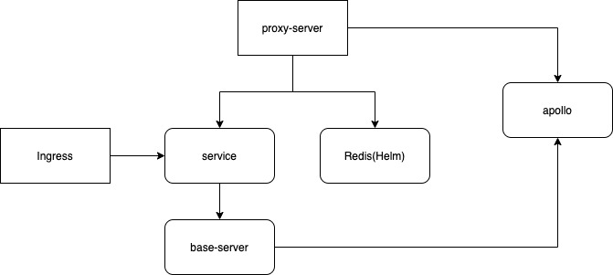

## 背景

理想汽车后台服务采用的是微服务架构，虽然借助 Kubernetes 进行部署，但运维工作依然很复杂。并具有以下特点：

- 一个应用能运行起来并对外提供服务，正常情况下都需要配套的db实例以及 redis 集群支撑。
- 应用之间存在依赖关系，对于部署顺序有比较强的诉求。
- 应用部署流程中需要和外围系统（如：配置中心）交互。

下面以一个理想汽车的经典场景为例，介绍如何借助 KubeVela 实现以上诉求。

## 典型场景介绍



这里面包含两个应用，分别是 `base-server` 和 `proxy-server`, 整体应用部署需要满足以下条件：

- base-server 成功启动（状态 ready）后需要往配置中心（apollo）注册信息。
- base-server 需要绑定到 service 和 ingress 进行负载均衡。
- proxy-server 需要在 base-server 成功运行后启动，并需要获取到 base-server 对应的 service 的 clusterIP。
- proxy-server 依赖 redis 中间件，需要在 redis 成功运行后启动。
- proxy-server 需要从配置中心（apollo）读取 base-server 的相关注册信息。

可见整个部署过程，如果人为操作，会变得异常困难以及容易出错。在借助 KubeVela 后，可以轻松实现场景的自动化和一键式运维。

## 解决方案

在 KubeVela 上，以上诉求可以拆解为以下 KubeVela 的模型：

- 组件部分: 包含三个分别是 base-server 、redis 、proxy-server。
- 运维特征: ingress (包括 service) 作为一个通用的负载均衡运维特征。
- 工作流: 实现组件按照依赖进行部署，并实现和配置中心的交互。
- 应用部署计划: 理想汽车的开发者可以通过 KubeVela 的应用部署计划完成应用发布。

详细过程如下:

## 平台的功能定制

理想汽车的平台工程师通过以下步骤完成方案中所涉及的能力，并向开发者用户透出（通过编写 definition 的方式实现）。

### 1.定义组件

- 编写 base-service 的组件定义，使用 `Deployment` 作为工作负载，并向终端用户透出参数 `image` 和 `cluster`。对于终端用户来说，之后在发布时只需要关注镜像以及部署的集群名称。
- 编写 proxy-service 的组件定义，使用 `argo rollout` 作为工作负载，同样向终端用户透出参数 `image` 和 `cluster`。

如下所示：

```
apiVersion: core.oam.dev/v1beta1
kind: ComponentDefinition
metadata:
  name: base-service
spec:
  workload:
    definition:
      apiVersion: apps/v1
      kind: Deployment
  schematic:
    kube:
      template:
        apiVersion: apps/v1
        kind: Deployment
        metadata:
          labels:
            appId: BASE-SERVICE
            appName: base-service
            version: 0.0.1
          name: base-service
        spec:
          replicas: 2
          revisionHistoryLimit: 5
          selector:
            matchLabels:
              app: base-service
          template:
            metadata:
              labels:
                antiAffinity: none
                app: base-service
                appId: BASE-SERVICE
                version: 0.0.1
            spec:
              affinity:
                podAntiAffinity:
                  preferredDuringSchedulingIgnoredDuringExecution:
                    - podAffinityTerm:
                        labelSelector:
                          matchExpressions:
                            - key: app
                              operator: In
                              values:
                                - base-service
                            - key: antiAffinity
                              operator: In
                              values:
                                - none
                        topologyKey: kubernetes.io/hostname
                      weight: 100
              containers:
                - env:
                    - name: NODE_IP
                      valueFrom:
                        fieldRef:
                          fieldPath: status.hostIP
                    - name: POD_IP
                      valueFrom:
                        fieldRef:
                          fieldPath: status.podIP
                    - name: POD_NAME
                      valueFrom:
                        fieldRef:
                          fieldPath: metadata.name
                    - name: POD_NAMESPACE
                      valueFrom:
                        fieldRef:
                          fieldPath: metadata.namespace
                    - name: APP_NAME
                      value: base-service
                    - name: LOG_BASE
                      value: /data/log
                    - name: RUNTIME_CLUSTER
                      value: default
                  image: base-service
                  imagePullPolicy: Always
                  name: base-service
                  ports:
                    - containerPort: 11223
                      protocol: TCP
                    - containerPort: 11224
                      protocol: TCP
                  volumeMounts:
                    - mountPath: /tmp/data/log/base-service
                      name: log-volume
                    - mountPath: /data
                      name: sidecar-sre
                    - mountPath: /app/skywalking
                      name: skywalking
              initContainers:
                - args:
                    - 'echo "do something" '
                  command:
                    - /bin/sh
                    - -c
                  env:
                    - name: NODE_IP
                      valueFrom:
                        fieldRef:
                          fieldPath: status.hostIP
                    - name: POD_IP
                      valueFrom:
                        fieldRef:
                          fieldPath: status.podIP
                    - name: APP_NAME
                      value: base-service
                  image: busybox
                  imagePullPolicy: Always
                  name: sidecar-sre
                  resources:
                    limits:
                      cpu: 100m
                      memory: 100Mi
                  volumeMounts:
                    - mountPath: /tmp/data/log/base-service
                      name: log-volume
                    - mountPath: /scratch
                      name: sidecar-sre
              terminationGracePeriodSeconds: 120
              volumes:
                - hostPath:
                    path: /logs/dev/base-service
                    type: DirectoryOrCreate
                  name: log-volume
                - emptyDir: {}
                  name: sidecar-sre
                - emptyDir: {}
                  name: skywalking
      parameters:
        - name: image
          required: true
          type: string
          fieldPaths:
            - "spec.template.spec.containers[0].image"
        - name: cluster
          required: true
          type: string
          fieldPaths:
            - "spec.template.spec.containers[0].env[6].value"
            - "spec.template.metadata.labels.cluster"
---
apiVersion: core.oam.dev/v1beta1
kind: ComponentDefinition
metadata:
  name: proxy-service
spec:
  workload:
    definition:
      apiVersion: argoproj.io/v1alpha1
      kind: Rollout
  schematic:
    kube:
      template:
        apiVersion: argoproj.io/v1alpha1
        kind: Rollout
        metadata:
          labels:
            appId: PROXY-SERVICE
            appName: proxy-service
            version: 0.0.0
          name: proxy-service
        spec:
          replicas: 1
          revisionHistoryLimit: 1
          selector:
            matchLabels:
              app: proxy-service
          strategy:
            canary:
              steps:
                - setWeight: 50
                - pause: {}
          template:
            metadata:
              labels:
                app: proxy-service
                appId: PROXY-SERVICE
                cluster: default
                version: 0.0.1
            spec:
              affinity:
                podAntiAffinity:
                  preferredDuringSchedulingIgnoredDuringExecution:
                    - podAffinityTerm:
                        labelSelector:
                          matchExpressions:
                            - key: app
                              operator: In
                              values:
                                - proxy-service
                        topologyKey: kubernetes.io/hostname
                      weight: 100
              containers:
                - env:
                    - name: NODE_IP
                      valueFrom:
                        fieldRef:
                          fieldPath: status.hostIP
                    - name: POD_IP
                      valueFrom:
                        fieldRef:
                          fieldPath: status.podIP
                    - name: POD_NAME
                      valueFrom:
                        fieldRef:
                          fieldPath: metadata.name
                    - name: POD_NAMESPACE
                      valueFrom:
                        fieldRef:
                          fieldPath: metadata.namespace
                    - name: APP_NAME
                      value: proxy-service
                    - name: LOG_BASE
                      value: /app/data/log
                    - name: RUNTIME_CLUSTER
                      value: default
                  image: proxy-service:0.1
                  imagePullPolicy: Always
                  name: proxy-service
                  ports:
                    - containerPort: 11024
                      protocol: TCP
                    - containerPort: 11025
                      protocol: TCP
                  volumeMounts:
                    - mountPath: /tmp/data/log/proxy-service
                      name: log-volume
                    - mountPath: /app/data
                      name: sidecar-sre
                    - mountPath: /app/skywalking
                      name: skywalking
              initContainers:
                - args:
                    - 'echo "do something" '
                  command:
                    - /bin/sh
                    - -c
                  env:
                    - name: NODE_IP
                      valueFrom:
                        fieldRef:
                          fieldPath: status.hostIP
                    - name: POD_IP
                      valueFrom:
                        fieldRef:
                          fieldPath: status.podIP
                    - name: APP_NAME
                      value: proxy-service
                  image: busybox
                  imagePullPolicy: Always
                  name: sidecar-sre
                  resources:
                    limits:
                      cpu: 100m
                      memory: 100Mi
                  volumeMounts:
                    - mountPath: /tmp/data/log/proxy-service
                      name: log-volume
                    - mountPath: /scratch
                      name: sidecar-sre
              terminationGracePeriodSeconds: 120
              volumes:
                - hostPath:
                    path: /app/logs/dev/proxy-service
                    type: DirectoryOrCreate
                  name: log-volume
                - emptyDir: {}
                  name: sidecar-sre
                - emptyDir: {}
                  name: skywalking
      parameters:
        - name: image
          required: true
          type: string
          fieldPaths:
            - "spec.template.spec.containers[0].image"
        - name: cluster
          required: true
          type: string
          fieldPaths:
            - "spec.template.spec.containers[0].env[5].value"
            - "spec.template.metadata.labels.cluster"
```

### 2.定义运维特征

编写用于负载均衡的运维特征的定义，其通过生成 Kubernetes 中的原生资源 `Service` 和 `Ingress` 实现负载均衡。

向终端用户透出的参数包括 domain 和 http ，其中 domain 可以指定域名，http 用来设定路由，具体将部署服务的端口映射为不同的 url path。

如下所示：

```
apiVersion: core.oam.dev/v1beta1
kind: TraitDefinition
metadata:
  name: ingress
spec:
  schematic:
    cue:
      template: |
        parameter: {
          domain: string
          http: [string]: int
        }
        outputs: {
          "service": {
            apiVersion: "v1"
            kind: "Service"
            metadata: {
              name: context.name
              namespace: context.namespace
            }
            spec: {
              selector: app: context.name
              ports: [for ph, pt in parameter.http{
                protocol: "TCP"
                port: pt
                targetPort: pt
              }]
            }
          }
          "ingress": {
            apiVersion: "networking.k8s.io/v1"
            kind: "Ingress"
            metadata: {
              name: "\(context.name)-ingress"
              namespace: context.namespace
            }
            spec: rules: [{
              host: parameter.domain
              http: paths: [for ph, pt in parameter.http {
                  path: ph
                  pathType: "Prefix"
                  backend: service: {
                      name: context.name
                      port: number: pt
                  }
              }]
            }]
           }
        }
```

### 3.定义工作流的步骤

- 定义 apply-base 工作流步骤: 完成部署 base-server，等待组件成功启动后，往注册中心注册信息。透出参数为 component，终端用户在流水线中使用步骤 apply-base 时只需要指定组件名称。
- 定义 apply-helm 工作流步骤: 完成部署 redis helm chart，并等待 redis 成功启动。透出参数为 component，终端用户在流水线中使用步骤 apply-helm 时只需要指定组件名称。
- 定义 apply-proxy 工作流步骤: 完成部署 proxy-server，并等待组件成功启动。透出参数为 component 和 backendIP，其中 component 为组件名称，backendIP 为 proxy-server 服务依赖组件的 IP。

如下所示：

```
apiVersion: core.oam.dev/v1beta1
kind: WorkflowStepDefinition
metadata:
  name: apply-base
  namespace: vela-system
spec:
  schematic:
    cue:
      template: |-
        import ("vela/op")
        parameter: {
           component: string
        }
        apply: op.#ApplyComponent & {
           component: parameter.component
        }

        // 等待 deployment 可用
        wait: op.#ConditionalWait & {
           continue: apply.workload.status.readyReplicas == apply.workload.status.replicas && apply.workload.status.observedGeneration == apply.workload.metadata.generation
        }
        
         message: {...}
        // 往三方配置中心apollo写配置
        notify: op.#HTTPPost & {
           url: "appolo-address"
           request: body: json.Marshal(message)
        }

        // 暴露 service 的 ClusterIP
        clusterIP: apply.traits["service"].value.spec.clusterIP
---
apiVersion: core.oam.dev/v1beta1
kind: WorkflowStepDefinition
metadata:
  name: apply-helm
  namespace: vela-system
spec:
  schematic:
    cue:
      template: |-
        import ("vela/op")
        parameter: {
           component: string
        }
        apply: op.#ApplyComponent & {
           component: parameter.component
        }

        chart: op.#Read & {
           value: {
                // redis 的元数据
                ...
           }
        }
        // 等待 redis 可用
        wait: op.#ConditionalWait & {
           // todo
           continue: chart.value.status.phase=="ready"
        }
---
apiVersion: core.oam.dev/v1beta1
kind: WorkflowStepDefinition
metadata:
  name: apply-proxy
  namespace: vela-system
spec:
  schematic:
    cue:
      template: |-
        import (
           "vela/op"
           "encoding/json"
        )
        parameter: {
           component: string
           backendIP: string
        }

        // 往三方配置中心apollo读取配置
        // config: op.#HTTPGet

        apply: op.#ApplyComponent & {
           component: parameter.component
           // 给环境变量中注入BackendIP
           workload: patch: spec: template: spec: {
             containers: [{
                // patchKey=name
                env: [{name: "BackendIP",value: parameter.backendIP}]
             },...]
           }
        }

        // 等待 argo.rollout 可用
        wait: op.#ConditionalWait & {
           continue: apply.workload.status.readyReplicas == apply.workload.status.replicas && apply.workload.status.observedGeneration == apply.workload.metadata.generation
        }      
```


### 用户使用

理想汽车的开发工程师接下来就可以使用 Application 完成应用的发布。


开发工程师可以直接使用如上平台工程师在 KubeVela 上定制的通用能力，轻松完成应用部署计划的编写。

> 在下面例子中通过 workflow 的数据传递机制 input/output，将 base-server 的 clusterIP 传递给 proxy-server。

```
apiVersion: core.oam.dev/v1beta1
kind: Application
metadata:
  name: lixiang-app
spec:
  components:
    - name: base-service
      type: base-service
      properties:
        image: nginx:1.14.2
        # 用于区分appollo环境
        cluster: default
      traits:
      - type: ingress
        properties:
            domain: base-service.dev.example.com
            http:
              "/": 11001
    # redis无依赖，启动后service的endpionts 需要通过http接口写入信息写入到apollo
    - name: "redis"
      type: helm
      properties:
        chart: "redis-cluster"
        version: "6.2.7"
        repoUrl: "https://charts.bitnami.com/bitnami"
        repoType: helm
    - name: proxy-service
      type: proxy-service
      properties:
          image: nginx:1.14.2
          # 用于区分appollo环境
          cluster: default
      traits:
      - type: ingress
        properties:
            domain: proxy-service.dev.example.com
            http:
              "/": 11002
  workflow:
    steps:
      - name: apply-base-service
        type: apply-base
        outputs:
        - name: baseIP
          exportKey: clusterIP
        properties:
          component: base-service
      - name: apply-redis
        type: apply-helm
        properties:
          component: redis
      - name: apply-proxy-service
        type: apply-proxy
        inputs:
        - from: baseIP
          parameterKey: backendIP
        properties:
          component: proxy-service
```