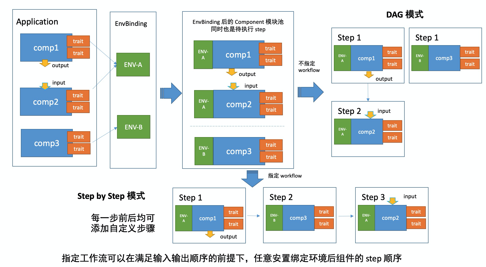

本章节会介绍如何使用 KubeVela 完成应用的多集群应用交付。

## 简介

如今，越来越多的企业及开发者出于不同的原因，开始在多集群环境中进行应用交付：

* 由于 Kubernetes 集群存在着部署规模的局限性（单一集群最多容纳 5k 节点），需要应用多集群技术来部署、管理海量的应用。
* 考虑到稳定性及高可用性，同一个应用可以部署在多个集群中，以实现容灾、异地多活等需求。
* 应用可能需要部署在不同的区域来满足不同政府对于数据安全性的政策需求。

下文将会介绍如何在 KubeVela 中使用多集群技术帮助你快速将应用部署在多集群环境中。

## 准备工作

在使用多集群应用部署之前，你需要将子集群通过 KubeConfig 加入到 KubeVela 的管控中来。Vela CLI 可以帮你实现这一点。

```shell script
vela cluster join <your kubeconfig path>
```

该命令会自动使用 KubeConfig 中的 `context.cluster` 字段作为集群名称，你也可以使用 `--name` 参数来指定，如

```shell
vela cluster join stage-cluster.kubeconfig --name cluster-staging
vela cluster join prod-cluster.kubeconfig --name cluster-prod
```

在子集群加入 KubeVela 中后，你同样可以使用 CLI 命令来查看当前正在被 KubeVela 管控的所有集群。

```bash
$ vela cluster list
CLUSTER         TYPE    ENDPOINT                
cluster-prod    tls     https://47.88.4.97:6443 
cluster-staging tls     https://47.88.7.230:6443
```

如果你不需要某个子集群了，还可以将子集群从 KubeVela 管控中移除。

```shell script
$ vela cluster detach cluster-prod
```

当然，如果现在有应用正跑在该集群中，这条命令会被 KubeVela 拒绝。

## 部署多集群应用

KubeVela 将一个 Kubernetes 集群看作是一个环境，对于一个应用，你可以将其部署在多个环境中。

下面的这个例子将会把应用先部署在预发环境中，待确认应用正常运行后，再将其部署在生产环境中。

对于不同的环境，KubeVela 支持进行差异化部署。比如在本文的例子中，预发环境只使用 webservice 组件而不是用 worker 组件，同时 webservice 也只部署了一份。而在生产环境中，两个组件都会使用，而且 webservice 还会部署三副本。


```yaml
apiVersion: core.oam.dev/v1beta1
kind: Application
metadata:
  name: example-app
  namespace: default
spec:
  components:
    - name: hello-world-server
      type: webservice
      properties:
        image: crccheck/hello-world
        port: 8000
      traits:
        - type: scaler
          properties:
            replicas: 1
    - name: data-worker
      type: worker
      properties:
        image: busybox
        cmd:
          - sleep
          - '1000000'
  policies:
    - name: example-multi-env-policy
      type: env-binding
      properties:
        envs:
          - name: staging
            placement: # 选择要部署的集群
              clusterSelector:
                name: cluster-staging
            selector: # 选择要使用的组件
              components:
                - hello-world-server

          - name: prod
            placement:
              clusterSelector:
                name: cluster-prod
            patch: # 对组件进行差异化配置
              components:
                - name: hello-world-server
                  type: webservice
                  traits:
                    - type: scaler
                      properties:
                        replicas: 3

    - name: health-policy-demo
      type: health
      properties:
        probeInterval: 5
        probeTimeout: 10

  workflow:
    steps:
      # 部署到预发环境中
      - name: deploy-staging
        type: deploy2env
        properties:
          policy: example-multi-env-policy
          env: staging

      # 手动确认
      - name: manual-approval
        type: suspend

      # 部署到生产环境中
      - name: deploy-prod
        type: deploy2env
        properties:
          policy: example-multi-env-policy
          env: prod
```

在应用创建后，它会通过 KubeVela 工作流完成部署。

> 你可以参考[多环境部署](../end-user/policies/envbinding)和[健康检查](../end-user/policies/health)的用户手册来查看更多参数细节。

首先，它会将应用部署到预发环境中，你可以运行下面的命令来查看应用的状态。

```shell
> kubectl get application example-app -o yaml
NAME          COMPONENT            TYPE         PHASE                HEALTHY   STATUS       AGE
example-app   hello-world-server   webservice   workflowSuspending   true      Ready:1/1    10s
```

可以看到，当前的部署工作流在 `manual-approval` 步骤中暂停。

```yaml
...
  status:
    workflow:
      appRevision: example-app-v1:44a6447e3653bcc2
      contextBackend:
        apiVersion: v1
        kind: ConfigMap
        name: workflow-example-app-context
        uid: 56ddcde6-8a83-4ac3-bf94-d19f8f55eb3d
      mode: StepByStep
      steps:
      - id: wek2b31nai
        name: deploy-staging
        phase: succeeded
        type: deploy2env
      - id: 7j5eb764mk
        name: manual-approval
        phase: succeeded
        type: suspend
      suspend: true
      terminated: false
      waitCount: 0
```

你也可以检查 `status.service` 字段来查看应用的健康状态。

```yaml
...
  status:
    services:
    - env: staging
      healthy: true
      message: 'Ready:1/1 '
      name: hello-world-server
      scopes:
      - apiVersion: core.oam.dev/v1alpha2
        kind: HealthScope
        name: health-policy-demo
        namespace: test
        uid: 6e6230a3-93f3-4dba-ba09-dd863b6c4a88
      traits:
      - healthy: true
        type: scaler
      workloadDefinition:
        apiVersion: apps/v1
        kind: Deployment
```

通过工作流的 resume 指令，你可以在确认当前部署正常后，继续将应用部署至生产环境中。

```shell
> vela workflow resume example-app
Successfully resume workflow: example-app
```

再次确认应用的状态：

```shell
> kubectl get application example-app
NAME          COMPONENT            TYPE         PHASE     HEALTHY   STATUS       AGE
example-app   hello-world-server   webservice   running   true      Ready:1/1    62s
```

```yaml
  status:
    services:
    - env: staging
      healthy: true
      message: 'Ready:1/1 '
      name: hello-world-server
      scopes:
      - apiVersion: core.oam.dev/v1alpha2
        kind: HealthScope
        name: health-policy-demo
        namespace: default
        uid: 9174ac61-d262-444b-bb6c-e5f0caee706a
      traits:
      - healthy: true
        type: scaler
      workloadDefinition:
        apiVersion: apps/v1
        kind: Deployment
    - env: prod
      healthy: true
      message: 'Ready:3/3 '
      name: hello-world-server
      scopes:
      - apiVersion: core.oam.dev/v1alpha2
        kind: HealthScope
        name: health-policy-demo
        namespace: default
        uid: 9174ac61-d262-444b-bb6c-e5f0caee706a
      traits:
      - healthy: true
        type: scaler
      workloadDefinition:
        apiVersion: apps/v1
        kind: Deployment
    - env: prod
      healthy: true
      message: 'Ready:1/1 '
      name: data-worker
      scopes:
      - apiVersion: core.oam.dev/v1alpha2
        kind: HealthScope
        name: health-policy-demo
        namespace: default
        uid: 9174ac61-d262-444b-bb6c-e5f0caee706a
      workloadDefinition:
        apiVersion: apps/v1
        kind: Deployment
```

现在，工作流中的所有步骤都已完成。

```yaml
...
  status:
    workflow:
      appRevision: example-app-v1:44a6447e3653bcc2
      contextBackend:
        apiVersion: v1
        kind: ConfigMap
        name: workflow-example-app-context
        uid: e1e7bd2d-8743-4239-9de7-55a0dd76e5d3
      mode: StepByStep
      steps:
      - id: q8yx7pr8wb
        name: deploy-staging
        phase: succeeded
        type: deploy2env
      - id: 6oxrtvki9o
        name: manual-approval
        phase: succeeded
        type: suspend
      - id: uk287p8c31
        name: deploy-prod
        phase: succeeded
        type: deploy2env
      suspend: false
      terminated: false
      waitCount: 0
```

## 更多使用案例

KubeVela 可以提供更多的应用多集群部署策略，如将单一应用的不同组件部署在不同环境中，或在管控集群及子集群中混合部署。

对于工作流与多集群部署的使用，你可以通过下图简单了解其整体流程。



更多的多集群环境下应用部署的使用案例将在不久后加入文档中。