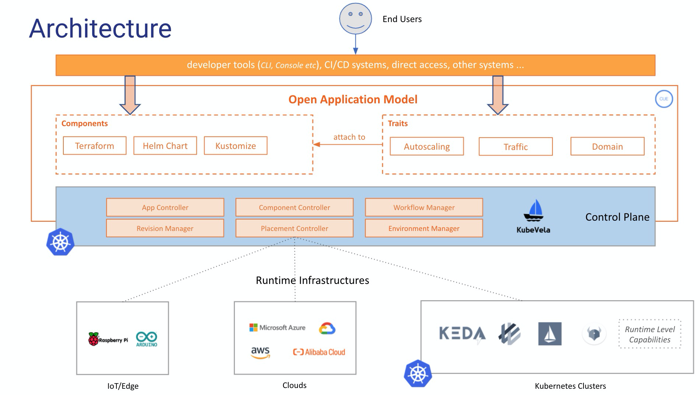

*"KubeVela是一个面向平台构建者的、简单易用但又高度可拓展的基于Kubernetes的云原生平台构建引擎。"*

在本部分中，我们会对KubeVela的核心思想进行详细解释，并进一步阐清一些在本项目中被广泛使用的技术术语。

## 综述

首先，KubeVela引入了下面所述的带有关注点分离思想的工作流：
- **平台团队**
  - 通过给部署环境和可重复使用的能力模块编写模板来构建应用，并将他们注册到集群中。
- **业务用户**
  - 选择部署环境、模型和可用模块来组装应用，并把应用部署到目标环境中。

工作流如下图所示:


这种基于模板的工作流，通过使用一系列的Kubernetes的CRD，使平台团队能够执行最佳的实践和deployment confidence成为现实，并且可以很自然地为业务用户提供平台即服务的体验（比如：app-centric， higher level abstractions， self-service operations）。


下面开始介绍KubeVela的核心概念

## `Application`
*Application*，应用，是KubeVela的核心API。它允许开发者通过一个单一的artifact来使用简化的primitives来描述完整的应用部署。

在应用交付平台，为了简化运维任务，并且作为避免操作过程中产生configuration drifts的固定点，*Application*这个概念尤为重要。同时，此概念为将Kubernetes的能力引入应用交付过程提供了一个更简单的，不用依赖底层细节的途径。 举个例子，开发者能够不需要每次都定义一个详细的Kubernetes Deployment + Service的组合来建模一个web service，或者不用依靠底层的KEDA ScaleObject来获取自动扩容的需求。

### 举例

一个需要两个组件（比如`frontend`和`backend`）的`website`应用可以如下建模：

```yaml
apiVersion: core.oam.dev/v1beta1
kind: Application
metadata:
  name: website
spec:
  components:
    - name: backend
      type: worker
      properties:
        image: busybox
        cmd:
          - sleep
          - '1000'
    - name: frontend
      type: webservice
      properties:
        image: nginx
      traits:
        - type: autoscaler
          properties:
            min: 1
            max: 10
        - type: sidecar
          properties:
            name: "sidecar-test"
            image: "fluentd"
```

## 构建抽象

不像大多数的higher level abstractions，KubeVela中的`Application`资源是一种积木风格的对象，而且它甚至没有固定的schema。相反，它由构建模块（比如应用组件app components和运维能力traits等）构成。这种构建模块允许开发者通过自己定义的抽象来集成平台的能力到此应用定义。

定义抽象和建模平台能力的构建模块是`ComponentDefinition`和`TraitDefinition`。

### ComponentDefinition

`ComponentDefinition`，组件定义，是一个预先定义好的，用于可部署的工作负载的*模板*。它包括了模板，参数化的和工作负载特性的信息作为一种声明式API资源。

因此，`Application`抽象本质上定义了在目标集群中，用户想要如何来**实例化**给定component definition。特别地，`.type`字段引用安装了的`ComponentDefinition`的名字;`.properties`字段是用户设置的用来实例化它的值。

一些主要的component definition有：长期运行的web service、一次性的task和Redis数据库。所有的component definition均应在平台提前安装，或由组件提供商，比如第三方软件供应商，来提供。

### TraitDefinition

可选的，每一个组件都有一个`.traits`部分。这个部分通过使用操作类行为，比如负载均衡策略、网络入口路由、自动扩容策略，和升级策略等，来增强组件实例。

*Trait*，运维能力，是由平台提供的操作性质的特性。为了给组件实例附加运维能力，用户需要声明`.type`字段来引用特定的`TraitDefinition`和`.properties`，以此来设置给定运维能力的属性值。相似的，`TraitDefiniton`同样允许用户来给这些操作特性定义*模板*。

在KubeVela中，我们还将component definition和trait definitions定义称为*“capability definitions”*。

## Environment
在将应用发布到生产环境之前，在testing/staging workspace中测试代码很重要。在KubeVela，我们将这些workspace描述为“deployment environments”，部署环境，或者简称为“environments”，环境。每一个环境都有属于自己的配置（比如说，domain，Kubernetes集群，命名空间，配置数据和访问控制策略等）来允许用户创建不同的部署环境，比如“test”，和“production”。

到目前为止，一个KubeVela的`environment`只map到一个Kubernetes的命名空间。集群级环境正在开发中。

### 总结

KubeVela的主要概念由下图所示：


## 架构

KubeVela的整体架构由下图所示：



特别的，application controller负责应用的抽象和封装（比如负责`Application` 和 `Definition`的controller）。Rollout contoller负责以整个应用为单位处理渐进式rollout策略。多集群部署引擎，在traffic shifting和rollout特性的支持下，负责跨多集群和环境部署应用。
