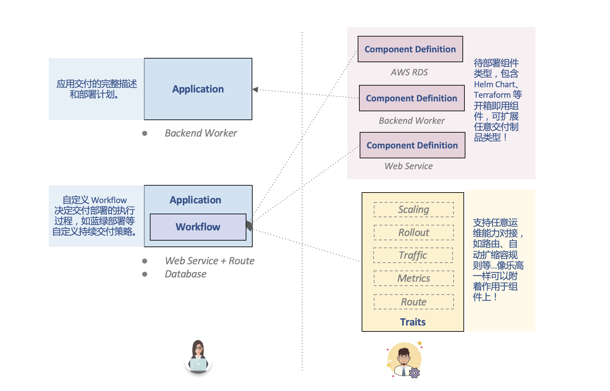

KubeVela 背后的应用交付模型是 [OAM（Open Application Model）](../platform-engineers/oam/oam-model.md)，其核心是将应用部署所需的所有组件和各项运维动作，描述为一个统一的、与基础设施无关的“部署计划”，进而实现在混合环境中进行标准化和高效率的应用交付。这个应用部署计划就是这一节所要介绍的 **Application** 对象，也是 OAM 模型的使用者唯一需要了解的 API。

## 应用程序部署计划（Application）

KubeVela 通过 YAML 文件的方式描述应用部署计划。一个典型的 YAML 样例如下：

```yaml
# sample.yaml
apiVersion: core.oam.dev/v1beta1
kind: Application
metadata:
  name: website
spec:
  components:
    - name: frontend              # 比如我们希望部署一个实现前端业务的 Web Service 类型组件
      type: webservice
      properties:
        image: nginx
      traits:
        - type: cpuscaler         # 给组件设置一个可以动态调节 CPU 使用率的 cpuscaler 类型运维特征
          properties:
            min: 1
            max: 10
            cpuPercent: 60
        - type: sidecar           # 往运行时集群部署之前，注入一个做辅助工作的 sidecar
          properties:
            name: "sidecar-test"
            image: "fluentd"
    - name: backend
      type: worker
      properties:
        image: busybox
        cmd:
          - sleep
          - '1000'
  workflow:
    steps:
        # 步骤名称
      - name: deploy-frontend
        # 指定步骤类型
        type: apply-component
        properties:
          # 指定组件名称
          component: frontend
      - name: manual-approval
        # 工作流内置 suspend 类型的任务，用于暂停工作流
        type: suspend
      - name: deploy-backend
        type: apply-component
        properties:
          component: backend  
  policies:
    - name: demo-policy
      type: env-binding
      properties:
        engine: local
        envs:
          - name: test
            patch:
              components:
                - name: nginx-server
                  type: webservice
                  properties:
                    image: nginx:1.20
                    port: 80
            placement:
              namespaceSelector:
                name: test
```

这里的字段对应着：

- `apiVersion`：所使用的 OAM API 版本。
- `kind`：种类。我们最经常用到的就是 Pod 了。
- `metadata`：业务相关信息。比如这次要创建的是一个网站。
- `Spec`：描述我们需要应用去交付什么，告诉 Kubernetes 做成什么样。这里我们放入 KubeVela 的 `components`。
- `components`：一次应用交付部署计划所涵盖的全部组件。
- `traits`：应用交付部署计划中每个组件独立的运维特征。
- `workflow`：自定义应用交付的工作流，可以不填，则默认依次全部创建。
- `policies`：应用策略。示例中的 `env-binding` 可以为应用提供差异化配置和环境调度策略。

下面这张示意图诠释了它们之间的关系：


先有一个总体的应用部署计划 Application。在此基础之上我们申明应用主体为可配置、可部署的组件（Components），并同时对应地去申明，期望每个组件要拥有的相关运维特征 （Traits），如果有需要，还可以申明自定义的执行流程 （Workflow）。

你使用 KubeVela 的时候，就像在玩“乐高“积木：先拿起一块大的“应用程序”，然后往上固定一块或几块“组件”，组件上又可以贴上任何颜色大小的“运维特征”。同时根据需求的变化，你随时可以重新组装，形成新的应用部署计划。

## 组件（Components）

KubeVela 内置了常用的组件类型，使用 [KubeVela CLI](../getting-started/quick-install.mdx##3) 命令查看：
```
vela components 
```
返回结果：
```
NAME       	NAMESPACE  	WORKLOAD                             	DESCRIPTION                                                 
alibaba-rds	default    	configurations.terraform.core.oam.dev	Terraform configuration for Alibaba Cloud RDS object        
task       	vela-system	jobs.batch                           	Describes jobs that run code or a script to completion.     
webservice 	vela-system	deployments.apps                     	Describes long-running, scalable, containerized services    
           	           	                                     	that have a stable network endpoint to receive external     
           	           	                                     	network traffic from customers.                             
worker     	vela-system	deployments.apps                     	Describes long-running, scalable, containerized services    
           	           	                                     	that running at backend. They do NOT have network endpoint  
           	           	                                     	to receive external network traffic.                        

```

你可以继续使用 [Helm 组件](../end-user/components/helm)和[Kustomize 组件](../end-user/components/kustomize)等开箱即用的 KubeVela 内置组件来构建你的应用部署计划。

如果你是熟悉 Kubernetes 的平台管理员，你可以通过[自定义组件入门](../platform-engineers/components/custom-component)文档了解 KubeVela 是如何扩展任意类型的自定义组件的。特别的，[Terraform 组件](../platform-engineers/components/component-terraform) 就是 KubeVela 自定义组件能力的一个最佳实践，可以满足任意云资源的供应，只需少量云厂商特定配置（如鉴权、云资源模块等），即可成为一个开箱即用的云资源组件。

## 运维特征（Traits）

KubeVela 也内置了常用的运维特征类型，使用 [KubeVela CLI](../getting-started/quick-install.mdx##3) 命令查看：
```
vela traits 
```
返回结果：
```
NAME       	NAMESPACE  	APPLIES-TO       	CONFLICTS-WITH	POD-DISRUPTIVE	DESCRIPTION                                          
annotations	vela-system	deployments.apps 	              	true          	Add annotations for your Workload.                   
cpuscaler  	vela-system	webservice,worker	              	false         	Automatically scale the component based on CPU usage.
ingress    	vela-system	webservice,worker	              	false         	Enable public web traffic for the component.         
labels     	vela-system	deployments.apps 	              	true          	Add labels for your Workload.                        
scaler     	vela-system	webservice,worker	              	false         	Manually scale the component.                        
sidecar    	vela-system	deployments.apps 	              	true          	Inject a sidecar container to the component.   
```

你可以继续阅读用户手册里的 [绑定运维特征](../platform-engineers/traits/built-in/ingress) ，具体查看如何完成各种运维特征的开发。

如果你是熟悉 Kubernetes 的平台管理员，也可以了解 KubeVela 中[自定义运维特征](../platform-engineers/traits/customize-trait) 的能力，为你的用户扩展任意运维功能。

## 工作流（Workflow）

KubeVela 的工作流机制允许用户自定义应用部署计划中的步骤，粘合额外的交付流程，指定任意的交付环境。简而言之，工作流提供了定制化的控制逻辑，在原有 Kubernetes 模式交付资源（Apply）的基础上，提供了面向过程的灵活性。比如说，使用工作流实现暂停、人工验证、状态等待、数据流传递、多环境灰度、A/B 测试等复杂操作。

工作流是 KubeVela 实践过程中基于 OAM 模型的进一步探索和最佳实践，充分遵守 OAM 的模块化理念和可复用特性。每一个工作流模块都是一个“超级粘合剂”，可以将你任意的工具和流程都组合起来。使得你在现代复杂云原生应用交付环境中，可以通过一份申明式的配置，完整的描述所有的交付流程，保证交付过程的稳定性和便利性。

> 需要说明的是，工作流机制是应用交付过程中的强大补充能力，但并非必填能力，用户在不编写 Workflow 过程的情况下，依旧可以完成组件和运维策略的自动化部署。

在上面的例子中，我们已经可以看到一些工作流的步骤：

- 这里使用了 `apply-component` 和 `suspend` 类型的工作流步骤：
  - `apply-component` 类型可以使用户部署指定的组件及其运维特征。
  - 在第一步完成后，开始执行 `suspend` 类型的工作流步骤。该步骤会暂停工作流，我们可以查看集群中第一个组件的状态，当其成功运行后，再使用 `vela workflow resume website` 命令来继续该工作流。
  - 当工作流继续运行后，第三个步骤开始部署组件及运维特征。此时我们查看集群，可以看到所以资源都已经被成功部署。

关于工作流，你可以从[指定组件部署](../end-user/workflow/apply-component)这个工作流节点类型开始逐次了解更多 KubeVela 当前的内置工作流节点类型。

如果你是熟悉 Kubernetes 的平台管理员，你可以[学习创建自定义工作流节点类型](../platform-engineers/workflow/steps)，或者通过[设计文档](https://github.com/oam-dev/kubevela/blob/master/design/vela-core/workflow_policy.md)了解工作流系统背后的设计和架构.

## 应用策略（Policy)

应用策略（Policy）负责定义应用级别的部署特征，比如健康检查规则、安全组、防火墙、SLO、检验等模块。

应用策略的扩展性和功能与运维特征类似，可以灵活的扩展和对接所有云原生应用生命周期管理的能力。相对于运维特征而言，应用策略作用于一个应用的整体，而运维特征作用于应用中的某个组件。

## 下一步

后续步骤:

- 加入 KubeVela 中文社区钉钉群，群号：23310022。
- [阅读**用户手册**基于开箱即用功能，构建你的应用部署计划](../end-user/component-delivery)。
- [阅读**管理员手册**了解 KubeVela 的扩展方式和背后的原理](../platform-engineers/oam/oam-model)。