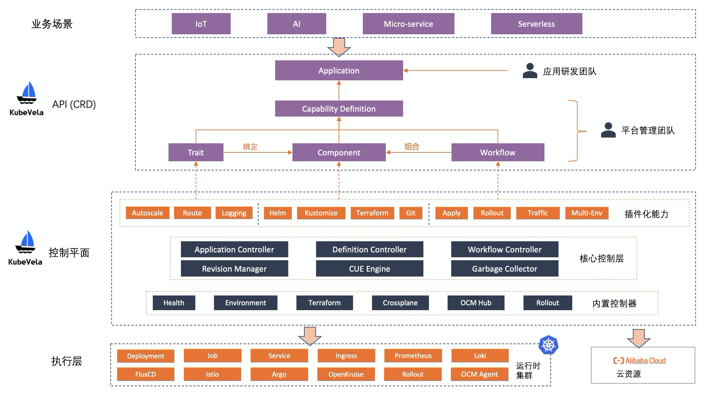

KubeVela 的系统在默认安装的模式下，是一个只包含“控制平面”的架构，通过插件机制与各种运行时系统进行紧密配合。其中 KubeVela 核心控制器工作在管控 Kubernetes 集群。
如下图所示，自上而下看，用户只与 KubeVela 所在的控制面 Kubernetes 集群发生交互。

## 应用（Application）控制器

应用控制器是 KubeVela 的核心控制器，也是 KubeVela 唯一一个必须要安装且不可替换的控制器，负责应用的全生命周期管控，主要包含应用版本化、交付模型引擎、工作流引擎等模块，即图中淡红色部分框图。

* 版本化控制（Revision Manager）：对于 KubeVela 而言，应用的每一次变动都会生成两种类型的版本，一个是应用的版本（AppRevision），一个是组件版本（Component Revision）。应用版本主要作为应用的快照记录，可以方便的进行应用修改的审计。组件的版本主要用于组件的滚动升级与回滚，也可以指定不同的组件版本同时运行，并做发布时的流量控制。
* 交付模型引擎（CUE Engine）：KubeVela 采用 Open Application Model（OAM）作为应用交付模型，并通过 [CUE](https://cuelang.org/) 配置语言来实现该模型，从而以可编程的方式（IaC）对待交付组件、运维能力、用户输入和交付工作流进行统一的编排和管理。
* 工作流引擎（Workflow Engine）：工作流是一次应用部署执行过程的描述，用户可以通过工作流自己定义部署的完整流程，或者灵活的插入各种步骤。举例来说，用户可以在工作流的最开始加入一个环境初始化的节点，这个工作流节点可以是创建一个运行时 Kubernetes 集群，或者是在一个环境上安装某种系统组件。然后再将应用部署到刚刚初始化完成的部署环境中。简而言之，**KubeVela 的工作流使得应用部署的完整流程可以通过一份声明式配置文件完成描述**。

## 模块定义（Definition）控制器

模块定义（Definition）控制器管理各 OAM 模块对象的生命周期，比如组件定义模块（ComponentDefinition）、运维特征模块（TraitDefinition）等等。模块定义控制器会为这些模块的修改生成不同的版本，自动生成操作文档，对接的 OpenAPI Schema 等辅助信息，方便其他系统对接。

## 健康检查控制器

健康检查控制器是默认的健康检查组件，将散落的 Kubernetes 资源汇总并提供应用整体的部署健康状态和拓扑结构，甚至能够将不同集群的健康状态汇总，并周期性的进行部署状态健康检查。
健康检查策略方面，不仅支持常见 Kubernetes 资源的自动化健康检查，同时可以基于 CUE 配置语言进行自定义健康检查策略。甚至平台构建者可以完全自己编写一个 Kubernetes 控制器，实现自定义健康检查逻辑。这一切都是基于 OAM 标准概念可插拔的。

## 环境差异化配置控制器

环境差异化配置（EnvBinding）控制器提供了针对不同的环境做差异化配置（patch）的能力，同时可以结合多集群组件，根据用户声明的策略将应用组件分发调度到不同的目标集群（环境）。

## 云资源供应控制器

如今 Terraform 已经逐渐成为了云资源创建的主流方式，涵盖了几乎所有云厂商的资源模块。而这里的云资源供应控制器，就是将 Terraform 客户端的功能与 Kubernetes 控制器相结合，在服务端面向终态的持续管理云资源，为 KubeVela 创建可以持续维护和管理的云资源。这个模块也是可插拔的，可以替换成 Crossplane 等其他云资源创建方案。

## 灰度发布（Rollout）控制器

灰度发布（Rollout）控制器可以结合 KubeVela 不同的组件版本进行灰度发布，包含的功能有分批发布、发布暂停、发布回滚、按百分比发布等。可以对接的工作负载包括 Kubernetes 的 Deployment、StatefulSet 等原生能力，以及 OpenKruise 中的 [Cloneset](https://openkruise.io/zh-cn/docs/cloneset.html)。结合 Istio 等 Service Mesh 组件还可以实现蓝绿发布等高级发布功能。

除了默认安装的控制器外，KubeVela 提供了包括多集群在内的一系列开箱即用的插件功能，只需要激活这些插件功能，就可以使用。

## 一键安装的插件化控制器

### FluxCD 控制器

KubeVela 通过 FluxCD 控制器来实现 Helm, Kustomize 等组件的交付，并实现基于 GitOps 模式的组件交付功能。

### OpenKruise 控制器

[OpenKruise](https://openkruise.io/) 控制器工作在运行时集群，提供了多种面向无状态、有状态应用管理的高级工作负载功能，通过 OpenKruise 中的各种高级工作负载，可以实现原地升级、镜像预热等高级功能。

## 下一步

后续步骤:

- 加入 KubeVela 中文社区钉钉群，群号：23310022。
- 阅读[**用户手册**](../end-user/components/helm)，从 Helm 组件开始了解如何构建你的应用部署计划。
- 阅读[**管理员手册**](../platform-engineers/oam/oam-model)了解 KubeVela 的扩展方式和背后的 OAM 模型原理。