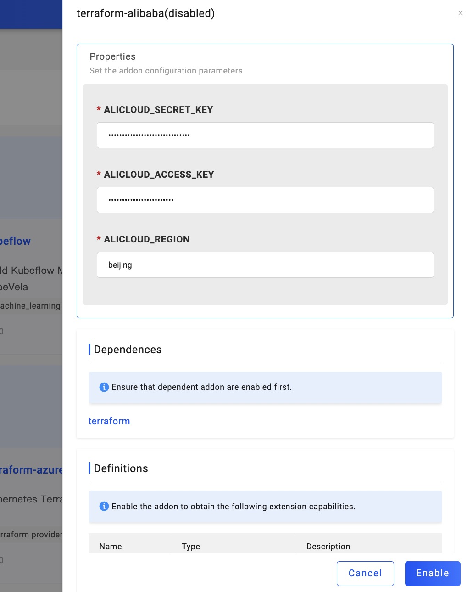
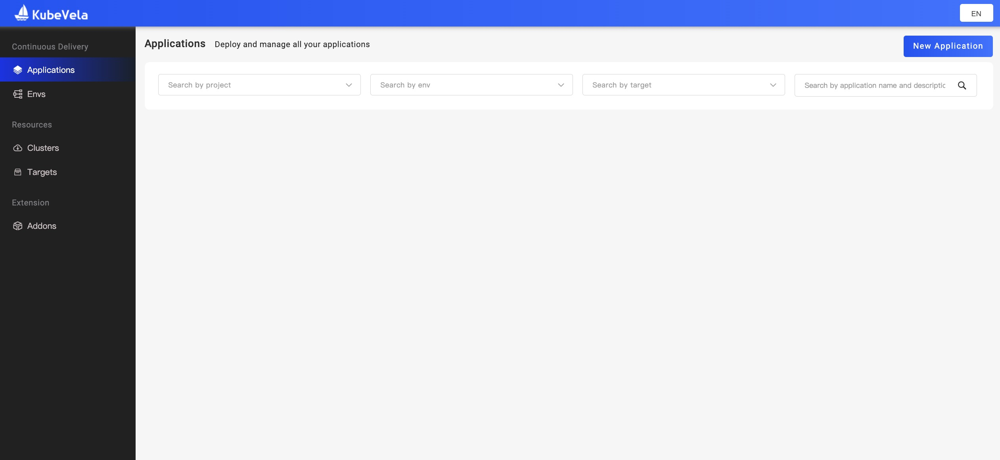
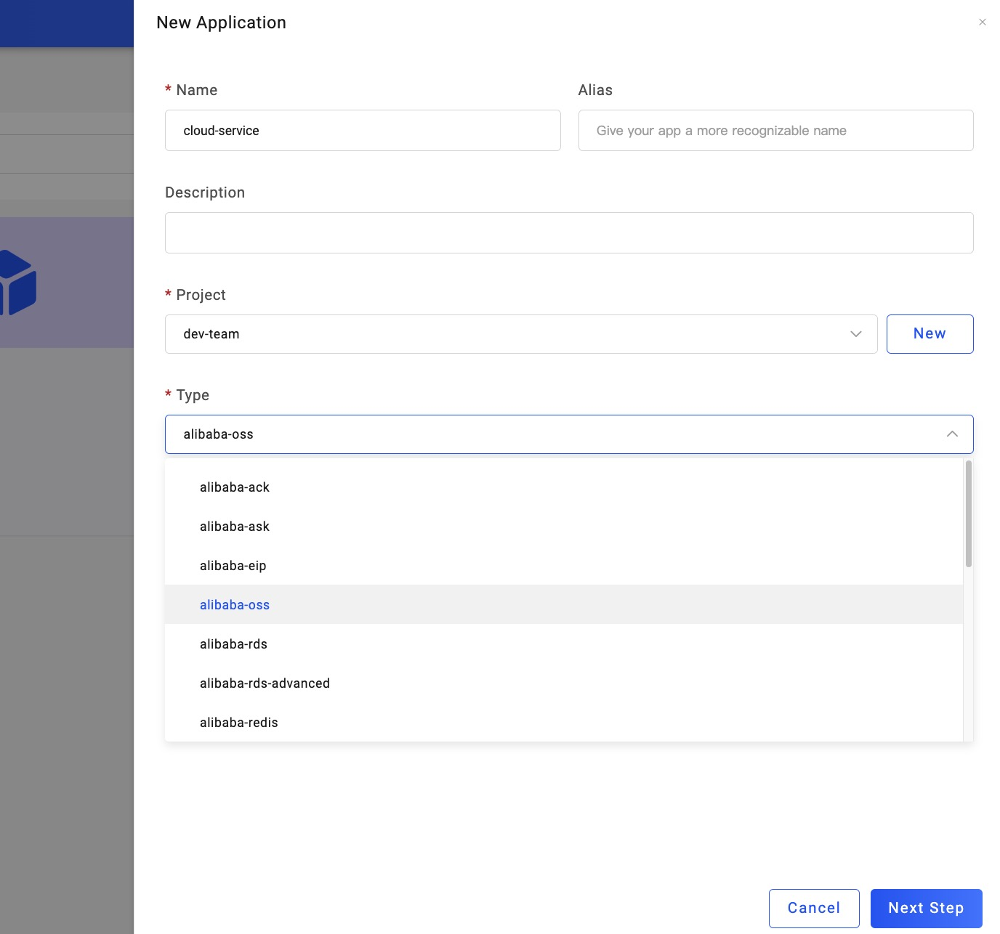

集成云服务是实际开发中最频繁的使用需求之一。从基础的对象存储、云数据库到负载均衡、云缓存，再到基于业务的搜索引擎等等，快速的接入云服务并便捷的使用它们可以大大降低开发成本。与此同时，由于可供选择的云服务厂商非常多，如何管理好接入混合云环境时各类资源之间的关系，也成为必须解决的最大挑战。

> 准备工作：使用云服务需要先启用 Addon 里的对应的 terraform 组件。比如 AliCloud 启用 terraform-alibaba、AWS 启用 terraform-aws 和 Azure 启用 terraform-azure 等等。

在本小节中，我们会为大家演示如何交付一个 AliCloud 的 OSS。

### 1. 开启对应云服务商的插件

首先我们打开 VelaUX Dashboard 的启动页面，选择左侧第四个选项卡 `Addon` ，点开 terraform-alibaba：

接着填入你的 ALICLOUD_ACCESS_KEY，ALICLOUD_REGION 和 ALICLOUD_SECRET_KEY 来 Enable 它。

> 注意：KubeVela 会加密存储以上所有的密钥信息，不用担心泄漏风险

### 2. 创建你需要的云资源类型

开启成功后，让我们回到左侧第一个 `Application` 第一个选项卡，点击右上角的 `New Application` 开始创建应用：

然后选择你需要的 Name 和 Project 后，新建一个 `Type` 是 alibaba-oss 的应用。同时你可以看到，**可供选择使用的云资源类型已经包括了 ACK、RDS、Redis、SLS 等等**：

