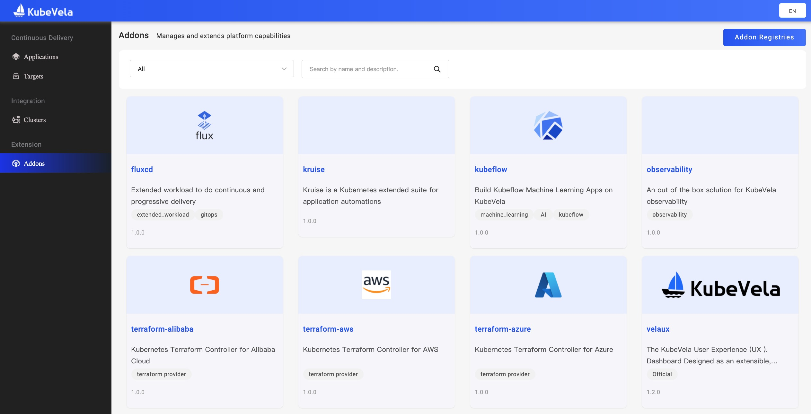
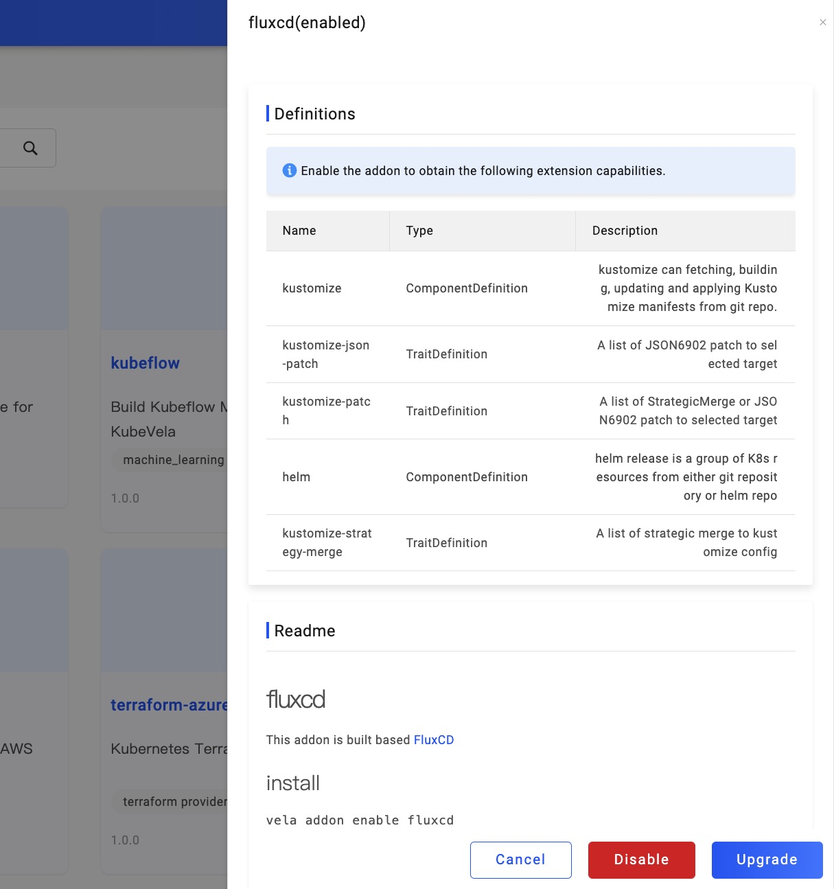
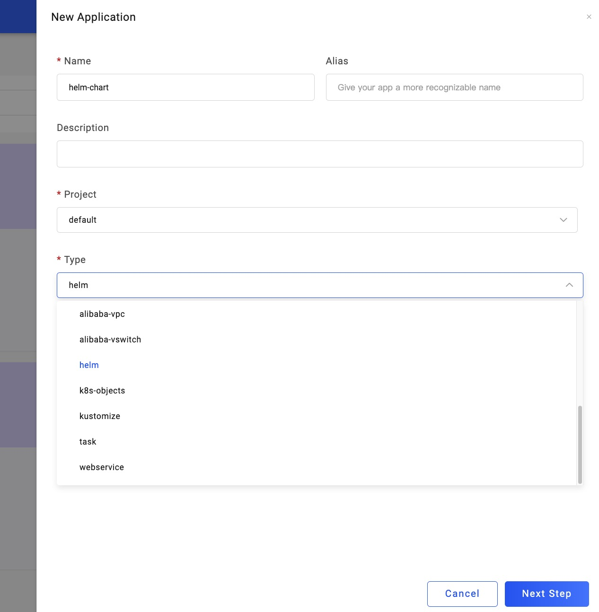
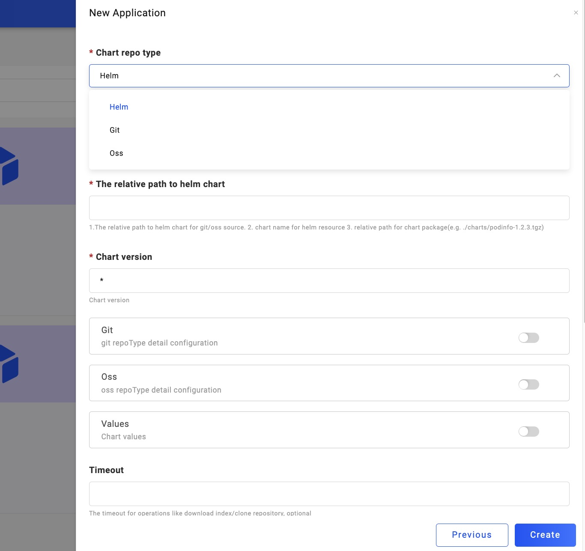
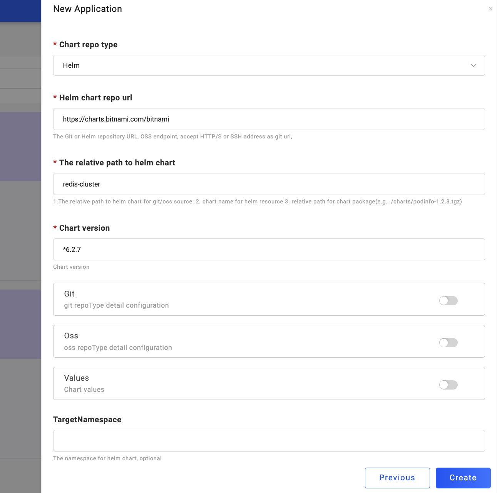

> 准备工作：使用 Helm 需要先启用 Addon 里的 FluxCD。

首先我们打开 VelaUX Dashboard 的启动页面，选择左侧第四个选项卡 `Addon` ，点开 fluxcd 并且 Enable 它：

让我们回到左侧第一个 `Application` 第一个选项卡，点击右上角的 `New Application` 开始创建应用：

然后选择你需要的 Name 和 Project 后，新建一个 `Type` 是 helm 的应用：

目前支持的 Helm Chart 有 Helm Repo、OSS Bucket 和 Git Repo 三种方式：

我们以 Helm Repo 来进行演示。它是来自 bitnami Helm 仓库的 Chart。Chart 类型为 redis-cluster，版本 6.2.7。

创建成功后，点击右上角的 `Deploy` 进行部署，成功后如下：

v1.2 TODO