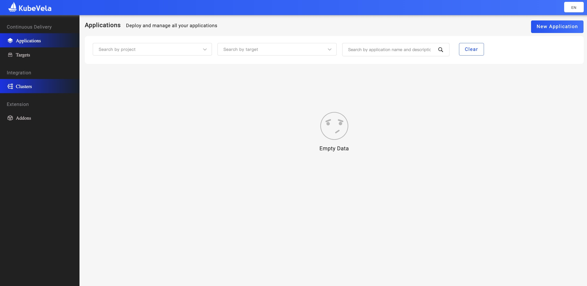
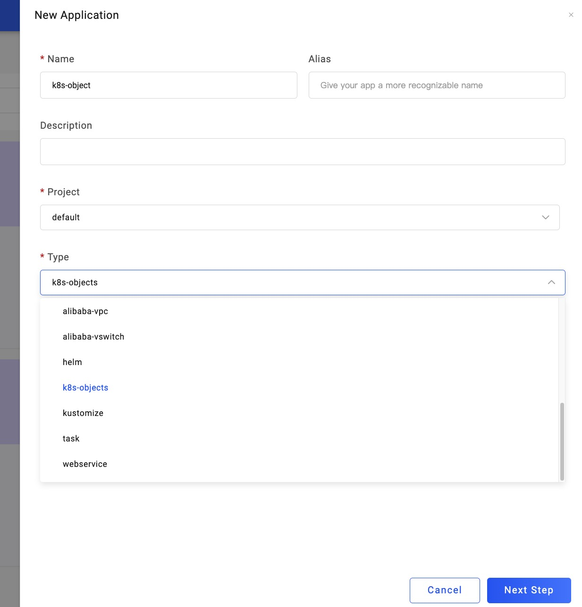
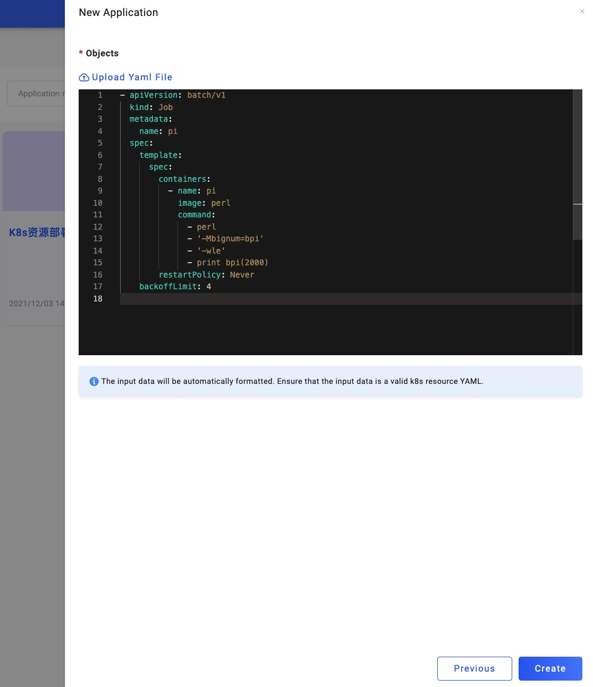
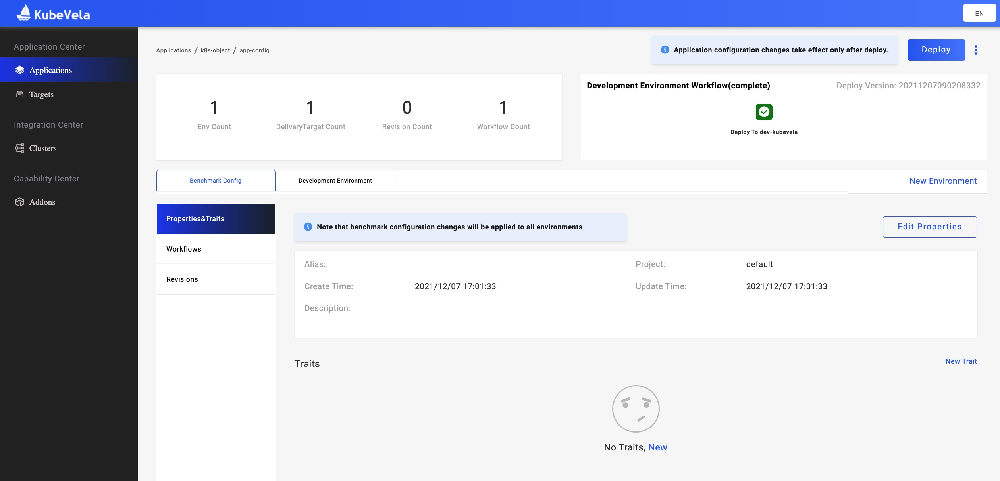

首先我们打开 VelaUX Dashboard 的启动页面，打开左侧第一个 `Application` 第一个选项卡，点击右上角的 `New Application` 开始创建应用：

然后选择你需要的 Name 和 Project 后，新建一个 `Type` 是 k8s-object 的应用：

你可以复制粘贴 YAML 信息或者直接上传一个 YAML 文。在这个示例中，我们跑一个简单的定时任务：

创建成功后，点击右上角的 `Deploy` 进行部署，成功后如下：

