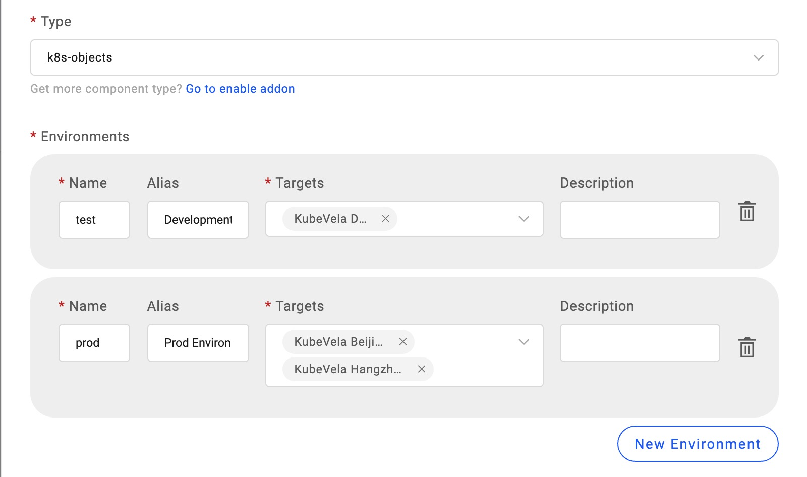
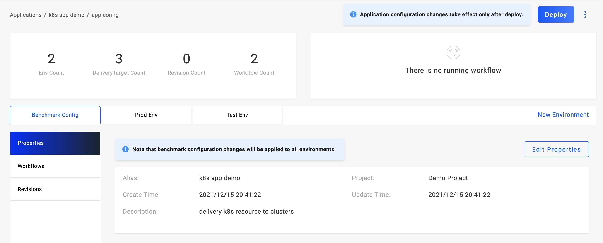
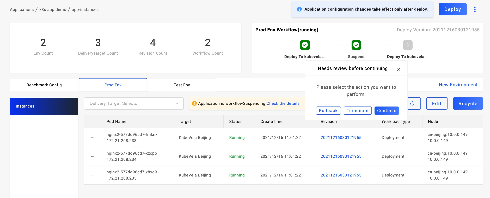
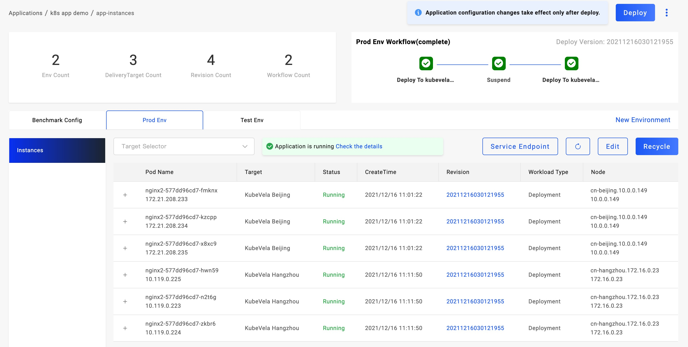

本文介绍了如何使用 KubeVela 将你定义的 Kubernetes 资源交付到多个目标环境和集群。

KubeVela 支持面向应用组织多个 Kubernetes 资源进行交付，常见的用例是 Deployment+Service。我们支持将其通过自定义工作流有序的在多个集群进行交付，因此在本例中你将学习到以下能力：

1. 交付 Kubernetes 原生资源。
2. 初步了解工作流使用方法和场景。
3. 初步了解多环境/多集群的应用发布。
4. 应用发布过程控制：回退、终止和继续。

## 开始之前

- 准备一个 Deployment+Service 资源的 Yaml 定义文件。

<!-- - 准备两个或更多的运行时集群, 参考: [管理运行时集群](./manage-cluster) TODO v1.2-->

## 规划并创建交付目标

[交付目标(Target)](../getting-started/core-concept#交付目标（target）) 定义了应用交付的运行时集群和命名空间，创建交付目标的同时完成运行时集群的命名空间创建。

点击 `New Target` 按钮进入创建流程，填写必要的信息，选择集群、命名空间即可完成创建。我们使用 2 个集群来创建交付目标，当然如果你暂无多个集群，也可以使用一个集群的多个命名空间来创建多个交付目标。我们最少准备 3 个交付目标，1 个用于测试环境，2 个或更多用户生产环境。

## 创建 Kubernetes 应用

完成交付目标创建后，我们开始创建应用。与 [交付第一个应用](../quick-start) 一样，首先我们需要填写应用的基础信息，这里有三个不同点：

（1）选择部署类型 k8s-objects; 该类型用于部署多个 Kubernetes 原生资源，请注意，同一个应用请尽量保持只有一个 Workload 资源，即不要出现多个 Deployment 或者 Statefulset。

（2）环境规划时我们分配两个环境，测试环境和生产环境，其中开发环境选择 1 个准备的开发用交付目标, 生产环境选择多个交付目标。

（3）设置部署参数，直接上传准备好的 Yaml 文件即可。需要注意的是，资源的名称如果在配置中指定，即使用配置的名称，你需要确定其与已存在的资源不冲突，如果不指定，则使用 KubeVela 资源命名规则自动命名。编辑器会自动将输入的内容进行格式化。

设置完成后点击 `Create` 即可完成应用创建。

## 部署测试环境

进入应用管理页面，你会发现改应用自动生成了 2 个环境，2 个工作流。Vela 会自动为每一个环境生成默认的工作流，工作流由`deploy2env`类型的步骤组成，每一个交付目标对于一个步骤，表示将应用交付到该交付目标。

我们首先切换到测试环境 Tab 页面下，点击页面中的 Deploy 按钮进行该环境的部署。由于测试环境我们只分配了一个交付目标，默认情况下工作流步骤只有一步。观察页面右上方的工作流执行状态，其变更为绿色后即已执行完成。如果其为红色，即工作流执行遇到故障，我们将鼠标移动到步骤上方即可查询失败原因，处理异常后工作量会继续重拾，如果故障解决其可完成部署。

部署完成后，刷新实例列表即可查看到 Pod 列表，如果 Pod 运行异常可以点击行查看 Pod 详情信息。

对于测试环境，它当然应该持续进行迭代，当我们变更了部署参数（镜像版本，实例数等），只需要重新执行测试环境的 Workflow 即可升级部署，鼠标移动到页面右上方，选择测试环境的 流水线 执行即可。若点击旁边的 Deploy 按钮，其含义是执行默认的流水线。

## 部署生产环境

当我们在测试环境多次部署完成业务的测试工作以后，我们要开始将应用发布到生产环境，我们切换到生产环境 Tab 下，会发现当前环境处于未部署状态。是的，同一个应用的不同环境是完全隔离管理的，它的背后是生成独立的应用部署实例（Application CR）。

由于我们生产环境有多个交付目标，它默认情况下是根据先后顺序依次部署，这时如果假设大家希望在部署完第一个交付目标后，希望人工审核/校验一下部署状态后再执行后续部署。带着这个需求，我们需要进入到应用基准配置的工作流管理页面。

我们可以看到已经自动生成的两条流水线配置，这时我们点击生产环境流水线的 `Edit` 进入编辑模式，从左侧的工作流步骤的选项中选择 `suspend`, 将其拖入右侧画板中。便捷弹窗将自动出现，该类型没有更多的配置参数，你可以设置别名或直接保存即可。

添加完成后我们需要编排它的顺序，首先断开已有步骤之间的连线（通过点击连线+delete 键）,然后将 suspend 步骤连线在中间即可。编辑完成后需要点击右上方的 Save 按钮即可保存并生效。

工作流编辑完成后回到生产环境页面下，点击 Deploy 按钮，即可开始生产环境的部署。

观察右上方的工作流执行状态，当第一个交付目标完成部署后，即会停止在第二个步骤等待用户进行审核操作，我们从下方的实例列表也可以查看到第一个交付目标的实例已经生成并处于运行状态。

暂停步骤有三个操作可以进行：

- Rollback: 版本回退，即将采用历史最新的完成部署的版本进行重新部署，当前版本部署工作流终止。
- Terminate: 终止，即停止当前版本的部署，但不会改变已经部署的交付目标。
- Continue: 继续执行，进入下一个步骤的执行。

当你选择继续执行后，第二个或更多的交付目标即可完成部署。从实例列表中你可以查看到多个交付目标的实例，可以通过选择交付目标进行实例筛选查询。

到此你已经完成了交付 Kubernetes 原生资源的学习！

<!-- ## 参考视频 TODO v1.2 -->

## 下一步

- [学习交付云厂商服务](./consume-cloud-services)
