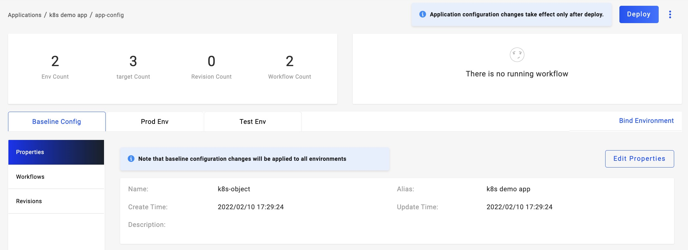

本文介绍了如何使用 KubeVela 将你定义的 Kubernetes 资源交付到多个目标环境和集群。

KubeVela 支持面向应用组织多个 Kubernetes 资源进行交付，常见的用例是 Deployment+Service。我们支持将其通过自定义工作流有序的在多个集群进行交付，因此在本例中你将学习到以下能力：

1. 交付 Kubernetes 原生资源。
2. 初步了解工作流使用方法和场景。
3. 初步了解多环境/多集群的应用发布。
4. 应用发布过程控制：回退、终止和继续。

## 开始之前

- 准备一个 Deployment+Service 资源的定义文件，或直接使用下面的用例：

    <details> <summary>查看Demo用例</summary>

  ```yaml
  ---
  apiVersion: apps/v1 # for versions before 1.9.0 use apps/v1beta2
  kind: Deployment
  metadata:
  name: nginx
  spec:
  strategy:
      type: Recreate
  selector:
      matchLabels:
      app: nginx
  replicas: 1 # tells deployment to run 1 pods matching the template
  template: # create pods using pod definition in this template
      metadata:
      labels:
          app: nginx
      spec:
      containers:
          - name: nginx
          image: nginx
          ports:
              - containerPort: 80
  ---
  apiVersion: v1
  kind: Service
  metadata:
  name: nginx
  namespace: default
  labels:
      app: nginx
  annotations:
      service.beta.kubernetes.io/aws-load-balancer-type: "nlb"
  spec:
  externalTrafficPolicy: Local
  ports:
      - name: http
      port: 80
      protocol: TCP
      targetPort: 80
  selector:
      app: nginx
  type: LoadBalancer
  ```

  </details>

<!-- - 准备两个或更多的运行时集群, 参考: [管理运行时集群](./manage-cluster) TODO v1.2-->

## 规划并创建 Targets

[Target](../getting-started/core-concept#交付目标（target）) 定义了应用交付的 Runtime 集群和 Namespace，创建 Target 的同时完成 Runtime 集群的 Namespace 创建。

Target 必须属于一个项目，同一个项目中的应用可以使用 Target，如果你的企业项目较多，分配 Target 即做好 Namespace 资源分配。

点击 `New Target` 按钮进入创建流程，填写必要的信息，选择项目、集群、Namespace 即可完成创建。我们使用接入的集群分别创建用于同一个项目的 Target，当然如果你暂无多个集群，也可以使用一个集群的多个 Namespace 来创建多个 Target。我们最少准备 3 个 Target，1 个用于测试环境，2 个或更多用户生产环境。

## 创建 Kubernetes 应用

完成 Target 创建后，我们开始创建应用。与[交付第一个应用](../quick-start)一样，首先我们需要填写应用的基础信息，这里有三个不同点：

（1）选择部署类型 k8s-objects; 该类型用于部署多个 Kubernetes 原生资源，请注意，同一个应用请尽量保持只有一个 Workload 资源，即不要出现多个 Deployment 或者 Statefulset。

（2）环境规划时我们分配两个环境，测试环境和生产环境，其中开发环境选择 1 个准备的开发用 Target, 生产环境选择多个 Target。


（3）设置部署参数，直接上传准备好的 Yaml 文件即可。需要注意的是，资源的名称如果在配置中指定，即使用配置的名称，您需要确定其与已存在的资源不冲突，如果不指定，则使用 KubeVela 资源命名规则自动命名。编辑器会自动将输入的内容进行格式化。


设置完成后点击 `Create` 即可完成应用创建。

## 部署测试环境



进入应用管理页面，你会发现改应用自动生成了 2 个环境，2 个工作流。Vela 会自动为每一个环境生成默认的工作流，工作流由`deploy2env`类型的步骤组成，每一个 Target 对于一个步骤，表示将应用交付到该 Target。

我们首先切换到测试环境 Tab 页面下，点击页面中的 Deploy 按钮进行该环境的部署。由于测试环境我们只分配了一个 Target，默认情况下工作流步骤只有一步。观察页面右上方的工作流执行状态，其变更为绿色后即已执行完成。如果其为红色，即工作流执行遇到故障，我们将鼠标移动到步骤上方即可查询失败原因，处理异常后工作量会继续重拾，如果故障解决其可完成部署。

部署完成后，刷新实例列表即可查看到 Pod 列表，如果 Pod 运行异常可以点击行查看 Pod 详情信息。


对于测试环境，它当然应该持续进行迭代，当我们变更了部署参数（镜像版本，实例数等），只需要重新执行测试环境的 Workflow 即可升级部署，鼠标移动到页面右上方，选择测试环境的 流水线 执行即可。若点击旁边的 Deploy 按钮，其含义是执行默认的流水线。


## 部署生产环境

当我们在测试环境多次部署完成业务的测试工作以后，我们要开始将应用发布到生产环境，我们切换到生产环境 Tab 下，会发现当前环境处于未部署状态。是的，同一个应用的不同环境是完全隔离管理的，它的背后是生成独立的应用部署实例（Application CR）。

由于我们生产环境有多个 Target，它默认情况下是根据先后顺序依次部署，这时如果假设大家希望在部署完第一个 Target 后，希望人工审核/校验一下部署状态后再执行后续部署。带着这个需求，我们需要进入到应用基准配置的工作流管理页面。


我们可以看到已经自动生成的两条流水线配置，这时我们点击生产环境流水线的 `Edit` 进入编辑模式，从左侧的工作流步骤的选项中选择 `suspend`, 将其拖入右侧画板中。便捷弹窗将自动出现，该类型没有更多的配置参数，你可以设置别名或直接保存即可。

添加完成后我们需要编排它的顺序，首先断开已有步骤之间的连线（通过点击连线+delete 键）,然后将 suspend 步骤连线在中间即可。编辑完成后需要点击右上方的 Save 按钮即可保存并生效。


工作流编辑完成后回到生产环境页面下，点击 Deploy 按钮，即可开始生产环境的部署。


观察右上方的工作流执行状态，当第一个 Target 完成部署后，即会停止在第二个步骤等待用户进行审核操作，我们从下方的实例列表也可以查看到第一个 Target 的实例已经生成并处于运行状态。

暂停步骤有三个操作可以进行：

- Rollback: 版本回退，即将采用历史最新的完成部署的版本进行重新部署，当前版本部署工作流终止。
- Terminate: 终止，即停止当前版本的部署，但不会改变已经部署的 Target。
- Continue: 继续执行，进入下一个步骤的执行。

当你选择继续执行后，第二个或更多的 Target 即可完成部署。从实例列表中你可以查看到多个 Target 的实例，可以通过选择 Target 进行实例筛选查询。


到此你已经完成了交付 Kubernetes 原生资源的学习！

<!-- ## 参考视频 TODO v1.2 -->

## 下一步
