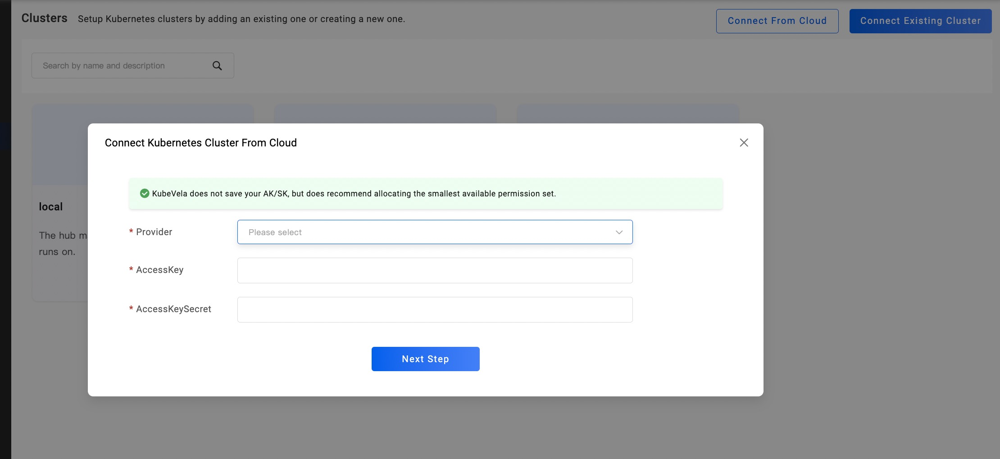
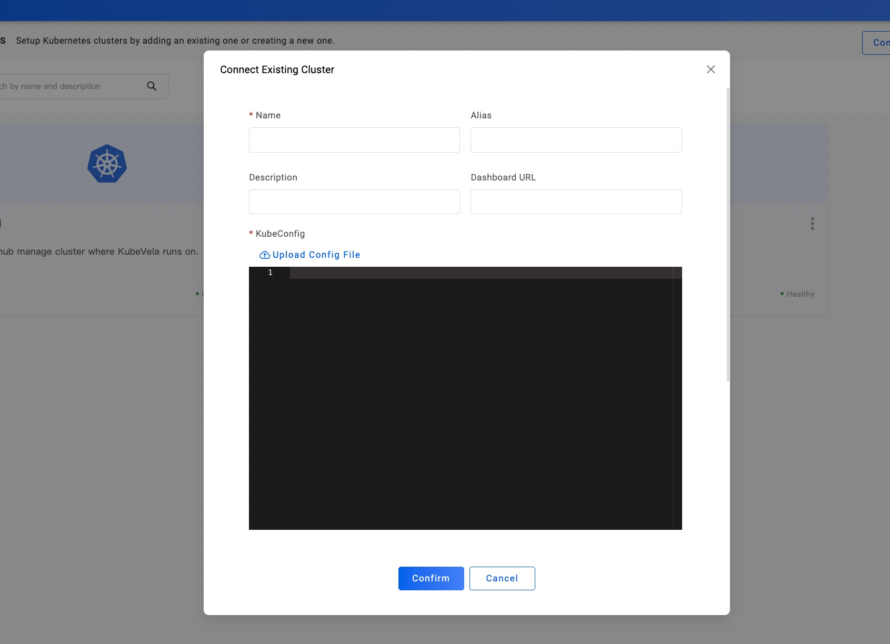
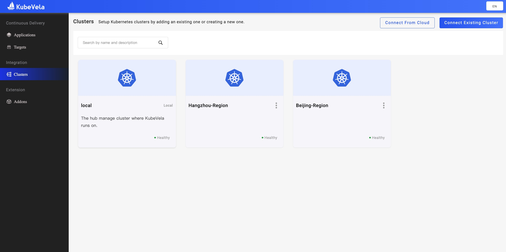

打开 VelaUX Dashboard，选择左侧导航的第三个 `Clusters` 选项。目前右上角提供两种方式，来支持你添加集群：

- Connect From Cloud。如下图一，输入云提供商的 AK/SK 密钥。
  - 这个方式适用于：**从云提供商提供的集群列表中，选择一个你需要的集群添加到 Dashboard 中。**
- Connect Existing Cluster。如下图二，复制粘贴或者直接上传你的某一个集群的 KubeConfig。
  - 这个方式适用于：**把你正在使用的集群直接加入到 Dashboard 中。**

创建 2 个非本地集群。在本示例中，假设我们有了 `Hangzhou-Region` 和 `Hangzhou-Beijing` 这两个集群：

