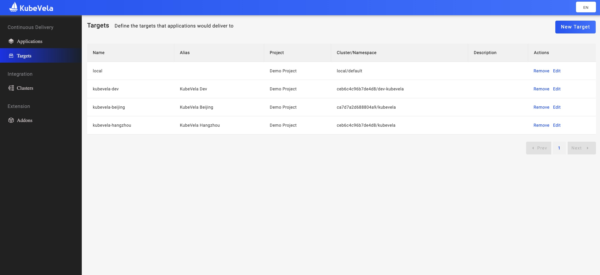
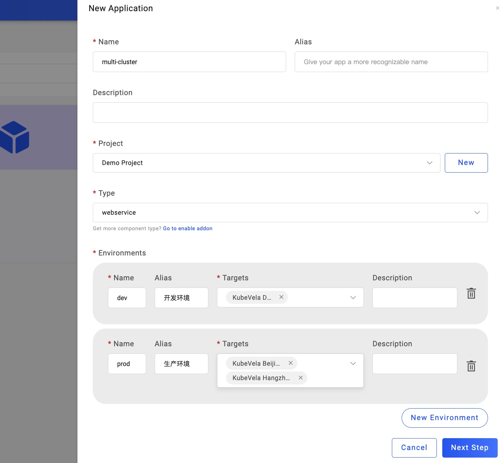
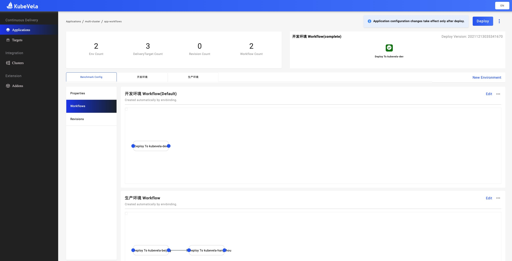
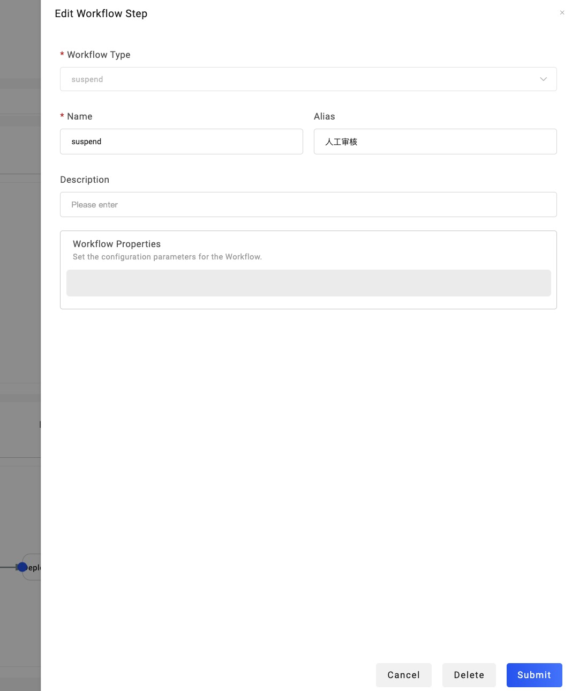
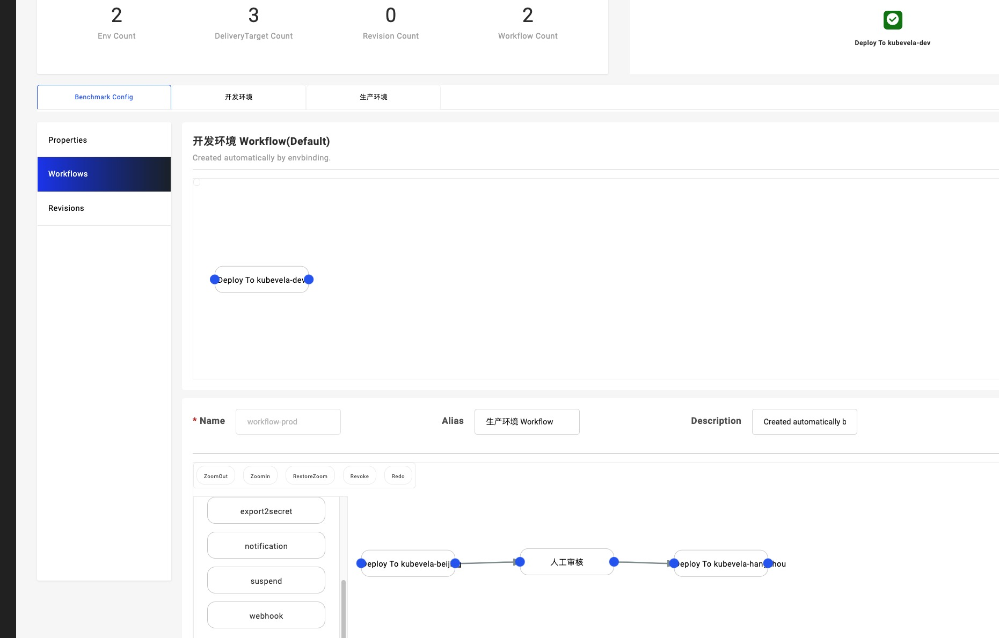
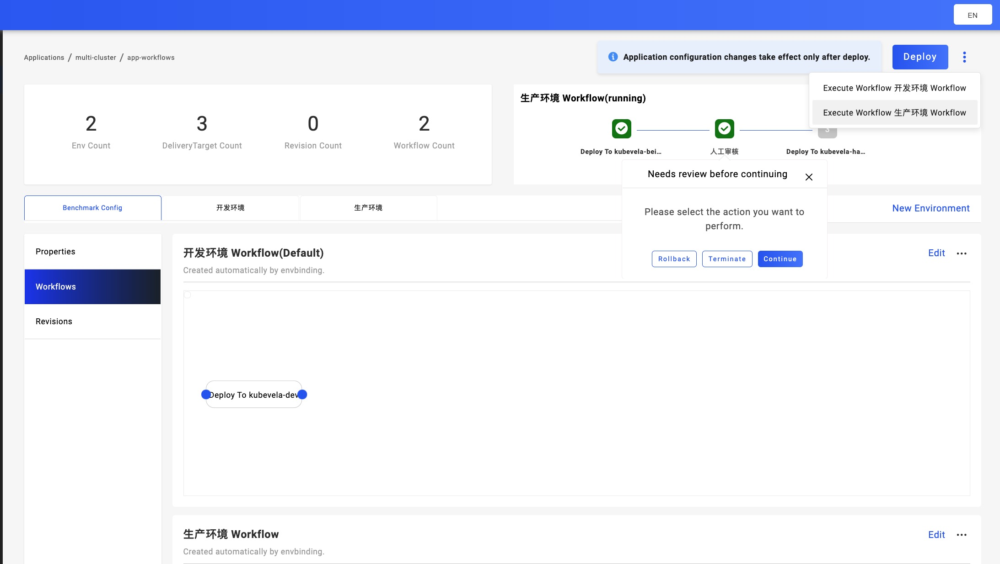
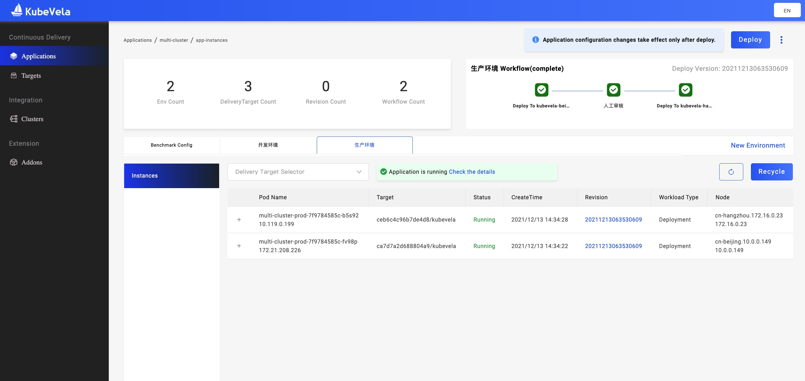

本小节将介绍如何交付多集群下的多环境，以及其中工作流如何在集群之间进行发布。

你将需要操作的步骤有：

1. 创建 2 个非本地的集群 `Cluster`；
2. 新建 3 个交付目标 `Target`。其中 1 个用作开发环境，剩下 2 个来自不同集群，但都用作生产环境。
3. 使用以上 3 交付目标进行环境规划，创建应用并交付。
4. 通过工作流手动审核，控制不同集群之间的应用发布。

## 新建两个集群

打开 VelaUX Dashboard 中，打开左侧导航的第三个 `Clusters` 选项。继续创建第二个来北京节点的集群，因而在本示例中，我们有了 `Hangzhou-Region` 和 `Hangzhou-Beijing` 这两个集群：

## 新建三个交付目标

在上一节中，我们已经有了两个交付目标 `KubeVela Dev` 和 `KubeVela Hangzhou`。我们继续回到左侧导航的第二个 `Targets` 选项，创建出第三个交付目标 `KubeVela Beijing`：

## 交付应用

接下来，我们创建一个 `webservice` 的简单应用，并直接规划环境到以上 3 个交付目标。注意，规划生产环境是，我们**多选**了 `KubeVela Hangzhou` 和 `KubeVela Beijing` 这两个交付目标：

## 工作流控制

可以看到在 `生产环境` 中，我们预先设置了先交付 `KubeVela Beijing` 然后交付到 `KubeVela Hangzhou`：

根据需求，我们有时候会把 `KubeVela Beijing` 作为预发环境，人工确定相关配置的实际表现无误后，再发布到 `KubeVela Hangzhou`。在这种情况，我们可以点击 `生产环境 Workflow` 右边的 `Edit`，拖动一个 `Suspend` 出来，并放到这两个环境之间：

设置完毕之后，当我们执行 `生产环境` 的工作流时，只要第一个环境发布成功，工作流则会自动弹出人工审核的操作窗口如下：

你可以根据实际情况，决定回滚/中止/继续的操作，直到最后 2 个集群都部署成功。

以上，我们仅仅展示了多集群多环境工作流 `Workflow` 一个简单的 `Suspend` 操作。你可以根据开发需求，选用更多操作：跨环境交付 `deploy2env`、增加通知 `notification` 和增加回调触发操作 `webhook` 等等。