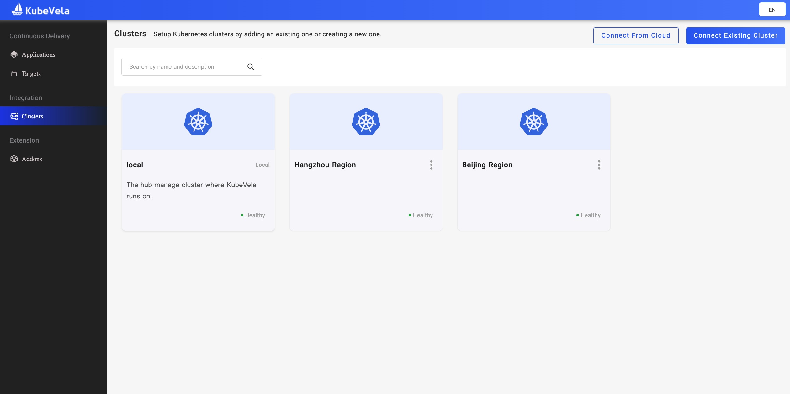

在实际的开发工作中，我们常常会根据需要，设置很多不同的环境类型，常见的比如有：测试、开发、预发和生产环境。同时在应用的交付环节中，我们需要定义和完成比如包括人工审核、数据传递、多集群发布、通知等关键操作。

**本小节将介绍如何交付多集群下的开发、预发和生产环境，演示如何使用工作流的 `suspend` 设置人工审核，来控制从预发环境到正式环境的应用发布流程。**

<!-- 如果你想查看更多的工作流，请直接访问参考文档：跨环境交付 deploy2env、增加通知 notification 和增加回调触发操作 webhook 等等。 -->

##  1. 新建两个非本地集群

打开 VelaUX Dashboard，选择左侧导航的第三个 `Clusters` 选项。目前右上角提供两种方式，来支持你添加集群：
 - Connect From Cloud。如下图一，输入云提供商的 AK/SK 密钥。
   - 这个方式适用于：**你需要从云提供商提供的集群列表中，选择一个需要的集群添加到 Dashboard 中。**
 - Connect Existing Cluster。如下图二，复制粘贴或者直接上传你的某一个集群的 KubeConfig。
   - 这个方式适用于：**把你正在使用的集群直接加入到 Dashboard 中。**

创建 2 个非本地集群。在本示例中，假设我们有了 `Hangzhou-Region` 和 `Hangzhou-Beijing` 这两个集群：

## 2. 新建三个交付目标

有了上面的两个示例集群后，我们在此基础之上，分别创建 3 个交付目标。打开左侧导航的第二个 `Targets` 选项，点击 `New Target` 创建交付目标：

**为了区分和管理交付目标的用途，我们通过 namespace 来加以标识，比如开发环境是 `dev-kubevela`，而预发和生产则是 `kubevela`。同时因为这三个交付目标同属于一个项目，假设它们的 `Project` 都指定为 `Demo Project`。**

这样，我们先创建第一个用于开发环境的交付目标 `KubeVela Dev`。然后再创第二个用作预发环境的交付目标 `KubeVela Beijing`。最后创建第三个用作生产环境的交付目标 `KubeVela Hangzhou`：

## 3. 创建应用

接下来，我们创建一个 `webservice` 的简单应用。注意，在规划生产环境时，我们可以**多选** `KubeVela Hangzhou` 和 `KubeVela Beijing` 这两个交付目标，把它们同时标识为 `生产环境`。**注意，它们在 `Targets`里的先后顺序决定了它们的发布顺序。这也是为什么我们可以通过 `Target` 和 `Environment` 的灵活搭配来完成复杂的多集群多环境管理**：

## 4. 工作流设置人工审核

可以看到在 `生产环境` 中，我们预先设置的是先交付 `KubeVela Beijing` 然后交付到 `KubeVela Hangzhou`：

根据需求，假设我们会把 `KubeVela Beijing` 作为预发环境，人工确定相关配置的实际表现无误后，再发布到作为正式环境的 `KubeVela Hangzhou`。在这种情况，我们可以点击 `生产环境 - Workflow` 右边的 `Edit`，拖动一个 `Suspend` 出来，并放到这两个环境之间。删除之前的连线逻辑，重新编辑连线逻辑：

设置完毕之后，当我们执行 `生产环境` 的工作流时，只要第一个环境发布成功，工作流则会自动弹出人工审核的操作窗口如下：

你可以根据观察到的实际情况，决定下一步采取回滚/中止/继续的操作，直到最后 2 个集群都部署成功。

以上，我们展示了多集群多环境的交付和工作流 `Workflow` 一个的 `Suspend` 操作。

<!-- 你可以查看参考文档，选用更多操作：跨环境交付 `deploy2env`、增加通知 `notification` 和增加回调触发操作 `webhook` 等等。 -->
