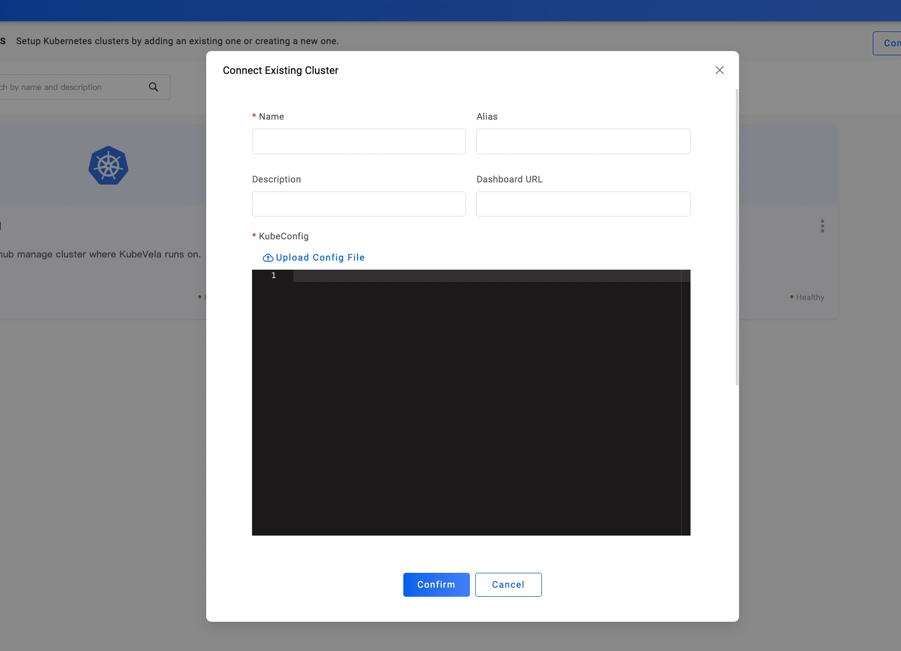

在实际的开发工作中，我们根据需要会设置很多不同的环境类型，常见的比如有：测试、开发和生产环境。本小节将介绍，你如何通过 `Target` 和 `Cluster` 来灵活地完成你的相关环境规划。

在这次的例子中，我们会交付一个简单应用到开发、生产两个环境。你将需要操作的步骤有：

1. 新建 1 个非本地的集群 `Cluster`；
2. 新建 2 个交付目标 `Target`，分别用作为开发环境和生产环境。
3. 创建应用设置环境规划时，对应设置交付目标为所需要的开发环境和生产环境。

在前几节的例子中，为了便于你学习，我们主要通过预设的本地 `local` 集群来演示各类应用的交付。从这里开始，你将需要新建一个你自己的集群。

## 新建一个集群

打开 VelaUX Dashboard 中，打开左侧导航的第三个 `Clusters` 选项。目前右上角提供两种方式，来支持你添加集群：
 - Connect From Cloud。如下图一，输入云提供商的 AK/SK 密钥。
 - Connect Existing Cluster。如下图二，复制粘贴或者直接上传你的某一个集群的 KubeConfig。

创建成功之后，会自动新增到 `Clusters` 列表。现在我们看到集群除了 `local`，也出现了一个叫做 `Hangzhou-Region` 的示例集群：

## 新建两个交付目标

有了上面这个叫做 `Hangzhou-Region` 的示例集群后，我们再次基础之上，创建 2 个交付目标。打开左侧导航的第二个 `Targets` 选项，点击 `New Target` 创建交付目标：

如上图所示，我们先创建一个用于开发环境的交付目标 `kubevela-dev`。

然后再创建一个生产环境的交付目标 `kubevela-hangzhou` 后：

如上图所示，我们在 ID 为 ceb6c4c96b7de4d8 的这个 `Hangzhou-Region` 集群里，新建了两个交付目标 `KubeVela Dev` 和 `KubeVela Hangzhou`。因为两者用于的环境不同，我们以 namespace 加以区分：开发是 `dev-kubevela`，而生产是 `kubevela`。

## 使用开发和生产环境

一切就绪，现在我们来交付一个简单的 `webservice` 应用到开发、生产环境。

再次回到应用创建页面：

可以看到，我们把 `KubeVela Dev` 的这个交付目标用作了开发环境，同时把 `KubeVela Hangzhou` 用作了生产环境。最后对这两个环境，分别点击部署即可：

以上，我们讲解一个单集群部署开发、生产环境的实际操作过程。

下一篇，我们将带你去操作如何交付多集群下的多环境，以及其中工作流如何进行发布到多集群和进行跨环境交付。