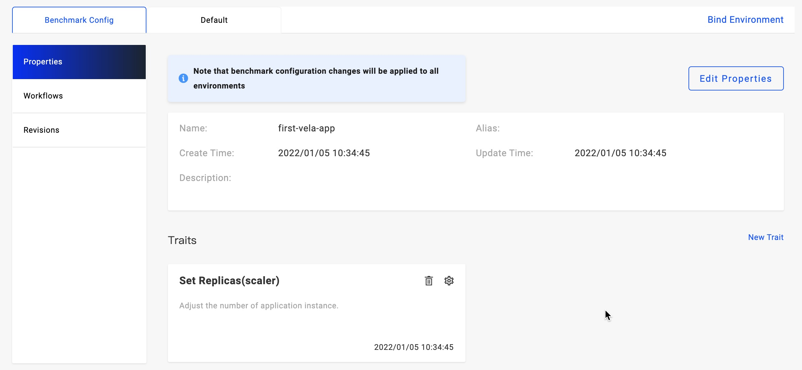

本小节会介绍，基于 KubeVela 手动调整应用的副本数量。

## 开始之前

- 你已参考之前的文档完成了至少一种类型的应用交付部署。

## 使用运维特征

KubeVela 默认内置了 `scalser` 运维特征，该特征支持常规工作负载类型应用的副本数调整，比如 `webservice` 类型和 `k8s-objects` 类型的应用。

> k8s-objects 类型的应用，涉及多个资源时请将 Deployment、Statefulset、Job 等工作负载类资源置于第一个，`scalser` 运维特征即可生效。

我们以 `交付第一个应用` 中的 first-vela-app 为例。首先打开应用的 `Benchmark Config`-`Properties` 页面：

接下来我们点击 Set Replicas 右侧的设置（齿轮）按钮，将应用实例数调整为 3，点击保存后此次更改被暂存。我们需要使其在某个环境生效，需要点击 `Deploy` 按钮或旁边的多环境工作流选择按钮，选择对应的环境执行部署即可。部署完成后可进入环境实例查询页面查看到实例列表中已经出现 3 条数据。

> 运维特征可以提供更多的副本数调整能力，比如 HPA。

## 直接编辑应用部署参数

对于使用 Helm 或其他自定义类型部署类型的创建的应用，如果运维特征不适用，你可以直接编辑部署参数达到调整应用实例数量的效果。比如 Helm 类应用，一般 Chart 包在设计时都提供了副本数设置的参数，通过设置 Values 即可。

以 [apache chart](https://github.com/bitnami/charts/tree/master/bitnami/apache) 为例， 在 Values 中设置 `replicaCount=3` 即可调整副本数量。

## 下一步

- [定义符合企业需求的副本数调整运维特征](../platform-engineers/traits/customize-trait)
