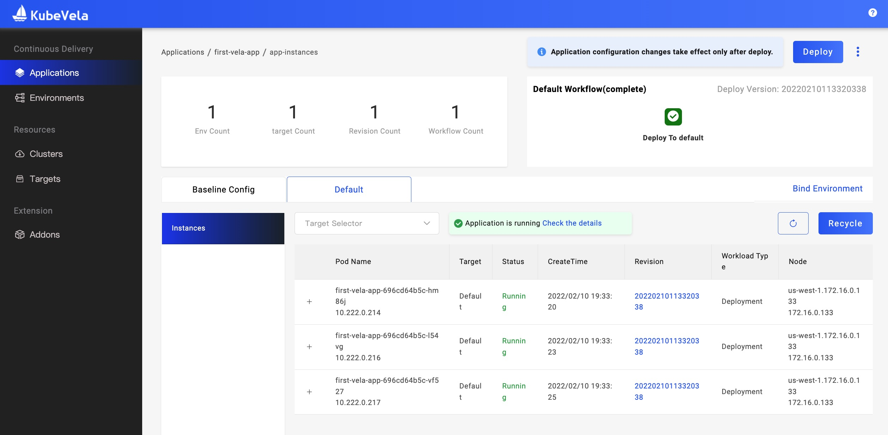

本小节会介绍，如何操作 VelxUX Dashaboard 为应用配置 `scaler` 运维特征，来完成实例数量的管理，满足业务中弹性伸缩的需求。

我们以 `交付第一个应用` 中的 first-vela-app 为例。首先打开应用的 `Benchmark Config-Properties` 页面：

点击 `New Trait` 进入编辑页面，比如我们选择一个实例数为 1 的 `scalser` 运维特征：

接下来我们点击 Trait 的齿轮按钮，再次编辑将实例数调整为 3，可以看到对应环境下的 `Instances` 页面的终态：

