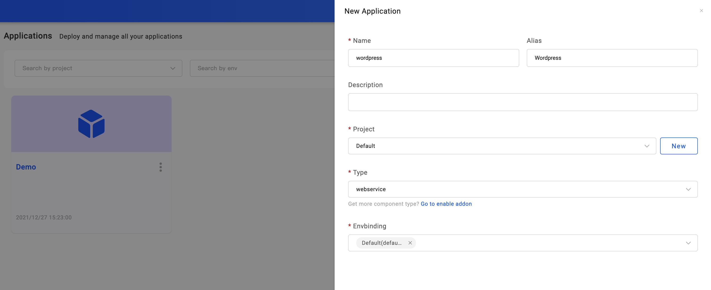
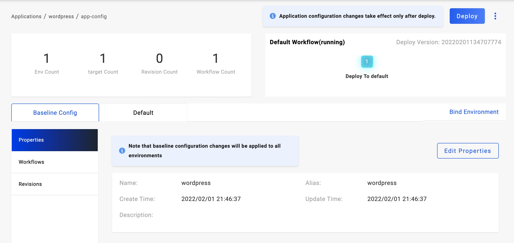
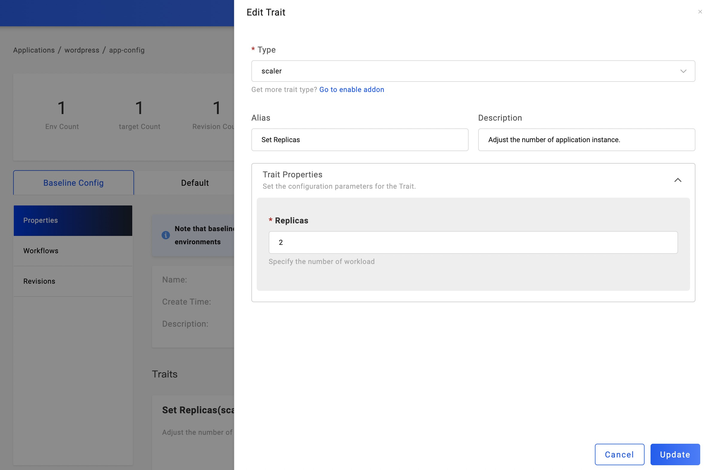

本文介绍企业基于 KubeVela 交付业务应用的操作方式，通过该方式交付应用无需你学习过多的 Kubernetes 领域知识。

## 开始之前

- 完成你的业务容器化，无论你的业务使用何种开发语言，请先将其通过 CI 系统或在本地完成运行镜像打包。

  > KubeVela 未来计划提供支持多种开发语言的容器打包方案，帮助你低门槛完成业务容器化。

- 将你的业务镜像存放于镜像仓库中，KubeVela 管理的集群可以正常获取该镜像。

- 明确你的业务需要设置哪些环境变量，是否有其他中间件依赖（比如数据库、缓存等），如果有，请先部署中间件服务。

## 创建应用

进入 KubeVela 应用管理页面（目录：Applictaions），点击 `New Application` 进入应用创建流程。首先设置应用的名称、别名和描述；选择应用所属的项目，初始情况下已经存在 Default 项目，你也可以创建新的项目; 选择类型 `webservice`；选择发布的环境，初始情况下已经存在 Default 环境可选，你也可以进入环境管理页面(目录：Envs) 创建新的环境。

点击 `Next Step` 进入部署参数设置页面。在当前页面中，我们需要设置业务应用的镜像名称（Image），如果需要设置镜像的启动命令，可以打开`CMD`栏目，添加启用命令，如果需要设置环境变量，可以打开`ENV`栏目，按照需要设置环境变量。

截图所示部署的业务是`Wordpress`，填写了镜像名称`wordpress`和设置了四个环境变量，若您也使用该镜像进行测试，请设置正确的数据库地址变量。

点击`Create`完成应用的创建流程，进入应用管理页面。

## 部署应用

点击页面右上方的`Deploy`按钮，开始应用的部署。点击该按钮的含义是执行默认的工作流。请注意，KubeVela 已经为应用的每一个发布环境生成了对应的工作流。在`Benchmark Config` 的右方即为应用需要交付的环境，点击环境名称即可进入该环境页面查询应用部署状态和应用实例信息。

若该环境中包括多个交付目标，可以切换不同的交付目标查看应用实例列表。点击`Check the details`，在弹窗中可以查看到应用的部署整体进度和创建的资源信息。

在实例列表中可以查看应用实例的交付状态，若其一直处于非运行态，可点击实例行最前方的+号展开实例详情，查看详细信息。

## 变更镜像版本

当应用完成第一次部署后，我们的业务可能在持续开发，后续产生的新版本镜像，我们需要变更镜像版本。点击`Benchmark Config`，进入应用配置页面，点击`Edit Properties` 按钮即可再次进入部署参数设置页面，在该页面中可以变更镜像名称，版本和环境变量等参数。

## 变更应用的副本数量

如果业务应用需要设置多个副本，进入应用配置页面，在运维特征管理中，已经默认挂载了名为`Set Replicas`的运维特征，点击设置图标按钮即可进入副本数调整设置页面，填写你需要设置的副本数量，点击 `Update` 按钮提交即可。

## 应用升级

上述两个步骤分别改变了应用的部署参数和运维特征，但是它还处于草稿状态，我们需要再次点击部署按钮即可将应用完成升级。

## 应用回收与删除

若你测试完成需要将应用删除，需要首先回收所有部署的环境，同样点击环境名称进入环境实例列表查询页面，点击 `Recycle` 按钮即可回收应用在该环境的部署。回收完成后应用在该环境进入未部署状态。

当所有环境都已回收完成后，可进行应用删除操作。目前应用删除入口在应用列表页面。点击左侧目录，回到应用列表页面，鼠标应用名称右侧的操作图标上，点击`Remove`选项即可。

到此，您已经基本掌握了业务应用的部署方法，更多的部署参数支持都集中在应用部署参数设置页面之中。

## 下一步

[学习基于 Helm Chart 部署中间件应用](./helm)
