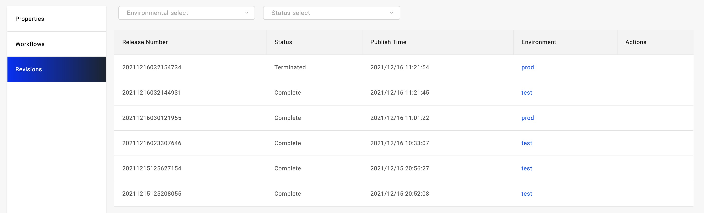

本文详细介绍应用工作流的功能和使用场景，带你更全面的了解工作流。

在 [交付 Kubernetes 原生资源](./k8s-object) 一文中，我们初识了工作流的一个重要使用场景，即人工介入多集群发布的过程，实现可控多集群发布。在本文中我们继续介绍以下话题：

1. 进一步了解 Workflow 、Revision 和 Env 的关系，以及目前内置的 Workflow 步骤。
2. 在工作流中实现通知。
3. 在工作流中进行数据初始化。

## 开始之前

本文介绍内容相对深入，在此之前，建议先参考 [交付第一个应用](../quick-start), [交付 Kubernetes 原生资源](./k8s-object) 等文章了解其他基础知识和流程。

## 工作流与应用版本的关系

应用进行部署的动作则为执行某一个工作流发布一个版本，版本状态跟随工作流的执行状态，也就是说工作流执行完成，则代表该版本处于完成发布的状态。工作流与应用发布的环境绑定，即应用的每一个环境都有独立的工作流。

我们会支持企业用户自定义发布的版本号，对接 CI 系统后，版本直接与 Code Commit 关联，实现版本可追溯。在版本操作中后续会实现版本回退功能，用户可在任何时候选择将某个环境回退到指定版本。

## 内置支持的工作流步骤

在 [交付 Kubernetes 原生资源](./k8s-object.mdx) 文章中，我们使用了人工审核步骤`suspend`。我们再来了解一下其他内置的步骤分别是什么作用：

- `deploy2env`: 应用交付到指定 Target。该步骤 Vela 会根据环境中配置的 Target 自动生成。
- `deploy-cloud-resource`: 云资源应用交付到指定 Target。该步骤 Vela 会为云资源应用，根据环境中配置的 Target 自动生成，需要注意的是，该类型步骤与 deploy2env 的区别在于控制云资源创建的 CR 资源是部署到管控集群的，服务创建完成生成访问密钥(Secret)后，将 Secret 分发到 Target 指定集群和 Namespace。
- `share-cloud-resource`: 分发云服务生成的 Secret 到指定 Target，使用该步骤实现云服务多集群共享，即在多集群应用中只创建一个云服务，将其访问密钥分发到多个集群，实现服务共享。
- `notification`: 通知，支持钉钉、邮件、Slack 三种通知模式，用户可将其置于工作流的任何阶段实现消息通知。
- `webhook`: Web 钩子，用户可将其置于工作流任何阶段，实现对外部系统的调用。

## 实现消息通知

## 扩展工作流实现数据初始化
