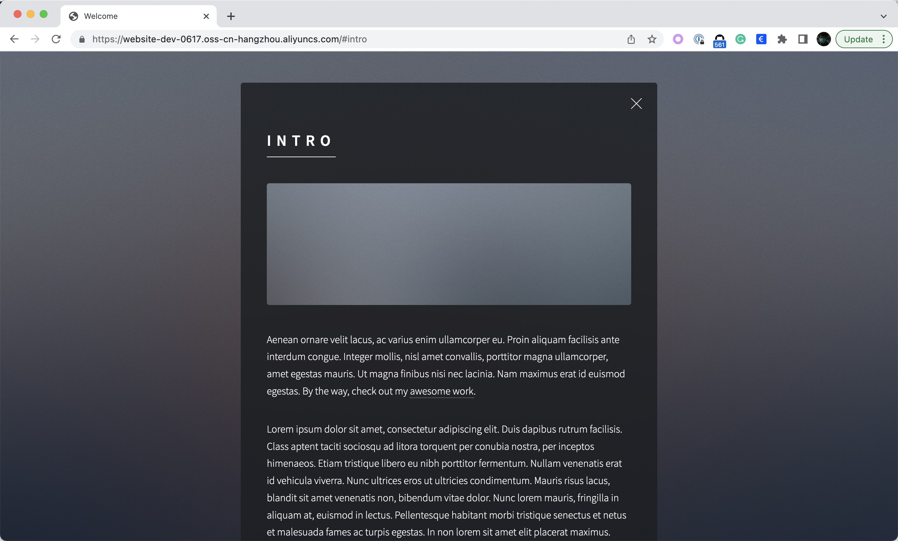

假设你正在创业，你想托管你的静态网站，你准备把网站托管在一个云实例中？
那么你需要购买一个实例和一个弹性 IP 地址，安装一个 Nginx 服务器，上传你的静态网站。
不要这样！这很复杂，也很昂贵，而且你必须自己维护一切。

这里有另一个解决方案 -- 只需一步就可以将你的静态网站部署在对象存储服务的 bucket 中。

对象存储服务可以是 AWS S3、阿里云 OSS 等。在下面的例子中，让我们以阿里云 OSS 为例。

## 先决条件

请根据[说明](../../../reference/addons/terraform)启用插件 "terraform" 和 "terraform-alibaba"，并认证阿里云。

## 托管静态网站

以下是在 OSS bucket 中托管静态网站的 ComponentDefinition 用法。

```shell
$ vela show deploy-website
### Properties
+----------------------------+-------------------------------------------------------------------+-----------------------------------------------------------+----------+---------+
|            NAME            |                            DESCRIPTION                            |                           TYPE                            | REQUIRED | DEFAULT |
+----------------------------+-------------------------------------------------------------------+-----------------------------------------------------------+----------+---------+
| bucket                     | OSS bucket name                                                   | string                                                    | false    |         |
| endpoint                   | OSS bucket endpoint                                               | string                                                    | true     |         |
| static_web_url             | The URL of the static website                                     | string                                                    | false    |         |
+----------------------------+-------------------------------------------------------------------+-----------------------------------------------------------+----------+---------+
```

如果你已经创建了一个 bucket `website-dev-0617`，endpoint 为 `oss-cn-hangzhou.aliyuncs.com`，那么你的静态网站将是
https://github.com/cloudacademy/static-website-example.git。提交下面的应用。

```yaml
apiVersion: core.oam.dev/v1beta1
kind: Application
metadata:
  name: business-website
spec:
  components:
    - name: website
      type: deploy-website
      properties:
        bucket: website-dev-0617
        endpoint: oss-cn-hangzhou.aliyuncs.com
        static_web_url: https://github.com/cloudacademy/static-website-example.git

```

一旦应用程序开始运行，你的网站就会在 [https://website-dev-0617.oss-cn-hangzhou.aliyuncs.com](https://website-dev-0617.oss-cn-hangzhou.aliyuncs.com) 上运行!

```shell
$ vela ls
应用程序组件类型特征阶段健康状态创建时间
business-website website deploy-website running healthy 云资源已部署并可使用 2022-06-17 15:48:01 +0800 CST

```

```shell
$ vela ls
APP             	COMPONENT	TYPE          	TRAITS	PHASE  	HEALTHY	STATUS                                       	CREATED-TIME
business-website	website  	deploy-website	      	running	healthy	Cloud resources are deployed and ready to use	2022-06-17 15:48:01 +0800 CST

```



