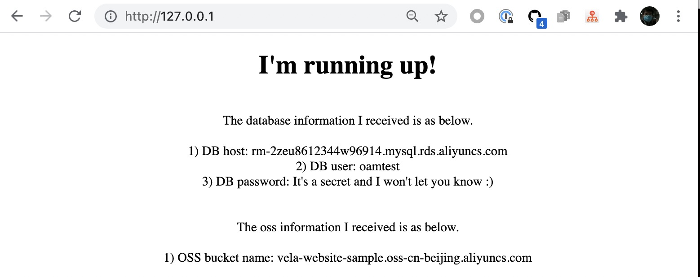

在面向云开发逐渐成为范式的这个时代，我们希望集成来源不同、类型不同云资源的需求非常迫切。不管是最基本的对象存储、云数据库，还是更多的负载均衡等等，
也面临着混合云、多云等复杂环境所带来的挑战，而 KubeVela 都可以很好满足你的需要。

KubeVela 通过云资源组件（Component）和运维特征（Trait）里的资源绑定功能，高效安全地完成不同类型云资源的集成工作。目前你可以直接调用阿里云容器
服务 Kubernetes 版（ACK ）、阿里云对象存储服务（OSS）和阿里云关系型数据库服务（RDS）这些默认组件。同时在未来，更多新的云资源也会在社区的支撑下
逐渐成为默认选项，让你标准化统一地去使用各种厂商的云资源。

> ⚠️ 请确认管理员已经安装了 [Terraform 插件 'terraform/provider-alicloud'](../../../platform-engineers/components/component-terraform).


## 支持的云资源列表
编排类型 | 云服务商 | 云资源 | 描述
------------ | ------------- | ------------- | -------------
Terraform | Alibaba Cloud | [ACK](./terraform/alibaba-ack) | 用于部署阿里云 ACK 的 Terraform Configuration 的 ComponentDefinition
| |  | [OSS](./terraform/alibaba-oss) | 用于部署阿里云 OSS 的 Terraform Configuration 的 ComponentDefinition
| |  | [RDS](./terraform/alibaba-rds) | 用于部署阿里云 RDS 的 Terraform Configuration 的 ComponentDefinition

## Terraform

KubeVela 支持的所有由 Terraform 编排的云资源如上所示，你也可以通过命令 `vela components --label type=terraform` 查看。

下面我们以阿里云关系型数据库（RDS）的例子，作为示例进行讲解。

首先请直接复制一个编写好的应用部署计划，在命令行中执行：

```shell
cat <<EOF | kubectl apply -f -
apiVersion: core.oam.dev/v1beta1
kind: Application
metadata:
  name: webapp
spec:
  components:
    - name: rds-server
      type: webservice
      properties:
        image: zzxwill/flask-web-application:v0.3.1-crossplane
        ports: 80
    - name: sample-db
      type: alibaba-rds
      properties:
        instance_name: sample-db
        account_name: oamtest
        password: U34rfwefwefffaked
        writeConnectionSecretToRef:
          name: db-conn
EOF
```

可以看到，我们使用了一个 `webservice` 组件作为 RDS 即将对外的服务器，而名称是 `sample-db` 的 `alibaba-rds` 组件则承载起去拉起云资源的责任，数据库相关访问信息被写 `db-conn` 中。

一般云资源的拉起，会消耗比较多的时间，比如这里的 RDS 就大约需要 15 分钟左右，我们可以看到它从渲染、健康检查到正常运行的全过程：
```
$ vela ls                  
APP                  	COMPONENT     	TYPE       	TRAITS            	PHASE  	HEALTHY	STATUS                                        	CREATED-TIME 
webapp               	rds-server    	webservice 	service-binding   	rendering	       	      	2021-08-30 20:04:03 +0800 CST
└─                 	sample-db     	alibaba-rds	                  	rendering	       	      	2021-08-30 20:04:03 +0800 CST

webapp               	rds-server    	webservice 	service-binding   	healthChecking	healthy  	                                      	2021-08-30 20:04:03 +0800 CST
└─                 	sample-db     	alibaba-rds	                  	healthChecking	unhealthy	Cloud resources are being provisioned.	2021-08-30 20:04:03 +0800 CST

webapp               	rds-server    	webservice 	service-binding   	running	healthy	                                              	2021-08-30 20:04:03 +0800 CST
└─                 	sample-db     	alibaba-rds	                  	running	healthy	Cloud resources are deployed and ready to use.	2021-08-30 20:04:03 +0800 CST
```

有了 RDS 的服务器，又有了正常运行的云资源，是时候让它们之间映射起来了：使用运维特征 service-binding。我们对 YAML 文件进行更新后，再次部署：

```shell
cat <<EOF | kubectl apply -f -
apiVersion: core.oam.dev/v1beta1
kind: Application
metadata:
  name: webapp
spec:
  components:
    - name: rds-server
      type: webservice
      properties:
        image: zzxwill/flask-web-application:v0.3.1-crossplane
        ports: 80
      traits:
        - type: service-binding
          properties:
            envMappings:
              # 环境变量与 db-conn 密钥形成映射
              DB_PASSWORD:
                secret: db-conn                             
              endpoint:
                secret: db-conn
                key: DB_HOST          
              username:
                secret: db-conn
                key: DB_USER
    - name: sample-db
      type: alibaba-rds
      properties:
        instance_name: sample-db
        account_name: oamtest
        password: U34rfwefwefffaked
        writeConnectionSecretToRef:
          name: db-conn
EOF
```
可以看到，db-conn 负责将密钥的账户、密码等信息转发给 rds-server 这个组件来使用。



## 自定义云资源

如果我们提供的开箱即用云资源没有覆盖你的研发需求，你依然可以通过灵活的[Terraform 组件](../../../platform-engineers/components/component-terraform.md)去自定义业务所需要的云资源。

## 下一步

- [组件可观测性](../../component-observability)
- [应用组件间的依赖和参数传递](../../component-dependency-parameter)
- [多应用、多环境、多集群编排](../../../case-studies/multi-app-env-cluster)

