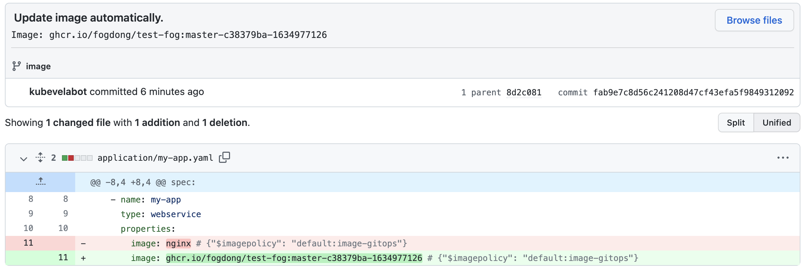

在本文中，我们主要讲解直接使用 KubeVela 在 GitOps 模式下进行交付的步骤。

> 请确保你已经开启了 FluxCD Addon。

## 自动同步仓库的配置到集群

### 准备配置仓库

GitOps 模式会自动同步仓库的配置到集群中，首先，我们需要一个仓库，里面存放着所有你需要的配置文件：如一些 Kubernetes 原生资源 Deployment，Secret，ConfigMap 等。当然，你可以在直接在仓库中存放 KubeVela 的 Application。

假设在我们的仓库中，有一个叫做 `infrastructure` 的文件夹，里面有一个叫做 `server` 的 KubeVela Application 以及一个叫做 `server-config` 的 ConfigMap。

配置仓库的目录结构如下:

```shell
├── infrastructure
    ├── server-config.yaml
    └── server.yaml
```

部署如下 KubeVela GitOps 应用：

```yaml
apiVersion: core.oam.dev/v1beta1
kind: Application
metadata:
  name: infra-gitops
spec:
  components:
  - name: database-config
    type: kustomize
    properties:
      repoType: git
      # 将此处替换成你需要监听的 git 配置仓库地址
      url: https://github.com/FogDong/KubeVela-GitOps-Infra-Demo
      # 如果是私有仓库，还需要关联 git secret
      # secretRef: git-secret
      # 自动拉取配置的时间间隔，由于基础设施的变动性较小，此处设置为十分钟
      pullInterval: 10m
      git:
        # 监听变动的分支
        branch: infra
      # 监听变动的路径，指向仓库中 infrastructure 目录下的文件
      path: ./infrastructure
```

查看该 GitOps 应用状态：

```yaml
$ vela status infra-gitops
About:

  Name:      	infra-gitops
  Namespace: 	default
  Created at:	2022-06-30 14:52:33 +0800 CST
  Status:    	running

Workflow:

  mode: DAG
  finished: true
  Suspend: false
  Terminated: false
  Steps
  - id:dgatat8jag
    name:database-config
    type:apply-component
    phase:succeeded
    message:

Services:

  - Name: database-config
    Cluster: local  Namespace: default
    Type: kustomize
    Healthy
    No trait applied
```

可以看到，该 GitOps 应用已经正常运行。此时，该应用会以 10 分钟的间隔不断拉取仓库中的配置并在集群中进行同步。

查看集群中的资源，可以发现 `server` Application 以及 `server-config` ConfigMap 都已经被自动部署了。

```bash
$ vela ls
APP         	COMPONENT      	TYPE      	TRAITS	PHASE  	HEALTHY	STATUS   	CREATED-TIME
infra-gitops	database-config	kustomize 	      	running	healthy	         	2022-06-30 14:52:33 +0800 CST
server      	server         	webservice	      	running	healthy	Ready:1/1	2022-06-30 14:52:35 +0800 CST

$ kubectl get configmap
NAME                                             DATA   AGE
server-config                                    1      2m58s
```

## 自动更新仓库中应用的镜像

GitOps 也可以通过监听你的镜像仓库，获得最新镜像版本，并用最新版本来更新你代码仓库中的配置，从而达到自动更新镜像的目的。

假设我们代码仓库的目录结构如下:

```shell
├── application
    └── my-app.yaml
```

application 中 my-app.yaml 如下：

```yaml
apiVersion: core.oam.dev/v1beta1
kind: Application
metadata:
  name: my-app
  namespace: default
spec:
  components:
    - name: my-app
      type: webservice
      properties:
        image: nginx # {"$imagepolicy": "default:image-gitops"}
```

> 注意，image 字段后有 `# {"$imagepolicy": "default:image-gitops"}` 的注释。KubeVela 会通过该注释去更新对应的镜像字段。`default:image-gitops` 是我们即将部署的 GitOps 应用组件对应的命名空间和名称。

部署如下 KubeVela GitOps 应用：

```yaml
apiVersion: core.oam.dev/v1beta1
kind: Application
metadata:
  name: image-gitops
spec:
  components:
  - name: image-gitops
    type: kustomize
    properties:
      repoType: git
      # 将此处替换成你需要监听的 git 配置仓库地址
      url: https://github.com/FogDong/KubeVela-GitOps-Infra-Demo
      # 需要在此处声明你的 git secret，因为 GitOps 会用最新的镜像更新你仓库中的文件，需要写权限
      secretRef: git-secret
      pullInterval: 1m
      git:
        # 监听变动的分支
        branch: image
      # 监听变动的路径，指向仓库中 application 目录下的文件
      path: ./application
      imageRepository:
        # 将此处替换成你需要的镜像地址
        image: ghcr.io/fogdong/test-fog
        # 如果这是一个私有的镜像仓库，可以通过 `kubectl create secret docker-registry` 创建对应的镜像秘钥并相关联
        # secretRef: imagesecret
        filterTags:
          # 可对镜像 tag 进行过滤
          pattern: '^master-[a-f0-9]+-(?P<ts>[0-9]+)'
          extract: '$ts'
        # 通过 policy 筛选出最新的镜像 Tag 并用于更新
        policy:
          numerical:
            order: asc
        # 追加提交信息
        commitMessage: "Image: {{range .Updated.Images}}{{println .}}{{end}}"
```

应用部署成功后，可以看到 `my-app` 应用也已经被自动部署。此时，`my-app` 中的镜像为 `nginx`：

```bash
$ vela ls
APP         	COMPONENT   	TYPE      	TRAITS	PHASE          	HEALTHY  	STATUS   	CREATED-TIME
image-gitops	image-gitops	kustomize 	      	running        	healthy  	         	2022-06-30 15:16:30 +0800 CST
my-app      	my-app      	webservice	      	running       	healthy	 Ready:1/1	2022-06-30 15:16:31 +0800 CST
```

隔了一段时间之后，我们配置的 imageRepository 会自动拉取到我们希望的最新镜像，并更新仓库中的应用镜像。

此时，可以看到配置仓库中有一条来自 `kubevelabot` 的提交，该提交将 `nginx` 镜像替换成了我们自己仓库的最新镜像。提交信息均带有 `Update image automatically.` 前缀。你也可以通过 `{{range .Updated.Images}}{{println .}}{{end}}` 在 `commitMessage` 字段中追加你所需要的信息。



> 值得注意的是，如果你希望将代码和配置放在同一个仓库，需要过滤掉来自 `kubevelabot` 的提交来防止流水线的重复构建。可以在 CI 中通过如下配置过滤：
> 
> ```shell
> jobs:
>  publish:
>    if: "!contains(github.event.head_commit.message, 'Update image automatically')"
> ```

重新查看集群中的应用，可以看到经过一段时间后，应用 `my-app` 的镜像已经被更新。

> KubeVela 会通过你配置的 `interval` 时间间隔，来每隔一段时间分别从配置仓库及镜像仓库中获取最新信息：
> * 当 Git 仓库中的配置文件被更新时，KubeVela 将根据最新的配置更新集群中的应用。
> * 当镜像仓库中多了新的 Tag 时，KubeVela 将根据你配置的 policy 规则，筛选出最新的镜像 Tag，并更新到 Git 仓库中。而当代码仓库中的文件被更新后，KubeVela 将重复第一步，更新集群中的文件，从而达到了自动部署的效果。
