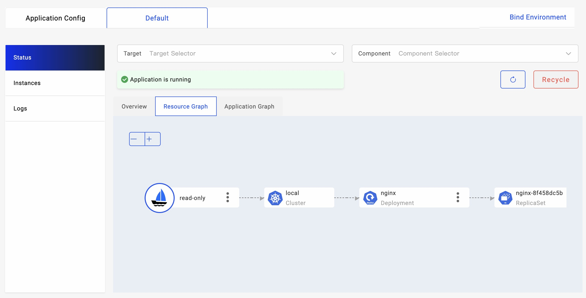

有时您可能希望使用 KubeVela 应用程序来接管现有资源，或者从其他来源（如 Helm 包）获取资源。在这种情况下，您可以利用 KubeVela 中的资源接管功能。

## 在 Application 中使用

默认情况下，当 KubeVela 应用尝试调度（创建或更新）某个资源时，它首先会检查这个资源是否属于自己。通过比较 `app.oam.dev/name` 和 `app.oam.dev/namespace` 标签值，看它们是否等于应用的名称和命名空间来进行检查。

如果此资源不属于当前应用本身（属于其他应用或被其他人创建），应用将停止调度操作并报告错误。这个机制旨在防止对由其他操作员或系统管理的资源进行无意编辑。

如果资源当前由其他应用程序管理，您可以参考 [资源共享](./shared-resource.md) 策略，并详细了解如何在多个应用之间共享资源。

如果资源没有被任何人管理，要允许 KubeVela 应用程序管理资源，您可以利用 `read-only` 策略或 `take-over` 策略来强制执行这些资源的接管。

### ReadOnly Policy

通过使用 `read-only` 策略，您可以选择可以被当前应用程序接管的资源。例如，在下面的应用程序中，部署类型的资源被视为只读资源，并能够被给定的应用程序接管。

```yaml
apiVersion: core.oam.dev/v1beta1
kind: Application
metadata:
  name: read-only
spec:
  components:
    - name: nginx
      type: webservice
      properties:
        image: nginx
  policies:
    - type: read-only
      name: read-only
      properties:
        rules:
          - selector:
              resourceTypes: ["Deployment"]
```

`read-only` 策略允许应用程序读取所选资源，但会跳过对目标资源的所有写操作。如果目标资源不存在，则会报告错误。

目标资源将**不会**附带应用的标签，即多个应用程序可以同时使用具有 `read-only` 只读策略的相同资源，删除应用本身也不会影响目标资源，将跳过目标资源的回收流程。

尽管在 `read-only` 只读策略中选择的资源无法通过应用程序进行编辑，但健康检查和资源拓扑图仍可以正常工作。因此，您可以使用具有只读策略的 KubeVela 应用构建底层资源的“监控组”，并利用像 `vela top` 或 VelaUX 之类的工具来观察它们，而无需进行任何修改。

<details>
<summary>实践举例</summary>

1. 创建 nginx K8s Deployment 资源。
```bash
kubectl create deploy nginx --image=nginx
```

1. 部署一个 `read-only` 策略的应用选中这个 nginx Deployment。
```bash
cat <<EOF | vela up -f -
apiVersion: core.oam.dev/v1beta1
kind: Application
metadata:
  name: read-only
spec:
  components:
    - name: nginx
      type: webservice
      properties:
        image: nginx
  policies:
    - type: read-only
      name: read-only
      properties:
        rules:
          - selector:
              resourceTypes: ["Deployment"]
EOF
```

1. 查看应用状态。
```bash
vela status read-only
```

1. 使用 `vela top` 查看资源状态和拓扑。


1. 使用 `velaux` 查看资源状态和拓扑。


</details>

### 接管策略

如果您不仅希望 KubeVela 应用能观察底层资源，还希望该应用能够管理它们的生命周期，则可以使用 `take-over` 策略来替换 `read-only` 策略。

```yaml
apiVersion: core.oam.dev/v1beta1
kind: Application
metadata:
  name: take-over
spec:
  components:
    - name: nginx-take-over
      type: k8s-objects
      properties:
        objects:
          - apiVersion: apps/v1
            kind: Deployment
            metadata:
              name: nginx
      traits:
        - type: scaler
          properties:
            replicas: 3
  policies:
    - type: take-over
      name: take-over
      properties:
        rules:
          - selector:
              resourceTypes: ["Deployment"]
```

在上述应用程序中，nginx Deployment 将被添加 KubeVela 标识的标签（Labels）并标记为属于当前应用程序。应用程序中附加的 `scaler` trait 将修改目标部署的副本数为3 ，同时保留所有其他字段不变。

资源被应用接管后，应用将控制目标资源的升级和删除。因此，与 `take-over` 策略不同，每个资源只能由一个使用 `take-over` 策略的应用程序进行管理。

`take-over` 策略在您希望应用完全控制给定资源时非常有用。

<details>
<summary>实践举例</summary>

1. 创建 nginx K8s Deployment 资源。
```bash
kubectl create deploy nginx --image=nginx
```

1. 部署 `take-over` 策略的应用接管这个 Deployment。
```bash
cat <<EOF | vela up -f -
apiVersion: core.oam.dev/v1beta1
kind: Application
metadata:
  name: take-over
spec:
  components:
    - name: nginx-take-over
      type: k8s-objects
      properties:
        objects:
          - apiVersion: apps/v1
            kind: Deployment
            metadata:
              name: nginx
      traits:
        - type: scaler
          properties:
            replicas: 3
  policies:
    - type: take-over
      name: take-over
      properties:
        rules:
          - selector:
              resourceTypes: ["Deployment"]
EOF
```

1. 检查应用的运行状态。其他操作同 `read-only` 策略。
```bash
vela status take-over
```
</details>


## 在命令行中使用

`read-only` 策略和 `take-over` 策略为用户提供了一种在 KubeVela 应用 API 中直接采用资源的方式。如果您喜欢直接从头开始使用现有资源构建KubeVela 应用程序，则可以使用 `vela adopt` CLI命令。

### 接管原生资源

通过提供一组本地 Kubernetes 资源，`vela adopt` 命令可以帮助您自动将这些资源纳入一个应用中。您可以按照以下步骤来尝试它：

1. 创建用于接管的原生资源。

```bash
kubectl create deploy example --image=nginx
kubectl create service clusterip example --tcp=80:80
kubectl create configmap example
kubectl create secret generic example
```

1. 运行 `vela adopt` 命令自动创建接管的应用。
```bash
vela adopt deployment/example service/example configmap/example secret/example
```

<details>
<summary>期望输出</summary>

```yaml
apiVersion: core.oam.dev/v1beta1
kind: Application
metadata:
  creationTimestamp: null
  labels:
    app.oam.dev/adopt: native
  name: example
  namespace: default
spec:
  components:
  - name: example.Deployment.example
    properties:
      objects:
      - apiVersion: apps/v1
        kind: Deployment
        metadata:
          name: example
          namespace: default
        spec:
          progressDeadlineSeconds: 600
          replicas: 1
          revisionHistoryLimit: 10
          selector:
            matchLabels:
              app: example
          strategy:
            rollingUpdate:
              maxSurge: 25%
              maxUnavailable: 25%
            type: RollingUpdate
          template:
            metadata:
              creationTimestamp: null
              labels:
                app: example
            spec:
              containers:
              - image: nginx
                imagePullPolicy: Always
                name: nginx
                resources: {}
                terminationMessagePath: /dev/termination-log
                terminationMessagePolicy: File
              dnsPolicy: ClusterFirst
              restartPolicy: Always
              schedulerName: default-scheduler
              securityContext: {}
              terminationGracePeriodSeconds: 30
    type: k8s-objects
  - name: example.Service.example
    properties:
      objects:
      - apiVersion: v1
        kind: Service
        metadata:
          name: example
          namespace: default
        spec:
          clusterIP: 10.43.65.46
          clusterIPs:
          - 10.43.65.46
          internalTrafficPolicy: Cluster
          ipFamilies:
          - IPv4
          ipFamilyPolicy: SingleStack
          ports:
          - name: 80-80
            port: 80
            protocol: TCP
            targetPort: 80
          selector:
            app: example
          sessionAffinity: None
          type: ClusterIP
    type: k8s-objects
  - name: example.config
    properties:
      objects:
      - apiVersion: v1
        kind: ConfigMap
        metadata:
          name: example
          namespace: default
      - apiVersion: v1
        kind: Secret
        metadata:
          name: example
          namespace: default
    type: k8s-objects
  policies:
  - name: read-only
    properties:
      rules:
      - selector:
          componentNames:
          - example.Deployment.example
          - example.Service.example
          - example.config
    type: read-only
status: {}
```
</details>

默认情况下，应用程序首先将所有给定的资源嵌入其组件中。然后，它会附加`read-only`策略。您可以编辑返回的配置并创建自己的采用应用程序。或者，您可以直接使用 `--apply` 参数应用此应用程序。

```bash
vela adopt deployment/example service/example configmap/example secret/example --apply
```

您还可以设置您想要使用的应用程序名称。

```bash
vela adopt deployment/example service/example configmap/example secret/example --apply --app-name=adopt-example
```

现在，您可以使用 `vela status` 和 `vela status -t -d` 命令来显示已应用的应用程序的状态。

```bash
vela status adopt-example
```

<details>
<summary>期望输出</summary>

```bash
About:                                
                                           
  Name:         adopt-example                 
  Namespace:    default                       
  Created at:   2023-01-11 14:21:21 +0800 CST
  Status:       running                                                                                                                                                       
                                                                                       
Workflow:                                                                                                                                                                     
                                                                                                                                                                              
  mode: DAG-DAG                                                                                                                                                               
  finished: true                                                                                                                                                              
  Suspend: false                                                                                                                                                              
  Terminated: false
  Steps
  - id: 8d8capzw7e
    name: adopt-example.Deployment.example
    type: apply-component
    phase: succeeded 
  - id: 6u6c6ai1gu
    name: adopt-example.Service.example
    type: apply-component
    phase: succeeded 
  - id: r847uymujz
    name: adopt-example.config
    type: apply-component
    phase: succeeded 

Services:

  - Name: adopt-example.Deployment.example   
    Cluster: local  Namespace: default
    Type: k8s-objects
    Healthy 
    No trait applied

  - Name: adopt-example.Service.example  
    Cluster: local  Namespace: default
    Type: k8s-objects
    Healthy 
    No trait applied

  - Name: adopt-example.config  
    Cluster: local  Namespace: default
    Type: k8s-objects
    Healthy 
    No trait applied    
```

</details>

```bash
vela status adopt-example -t -d
```

```bash
CLUSTER       NAMESPACE     RESOURCE           STATUS    APPLY_TIME          DETAIL
local     ─── default   ─┬─ ConfigMap/example  updated   2023-01-11 14:15:34 Data: 0  Age: 6m1s
                         ├─ Secret/example     updated   2023-01-11 14:15:52 Type: Opaque  Data: 0  Age: 5m43s
                         ├─ Service/example    updated   2023-01-11 14:12:00 Type: ClusterIP  Cluster-IP: 10.43.65.46  External-IP: <none>  Port(s): 80/TCP  Age: 9m35s
                         └─ Deployment/example updated   2023-01-11 14:11:06 Ready: 1/1  Up-to-date: 1  Available: 1  Age: 10m
```

The `read-only` only allows the application to observe resources, but disallow any edits to it. If you want to make modifications you can use the `--mode=take-over` to use the `take-over` policy in the adoption application.

### Adopt Helm Release

`vela adopt` also supports directly reading native resources from existing helm release. This is helpful if you previously deployed resources through helm.

1. For example, you can firstly deploy a mysql instance through helm.

```bash
helm repo add bitnami https://charts.bitnami.com/bitnami
helm repo update
helm install mysql bitnami/mysql
```

2. You can validate the installation through `helm ls`.

```bash
helm ls
```
```bash
NAME    NAMESPACE       REVISION        UPDATED                                 STATUS          CHART           APP VERSION
mysql   default         1               2023-01-11 14:34:36.653778 +0800 CST    deployed        mysql-9.4.6     8.0.31  
```

1. 运行vela adopt命令，从现有的发布中采用资源。与本机资源采用类似，您可以获得一个带有 `read-only` 策略的 KubeVela 应用程序。

```bash
vela adopt mysql --type helm
```

<details>
<summary>期望输出</summary>

```yaml
apiVersion: core.oam.dev/v1beta1
kind: Application
metadata:
  creationTimestamp: null
  labels:
    app.oam.dev/adopt: helm
  name: mysql
  namespace: default
spec:
  components:
  - name: mysql.StatefulSet.mysql
    properties:
      objects:
      - apiVersion: apps/v1
        kind: StatefulSet
        metadata:
          name: mysql
          namespace: default
        spec:
          podManagementPolicy: ""
          replicas: 1
          selector:
            matchLabels:
              app.kubernetes.io/component: primary
              app.kubernetes.io/instance: mysql
              app.kubernetes.io/name: mysql
          serviceName: mysql
          template:
            metadata:
              annotations:
                checksum/configuration: f8f3ad4a6e3ad93ae6ed28fdb7f7b4ff9585e08fa730e4e5845db5ebe5601e4d
              labels:
                app.kubernetes.io/component: primary
                app.kubernetes.io/instance: mysql
                app.kubernetes.io/managed-by: Helm
                app.kubernetes.io/name: mysql
                helm.sh/chart: mysql-9.4.6
            spec:
              affinity:
                nodeAffinity: null
                podAffinity: null
                podAntiAffinity:
                  preferredDuringSchedulingIgnoredDuringExecution:
                  - podAffinityTerm:
                      labelSelector:
                        matchLabels:
                          app.kubernetes.io/instance: mysql
                          app.kubernetes.io/name: mysql
                      topologyKey: kubernetes.io/hostname
                    weight: 1
              containers:
              - env:
                - name: BITNAMI_DEBUG
                  value: "false"
                - name: MYSQL_ROOT_PASSWORD
                  valueFrom:
                    secretKeyRef:
                      key: mysql-root-password
                      name: mysql
                - name: MYSQL_DATABASE
                  value: my_database
                envFrom: null
                image: docker.io/bitnami/mysql:8.0.31-debian-11-r30
                imagePullPolicy: IfNotPresent
                livenessProbe:
                  exec:
                    command:
                    - /bin/bash
                    - -ec
                    - |
                      password_aux="${MYSQL_ROOT_PASSWORD:-}"
                      if [[ -f "${MYSQL_ROOT_PASSWORD_FILE:-}" ]]; then
                          password_aux=$(cat "$MYSQL_ROOT_PASSWORD_FILE")
                      fi
                      mysqladmin status -uroot -p"${password_aux}"
                  failureThreshold: 3
                  initialDelaySeconds: 5
                  periodSeconds: 10
                  successThreshold: 1
                  timeoutSeconds: 1
                name: mysql
                ports:
                - containerPort: 3306
                  name: mysql
                readinessProbe:
                  exec:
                    command:
                    - /bin/bash
                    - -ec
                    - |
                      password_aux="${MYSQL_ROOT_PASSWORD:-}"
                      if [[ -f "${MYSQL_ROOT_PASSWORD_FILE:-}" ]]; then
                          password_aux=$(cat "$MYSQL_ROOT_PASSWORD_FILE")
                      fi
                      mysqladmin status -uroot -p"${password_aux}"
                  failureThreshold: 3
                  initialDelaySeconds: 5
                  periodSeconds: 10
                  successThreshold: 1
                  timeoutSeconds: 1
                resources:
                  limits: {}
                  requests: {}
                securityContext:
                  runAsNonRoot: true
                  runAsUser: 1001
                startupProbe:
                  exec:
                    command:
                    - /bin/bash
                    - -ec
                    - |
                      password_aux="${MYSQL_ROOT_PASSWORD:-}"
                      if [[ -f "${MYSQL_ROOT_PASSWORD_FILE:-}" ]]; then
                          password_aux=$(cat "$MYSQL_ROOT_PASSWORD_FILE")
                      fi
                      mysqladmin status -uroot -p"${password_aux}"
                  failureThreshold: 10
                  initialDelaySeconds: 15
                  periodSeconds: 10
                  successThreshold: 1
                  timeoutSeconds: 1
                volumeMounts:
                - mountPath: /bitnami/mysql
                  name: data
                - mountPath: /opt/bitnami/mysql/conf/my.cnf
                  name: config
                  subPath: my.cnf
              initContainers: null
              securityContext:
                fsGroup: 1001
              serviceAccountName: mysql
              volumes:
              - configMap:
                  name: mysql
                name: config
          updateStrategy:
            type: RollingUpdate
          volumeClaimTemplates:
          - metadata:
              annotations: null
              labels:
                app.kubernetes.io/component: primary
                app.kubernetes.io/instance: mysql
                app.kubernetes.io/name: mysql
              name: data
            spec:
              accessModes:
              - ReadWriteOnce
              resources:
                requests:
                  storage: 8Gi
    type: k8s-objects
  - name: mysql.Service.mysql
    properties:
      objects:
      - apiVersion: v1
        kind: Service
        metadata:
          name: mysql
          namespace: default
        spec:
          ports:
          - name: mysql
            nodePort: null
            port: 3306
            protocol: TCP
            targetPort: mysql
          selector:
            app.kubernetes.io/component: primary
            app.kubernetes.io/instance: mysql
            app.kubernetes.io/name: mysql
          sessionAffinity: None
          type: ClusterIP
    type: k8s-objects
  - name: mysql.Service.mysql-headless
    properties:
      objects:
      - apiVersion: v1
        kind: Service
        metadata:
          name: mysql-headless
          namespace: default
        spec:
          clusterIP: None
          ports:
          - name: mysql
            port: 3306
            targetPort: mysql
          publishNotReadyAddresses: true
          selector:
            app.kubernetes.io/component: primary
            app.kubernetes.io/instance: mysql
            app.kubernetes.io/name: mysql
          type: ClusterIP
    type: k8s-objects
  - name: mysql.config
    properties:
      objects:
      - apiVersion: v1
        kind: Secret
        metadata:
          name: mysql
          namespace: default
      - apiVersion: v1
        kind: ConfigMap
        metadata:
          name: mysql
          namespace: default
    type: k8s-objects
  - name: mysql.sa
    properties:
      objects:
      - apiVersion: v1
        kind: Secret
        metadata:
          name: mysql
          namespace: default
      - apiVersion: v1
        kind: ConfigMap
        metadata:
          name: mysql
          namespace: default
    type: k8s-objects
  policies:
  - name: read-only
    properties:
      rules:
      - selector:
          componentNames:
          - mysql.StatefulSet.mysql
          - mysql.Service.mysql
          - mysql.Service.mysql-headless
          - mysql.config
          - mysql.sa
    type: read-only
status: {}
```

</details>

1. 您可以类似地使用 `--apply` 参数将应用程序应用到群集中，并使用 `--mode=take-over` 允许强制执行 `take-over` 策略进行修改。除此之外，如果您想完全将 Helm Chart 中的资源采用到 KubeVela 应用程序中，并禁用对该 Helm Chart 的管理（防止多个操控源），则可以添加 `--recycle` 标志，在应用程序进入运行状态后删除 Helm Release 信息。

```bash
vela adopt mysql --type helm --mode take-over --apply --recycle
```
```
resources adopted in app default/mysql
successfully clean up old helm release
```

1. 你可以用 `vela status` 和 `vela status -t -d` 查看应用状态。

```bash
vela status mysql
```

<details>
<summary>期望输出</summary>

```bash
About:

  Name:         mysql                        
  Namespace:    default                      
  Created at:   2023-01-11 14:40:16 +0800 CST
  Status:       running                      

Workflow:

  mode: DAG-DAG
  finished: true
  Suspend: false
  Terminated: false
  Steps
  - id: orq8dnqbyv
    name: mysql.StatefulSet.mysql
    type: apply-component
    phase: succeeded 
  - id: k5kwoc49jv
    name: mysql.Service.mysql-headless
    type: apply-component
    phase: succeeded 
  - id: p5qe1drkoh
    name: mysql.Service.mysql
    type: apply-component
    phase: succeeded 
  - id: odicbhtf9a
    name: mysql.config
    type: apply-component
    phase: succeeded 
  - id: o36adyqqal
    name: mysql.sa
    type: apply-component
    phase: succeeded 

Services:

  - Name: mysql.StatefulSet.mysql  
    Cluster: local  Namespace: default
    Type: k8s-objects
    Healthy 
    No trait applied

  - Name: mysql.Service.mysql-headless  
    Cluster: local  Namespace: default
    Type: k8s-objects
    Healthy 
    No trait applied

  - Name: mysql.Service.mysql  
    Cluster: local  Namespace: default
    Type: k8s-objects
    Healthy 
    No trait applied

  - Name: mysql.config  
    Cluster: local  Namespace: default
    Type: k8s-objects
    Healthy 
    No trait applied

  - Name: mysql.sa  
    Cluster: local  Namespace: default
    Type: k8s-objects
    Healthy 
    No trait applied
```

</details>

```bash
vela status mysql -t -d
```

```bash
CLUSTER       NAMESPACE     RESOURCE               STATUS    APPLY_TIME          DETAIL
local     ─── default   ─┬─ ConfigMap/mysql        updated   2023-01-11 14:40:16 Data: 1  Age: 7m41s
                         ├─ Secret/mysql           updated   2023-01-11 14:40:16 Type: Opaque  Data: 2  Age: 7m41s
                         ├─ Service/mysql          updated   2023-01-11 14:40:16 Type: ClusterIP  Cluster-IP: 10.43.154.7  External-IP: <none>  Port(s): 3306/TCP  Age: 7m41s
                         ├─ Service/mysql-headless updated   2023-01-11 14:40:16 Type: ClusterIP  Cluster-IP: None  External-IP: <none>  Port(s): 3306/TCP  Age: 7m41s
                         └─ StatefulSet/mysql      updated   2023-01-11 14:40:16 Ready: 1/1  Age: 7m41s
```

5. 如果运行 `helm ls` 命令，您将无法找到原始的 MySQL Helm 发布，因为记录已被回收。

```bash
helm ls
```

```bash
NAME    NAMESPACE       REVISION        UPDATED STATUS  CHART   APP VERSION
```

:::tip
有多种方式可以将 KubeVela 与 Helm 结合使用。

如果您想要使用 Helm Chart 的发布流程并使用 KubeVela 监控这些资源，则可以使用默认模式（`read-only`），并且不回收 Helm 发布密钥。在这种情况下，您将能够使用 KubeVela 工具或生态系统（例如在 Grafana 上查看）监视由 Helm Chart 分派的资源。

如果您想将现有资源从 Helm Chart 迁移到 KubeVela 应用模式来完整的管理资源的生命周期，则可以使用 `take-over` 模式，并使用 `--apply` 标志回收 Helm 发布记录。
:::

### 自定义接管策略

默认情况下，`vela adopt` 将从给定源（本机资源列表或 Helm Chart）中获取资源并将其分组到不同的组件中。对于像 Deployment 或 StatefulSet 这样的资源，原始的字段将被保留。对于其他资源，如 ConfigMap 或 Secret，接管时应用不会保存其中的数据（这也意味着 vela application 不会对其中的内容做终态保持）。对于特殊资源（CustomResourceDefinition），`garbage-collect` 和 `apply-once`应用策略将附加到应用程序中。

将资源转换为应用程序是通过使用 CUE 模板来实现的。您可以参考 [GitHub](https://github.com/kubevela/kubevela/blob/master/references/cli/adopt-templates/default.cue) 查看默认模板。

您还可以使用 CUE 构建自己的采用规则，并将 `--adopt-template` 添加到 `vela adopt` 命令中。

1. 例如，让我们创建一个示例部署。

```bash
kubectl create deploy custom-adopt --image=nginx
```

1. 创建一个名为 `my-adopt-rule.cue` 的自定义规则。

```
import "list"

#Resource: {
	apiVersion: string
	kind:       string
	metadata: {
		name:       string
		namespace?: string
		...
	}
	...
}

#Component: {
	type: string
	name: string
	properties: {...}
	dependsOn?: [...string]
	traits?: [...#Trait]
}

#Trait: {
	type: string
	properties: {...}
}

#Policy: {
	type: string
	name: string
	properties?: {...}
}

#Application: {
	apiVersion: "core.oam.dev/v1beta1"
	kind:       "Application"
	metadata: {
		name:       string
		namespace?: string
		labels?: [string]:      string
		annotations?: [string]: string
	}
	spec: {
		components: [...#Component]
		policies?: [...#Policy]
		workflow?: {...}
	}
}

#AdoptOptions: {
	mode:         *"read-only" | "take-over"
	type:         *"helm" | string
	appName:      string
	appNamespace: string
	resources: [...#Resource]
	...
}

#Adopt: {
	$args:    #AdoptOptions
	$returns: #Application

	// adopt logics

	$returns: #Application & {
		metadata: {
			name:      $args.appName
			labels: "app.oam.dev/adopt": $args.type
		}
		spec: components: [for r in $args.resources if r.kind == "Deployment" {
		    type: "webservice"
		    name: r.metadata.name
		    properties: image: r.spec.template.spec.containers[0].image
		    traits: [{
		        type: "scaler"
		        properties: replicas: r.spec.replicas
		    }]
		}]
		spec: policies: [
			{
				type: $args.mode
				name: $args.mode
				properties: rules: [{
					selector: componentNames: [ for comp in spec.components {comp.name}]
				}]
			}]
	}
}
```

此自定义接管规则将自动识别 Deployment 资源并将其转换为 KubeVela 应用的 `webservice` 组件。它可以智能地检测给定部署的副本数，并将一个`scaler` trait 附加到该组件上。

1. 运行 `vela adopt deployment/custom-adopt --adopt-template=my-adopt-rule.cue`。你就可以看到转换出来的应用了。 
```yaml
apiVersion: core.oam.dev/v1beta1
kind: Application
metadata:
  creationTimestamp: null
  labels:
    app.oam.dev/adopt: native
  name: custom-adopt
spec:
  components:
  - name: custom-adopt
    properties:
      image: nginx
    traits:
    - properties:
        replicas: 1
      type: scaler
    type: webservice
  policies:
  - name: read-only
    properties:
      rules:
      - selector:
          componentNames:
          - custom-adopt
    type: read-only
status: {}
```

有了这个能力，您可以为从现有资源或 Helm Chart 中构建应用程序创建自己的规则。

### 批量接管

#### 批量接管原生资源

如果你想要批量接管一个 K8s 命名空间的所有资源，你可以使用 `--all` 标记。

```bash
vela adopt --all
```

默认情况下，它将接管命名空间中的所有部署（Deployment）/有状态集（StatefulSet）/守护程序集（DaemonSet）资源。您还可以指定一个自定义资源进行采用。

```bash
vela adopt mycrd --all
```

此命令将首先尝试在命名空间中列出所有指定的资源，并根据资源拓扑规则找到相关资源（如 ConfigMap、Secret、Service 等）进行采用。

资源拓扑规则是使用 CUE 模板编写的，默认模板在 [GitHub](https://github.com/kubevela/kubevela/blob/master/references/cli/resource-topology/builtin-rule.cue) 中。使用此默认规则，将与 Deployment/StatefulSet/DaemonSet 相关的资源（ConfigMap、Secret、Service、Ingress）一起接管。

例如，如果在集群中有以下资源：

<details>
<summary>Resources(Deployment, ConfigMap, Service, Ingress)</summary>
apiVersion: apps/v1
kind: Deployment
metadata:
  name: test1
  namespace: default
spec:
  progressDeadlineSeconds: 600
  replicas: 1
  revisionHistoryLimit: 10
  selector:
    matchLabels:
      myapp: test1
  strategy:
    rollingUpdate:
      maxSurge: 25%
      maxUnavailable: 25%
    type: RollingUpdate
  template:
    metadata:
      creationTimestamp: null
      labels:
        myapp: test1
    spec:
      containers:
      - image: crccheck/hello-world
        imagePullPolicy: Always
        name: test1
        ports:
        - containerPort: 8000
          name: port-8000
          protocol: TCP
        resources: {}
        terminationMessagePath: /dev/termination-log
        terminationMessagePolicy: File
        volumeMounts:
        - mountPath: /test
          name: configmap-my-test
      dnsPolicy: ClusterFirst
      restartPolicy: Always
      schedulerName: default-scheduler
      securityContext: {}
      terminationGracePeriodSeconds: 30
      volumes:
      - configMap:
          defaultMode: 420
          name: my-test1
        name: configmap-my-test
---
apiVersion: v1
kind: ConfigMap
metadata:
  name: my-test1
  namespace: default
---
apiVersion: v1
kind: Service
metadata:
  name: test1
spec:
  ports:
  - port: 8000
    protocol: TCP
    targetPort: 8000
  selector:
    myapp: test1
  type: ClusterIP
---
apiVersion: networking.k8s.io/v1
kind: Ingress
metadata:
  annotations:
    kubernetes.io/ingress.class: nginx
  name: test1
  namespace: default
spec:
  rules:
  - host: testsvc.example.com
    http:
      paths:
      - backend:
          service:
            name: test1
            port:
              number: 8000
        path: /
        pathType: ImplementationSpecific
status:
  loadBalancer: {}
</details>

通过 `vela adopt --all` 命令，这些资源会自动被接管到如下应用中：

<details>
<summary>接管后的应用</summary>
apiVersion: core.oam.dev/v1beta1
kind: Application
metadata:
  name: test1
  namespace: default
spec:
  components:
  - name: test1.Deployment.test1
    properties:
      objects:
      - apiVersion: apps/v1
        kind: Deployment
        metadata:
          name: test1
          namespace: default
        spec:
          ...
    type: k8s-objects
  - name: test1.Service.test1
    properties:
      objects:
      - apiVersion: v1
        kind: Service
        metadata:
          name: test1
          namespace: default
        spec:
          ...
    type: k8s-objects
  - name: test1.Ingress.test1
    properties:
      objects:
      - apiVersion: networking.k8s.io/v1
        kind: Ingress
        metadata:
          name: test1
          namespace: default
        spec:
          ...
    type: k8s-objects
  - name: test1.config
    properties:
      objects:
      - apiVersion: v1
        kind: ConfigMap
        metadata:
          name: record-event
          namespace: default
    type: k8s-objects
  policies:
  - name: read-only
    properties:
      rules:
      - selector:
          componentNames:
          - test1.Deployment.test1
          - test1.Service.test1
          - test1.Ingress.test1
          - test1.config
    type: read-only
</details>

您还可以使用 CUE 构建自己的资源拓扑规则，以查找自定义资源关系，并将 `--resource-topology-rule` 添加到 `vela adopt` 命令中。

```
vela adopt --all --resource-topology-rule=my-rule.cue
```

在采用所有资源并将其应用于集群之后，您可以使用 `vela ls` 或仪表板查看所有采用的应用程序。


#### 批量接管 Helm 部署

如果您想在命名空间中批量接管 Helm 发布，则可以使用 `--all` 标志以及 `--type=helm`。

```bash
vela adopt --all --type helm
```

以上就是所有的接管功能了，期待 KubeVela 为你的应用交付保驾护航。