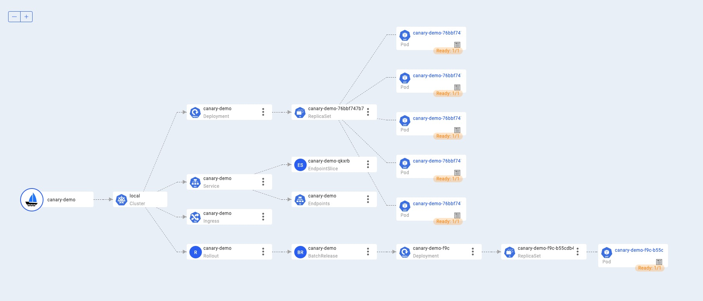
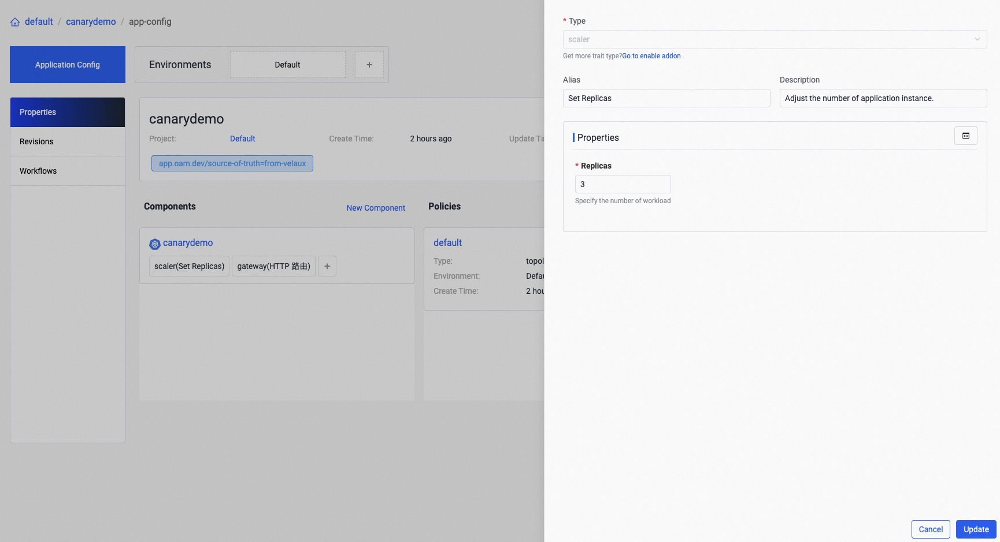
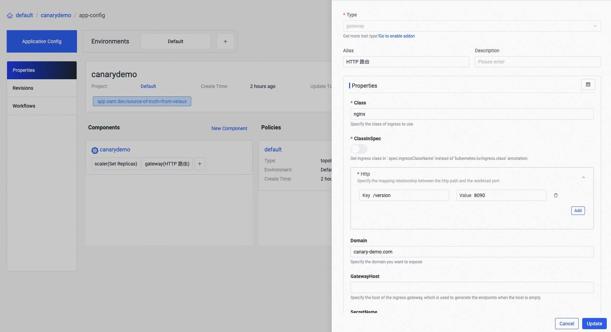
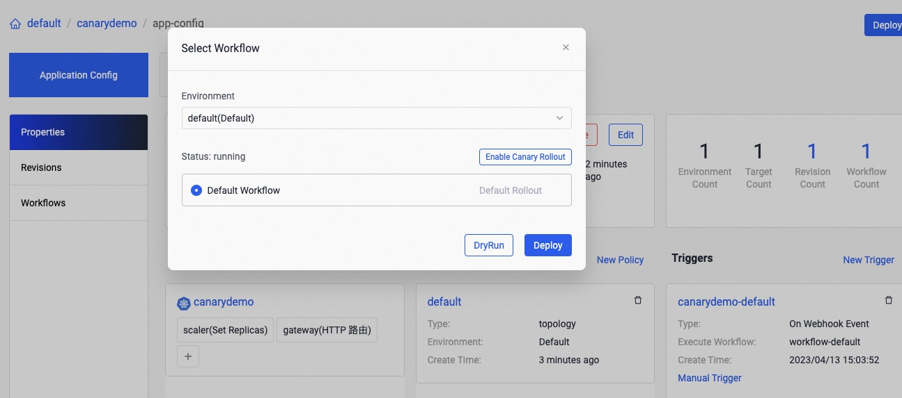
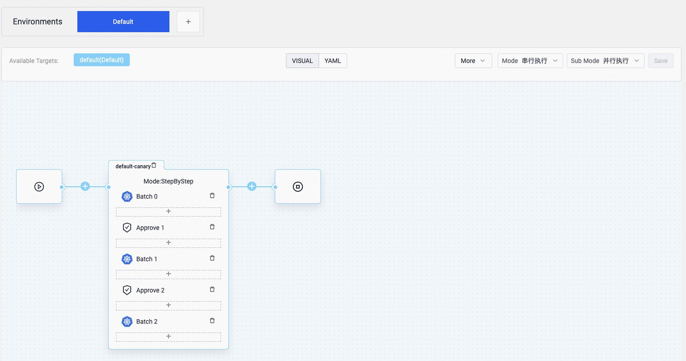

本文将介绍实现金丝雀发布。

## 准备工作

通过如下命令启用 [`kruise-rollout`](../../reference/addons/kruise-rollout) 插件，金丝雀发布依赖于 [rollouts from OpenKruise](https://github.com/openkruise/rollouts).
   
```shell
vela addon enable kruise-rollout
```

## 首次部署

对应用进行首次发布：

```yaml
cat <<EOF | vela up -f -
apiVersion: core.oam.dev/v1beta1
kind: Application
metadata:
   name: canary-demo
   annotations:
      app.oam.dev/publishVersion: v1
spec:
   components:
      - name: canary-demo
        type: webservice
        properties:
           image: wangyikewyk/canarydemo:v1
           ports:
              - port: 8090
        traits:
           - type: scaler
             properties:
                replicas: 5
           - type: gateway
             properties:
                domain: canary-demo.com
                http:
                   "/version": 8090
EOF
```

我们的首次部署就是进行一个普通的发布，你可以通过如下命令来检查应用的状态来确保可以进行下一步操作：

```shell
$ vela status canary-demo
About:

  Name:         canary-demo                  
  Namespace:    default                      
  Created at:   2023-04-10 14:27:58 +0800 CST
  Status:       running                      

Workflow:

  mode: DAG-DAG
  finished: true
  Suspend: false
  Terminated: false
  Steps
  - id: c1cqamr5w6
    name: canary-demo
    type: apply-component
    phase: succeeded 

Services:

  - Name: canary-demo  
    Cluster: local  Namespace: default
    Type: webservice
    Healthy Ready:5/5
    Traits:
      ✅ scaler      ✅ gateway: No loadBalancer found, visiting by using 'vela port-forward canary-demo'
```

如果你已经启用了 [velaux](../../reference/addons/velaux) 插件，你可以通过拓扑图来观察到所有的 `v1`  都处于 ready 状态。


如果你的集群中已经按转了一个 ingress controller （或者你也可以通过启用 [ingress-nginx](../../reference/addons/nginx-ingress-controller.md) 插件来为你的集群安装一个，你就可以通过下面的命令来访问你的应用的网关入口：

```shell
$ curl -H "Host: canary-demo.com" <ingress-controller-address>/version
Demo: V1
```

主机名 `canary-demo.com` 需要和应用 `gateway` 中的特性保持一致，你可以配置 `/etc/hosts` 来通过Host地址访问网关。

## Day-2 金丝雀发布

让我们把组件的镜像版本从 `v1` 更新到 `v2`，如下所示：

```yaml
cat <<EOF | vela up -f -
apiVersion: core.oam.dev/v1beta1
kind: Application
metadata:
   name: canary-demo
   annotations:
      app.oam.dev/publishVersion: v2
spec:
   components:
      - name: canary-demo
        type: webservice
        properties:
           image: wangyikewyk/canarydemo:v2
           ports:
              - port: 8090
        traits:
           - type: scaler
             properties:
                replicas: 5
           - type: gateway
             properties:
                domain: canary-demo.com
                http:
                   "/version": 8090
   workflow:
      steps:
         - type: canary-deploy
           name: rollout-20
           properties:
              weight: 20
         - name: suspend-1st
           type: suspend
         - type: canary-deploy
           name: rollout-50
           properties:
              weight: 50
         - name: suspend-2nd
           type: suspend
         - type: canary-deploy
           name: rollout-100
           properties:
              weight: 100
EOF
```

请注意，在这次更新中，我们除了更新了组件的镜像配置，还为这次更新设置了一条金丝雀发布的工作流，这个工作流包含 5 个步骤，总共 3 个阶段。
下面介绍了三个阶段应用升级的详细状态：

1. 先进行第一批次的升级，更新 `20%` 的实例数量到 v2 版本。在我们的示例中， 我们一共设置了5个实例，所以这个阶段会升级 `5 * 20% = 1` 个实例版本到新版本，并且导入了 `20%` 的流量。在所实例就绪之后好后，工作流会进入暂停状态，等待手工批准。
2. 在手工批准后，会进入到第二个阶段，它会升级 `5 * 50% = 2。5` 实际上是 `5` 个实例的新版本，并且导入 `50%` 的流量。接下来，工作流会再次进入暂停状态，等待下一步的手工批准。
3. 在批准后，全部的实例都将会更新到新版本，并且所有的流量路由都指向新的版本的实例。

更新后你可以检查应用的状态：

```shell
$ vela status canary-demo
About:

  Name:         canary-demo                  
  Namespace:    default                      
  Created at:   2023-04-10 15:10:56 +0800 CST
  Status:       workflowSuspending           

Workflow:

  mode: StepByStep-DAG
  finished: false
  Suspend: true
  Terminated: false
  Steps
  - id: hqhtsm949f
    name: rollout-20
    type: canary-deploy
    phase: succeeded 
  - id: umzd2xain9
    name: suspend-1st
    type: suspend
    phase: suspending 
    message: Suspended by field suspend

Services:

  - Name: canary-demo  
    Cluster: local  Namespace: default
    Type: webservice
    Healthy Ready:5/5
    Traits:
      ✅ rolling-release: workload deployment is completed      ✅ scaler      ✅ gateway: Visiting URL: canary-demo.com, IP: 192.168.9.103
  - Name: canary-demo  
    Cluster: local  Namespace: default
    Type: webservice
    Healthy Ready:5/5
    Traits:
      ✅ scaler      ✅ gateway: No loadBalancer found, visiting by using 'vela port-forward canary-demo'
```

应用的状态是 `workflowSuspending` 这意味着工作流进入到等待审批的阶段。

再次查看拓扑图，你会看到 deployment 已经升级了两个实例到 `v2` 版本，并且这些实例会被导入 20% 的流量。同时 `v1` 版本的实例还在运行中并且倒入 80% 的流量。



再次访问网关，你会发现访问结果中有 `20%` 的机率是 `Demo: v2`。

```shell
$ curl -H "Host: canary-demo.com" <ingress-controller-address>/version
Demo: V2
```

## 继续金丝雀发布

用户可以通过检查业务的相关指标，如：日志、Metrics等其它手段，验证金丝雀的版本访问成功后，你可以继续执行工作流，让发布继续往下进行。

```shell
vela workflow resume canary-demo
```

在多次重新访问网关后，你会发现机率大幅提升，有 `50%` 的结果是 `Demo: v2`。

```shell
$ curl -H "Host: canary-demo.com" <ingress-controller-address>/version
Demo: V2
```

## 金丝雀验证通过，全量发布

最后，你可以继续执行工作流全量发布。

```shell
vela workflow resume canary-demo
```

并多次访问网关，你会发布结果总是 `Demo: v2`。

```shell
$ curl -H "Host: canary-demo.com" <ingress-controller-address>/version
Demo: V2
```

## 金丝雀验证失败，回滚

如果经过验证发现新版本有问题，你想中断发布，将应用回滚至上一个版本。可以如下操作快速将应用回滚：

```shell
$ vela workflow rollback canary-demo
Application spec rollback successfully.
Application status rollback successfully.
Successfully rollback rolloutApplication outdated revision cleaned up.
```

再次访问网关，你会看到结果一直是 `Demo: V1`:

```shell
$ curl -H "Host: canary-demo.com" <ingress-controller-address>/version
Demo: V1
```

需要注意的是，任何在应用处于发布中状态时的回滚操作，都会回滚到应用最后一次成功发布的版本，所以如果你已经成功部署了 `v1` 并且升级到 `v2`， 但是如果 `v2` 失败了但是你又继续更新到 `v3`。那么从 `v3` 回滚会自动到 `v1`，这是因为 `v2` 并不是成功发布的版本。

## 在 VelaUX 上做金丝雀发布

你也可以在 VelaUX 上对应用进行金丝雀方式的升级。

### 首次部署

首先在 VelaUX 界面上创建一个应用，其中包含了一个 `webservice` 类型的组件，并且将组件的镜像设置为 `wangyikewyk/canarydemo:v1` 如下图所示：


接下来为这个组件添加一个副本个数为 3 的 `scaler` 运维特征：



最后为组件添加一个 `gateway` 运维特征，并设置响应的路由规则，如下：



之后点击 `deploy` 按钮应用进行部署，之后你就可以在资源拓扑图页面中看到所有实例都已经被创建：


### 继续金丝雀发布

更新组件将镜像设置为 `wangyikewyk/canarydemo:v2`：


点击 `deploy` 按钮，并点击 `Enable Canary Rollout` 创建金丝雀发布的工作流，如下所示：



这里我们可以将批次设置为 3，从而对应用分三个批次进行升级：


接下来可以看到新新创建的了一条金丝雀发布的工作流，点击 `save` 按钮对工作流进行保存，如下所示：



工作流包含三个 `canary-deploy`的步骤，说明整个发布过程被分为了三批进行发布，每个批次有升级 1/3 的实例到新版本，并且将 1/3 的流量导入到新版本。两个 `canary-deploy` 步骤间有一个人工确认的步骤。你也可以编辑 `canary-deploy` 的步骤来修改每个批次的发布比例。

再次点击 `Deploy` 按钮发布，并选择刚才创建的 `Default Canary Workflow` 工作流开始发布，如下所示：


当第一步完成之后，可以看到有 1 个实例被升级到了新版本，如下所示：


你可以通过下面的命令访问应用网关，你将会发现大约有 1/3 的概率看到 `Demo: V1` 的结果：

```shell
$ curl -H "Host: canary-demo.com" <ingress-controller-address>/version
Demo: V1
```

### 继续发布

在工作流页面，点击 `continue` 按钮继续下面后面的发布步骤：


之后你将会看到又有 2 个实例升级到新版本：


### 回滚

如果你想终止当前的发布工作流，并将应用的实例和流量回滚到发布钱的状态，可以在工作流的页面点击 `rollback` 按钮来进行这个操作：


接下来你将会发现所有的实例都回滚到了 v1版本：


