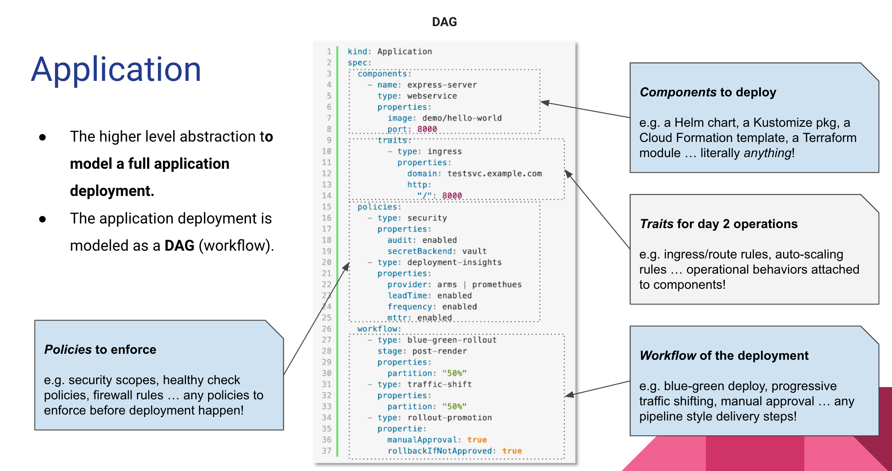
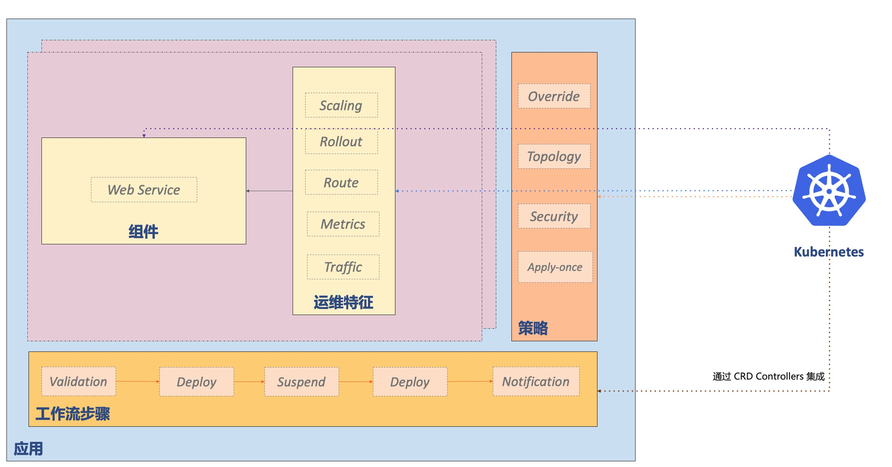

KubeVela 围绕着云原生应用交付和管理场景展开，背后的应用交付模型是 [Open Application Model](../platform-engineers/oam/oam-model)，简称 OAM 。


## 应用部署计划

KubeVela 的核心是将应用部署所需的所有组件和各项运维动作，描述为一个统一的、与基础设施无关的“部署计划”，进而实现在混合环境中标准化和高效率的应用交付。这使得最终用户无需关注底层细节，就可以使用丰富的扩展能力，并基于统一的概念自助式操作。



每一个应用部署计划都由四个部分组成，分别是组件、运维能力、部署策略和工作流。其格式如下：

```yaml
apiVersion: core.oam.dev/v1beta1
kind: Application
metadata:
  name: <name>
spec:
  components:
    - name: <component name>
      type: <component type>
      properties:
        <parameter values>
      traits:
        - type: <trait type>
          properties:
            <traits parameter values>
    - name: <component name>
      type: <component type>
      properties:
        <parameter values>
  policies:
  - name: <policy name>
    type: <policy type>
    properties:
      <policy parameter values>
  workflow:
    - name: <step name>
      type: <step type>
      properties:
        <step parameter values>   
```


这个 `Application` 对象会引用 `component`、`trait`、`policy` 以及 `workflow step` 的类型，这些类型背后是平台构建者（运维团队）维护的可编程模块。可以看到，这种抽象的方式是高度可扩展、可定制的。

* **组件（Component）**: 组件定义一个应用包含的待交付制品（二进制、Docker 镜像、Helm Chart...）或云服务。我们认为一个应用部署计划部署的是一个微服务单元，里面主要包含一个核心的用于频繁迭代的服务，以及一组服务所依赖的中间件集合（包含数据库、缓存、云服务等），一个应用中包含的组件数量应该控制在约 15 个以内。

* **运维特征（Trait）**: 运维特征是可以随时绑定给待部署组件的、模块化、可拔插的运维能力，比如：副本数调整（手动、自动）、数据持久化、 设置网关策略、自动设置 DNS 解析等。

* **应用策略（Policy）**: 应用策略负责定义指定应用交付过程中的策略，比如多集群部署的差异化配置、资源放置策略、安全组策略、防火墙规则、SLO 目标等。

* **工作流步骤（Workflow Step）**: 工作流由多个步骤组成，允许用户自定义应用在某个环境的交付过程。典型的工作流步骤包括人工审核、数据传递、多集群发布、通知等。

以上这些概念的背后都是由一组称为[模块定义（Definitions）](../platform-engineers/oam/x-definition)的可编程模块提供具体功能。KubeVela 会像胶水一样基于 Kubernetes API 定义基础设施定义的抽象并将不同的能力组合起来。下图描述了概念间的关系：



## 插件（Addon）：可编程能力及其实现构成的包

插件包是由 OAM 的模块定义和背后的 [Kubernetes CRD 控制器](https://kubernetes.io/docs/concepts/extend-kubernetes/api-extension/custom-resources/)组成的集合。KubeVela 社区已经有一个完善的且在不断扩大的[插件目录](https://github.com/kubevela/catalog)，比如 [terraform 插件](https://github.com/kubevela/catalog/tree/master/addons/terraform) 提供了云资源的供给，[fluxcd 插件](https://github.com/kubevela/catalog/tree/master/addons/fluxcd) 提供了 GitOps 能力等等。

### 不再配置漂移

除了扩展性和效率以外，许多围绕 IaC 的工具都会引发生产环境和配置中心数据不一致的问题，业界称之为“配置漂移”，引起配置漂移的核心原因往往来自于生产环境的配置修改有多个来源、平台对配置的覆盖不完整等。KubeVela 通过一个 Application 对象涵盖了所有应用涉及的配置、并通过 [Kubernetes 控制循环](https://kubernetes.io/docs/concepts/architecture/controller/) 来维护状态，并基于此始终面向终态维护配置的一致性、消除配置漂移的问题，且保留基于 IaC 模式的扩展性和灵活性。

## 下一步

- 查看 [架构文档](./architecture)，了解 KubeVela 的整体架构。