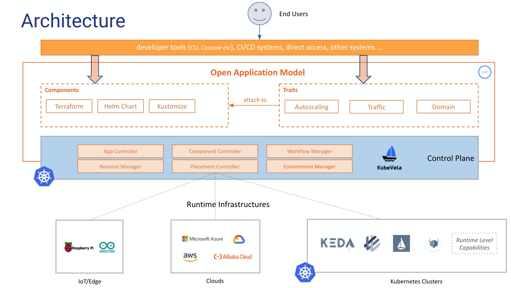

## 背景

云原生技术的趋势，一直在朝着标准、统一和跨云的应用交付迈进。作为通用底座的 Kubernetes，尽管在抽象底层基础架构细节方面表现出色，但并未引入抽象来模拟混合环境之上的软件部署。我们已经频繁看到，由于缺乏此类应用程序级的上下文控制，用户体验受影响、生产力降低，甚至导致生产中出现错误配置。

与此同时，今天微服务应用程序的部署建模，是一个高度碎片化的过程。因此，大多数旨在解决上述问题的解决方案（尽管使用 Kubernetes 构建）本质上是受限制的系统，几乎不可扩展。随着我们应用程序需求的增长，它们几乎肯定会超出此类系统所能支持的上限。

应用开发团队，面临着业务不断高速变化所带来的迭代压力，希望平台开发团队可以随时满足需求。而平台团队虽然确实想提供帮助，但即使是平台中任何简单的 API 更改，都受限于底层设计而无法对应的跟上。

## 什么是 KubeVela？

KubeVela 是一个应用程序平台，旨在通过执行以下操作，使跨混合、多云环境的应用程序部署和管理变得更容易和更快：

- 以应用程序为中心 - KubeVela 引入了开放应用程序模型（OAM）来作为更高级别的 API，通过高度一致的工作流，来捕获面向混合环境的微服务交付的所有信息。包括多集群分发策略、流量调配和滚动更新等运维特征，都声明在应用级别。用户无需关心任何基础设施细节，只需要定义和部署应用即可。
- 可编程式交付工作流 - KubeVela 的模型层是利用 CUE 来实现的。它使得你可以轻松地将应用交付工作流声明为一个 DAG（有向无环图），并将所有步骤和应用部署需求以可编程的方式粘合在一起。这里没有任何限制，原生可扩展。
- 运行时无关 - KubeVela 是一个完全与运行时无关的应用交付与管理控制平面。它可以按照你定义的工作流与策略，面向混合环境交付和管理任何应用组件：包括容器、云函数、数据库甚至 AWS EC2 实例。

## 架构图

KubeVela 的整体架构如下图所示：

### 控制平面 

正如 KubeVela 的 Kube 所暗示，KubeVela 作为控制平面在设计上是依赖 Kubernetes 而成立。这是 KubeVela 如何为大规模应用程序交付，带来自动化和确定性的关键。用户将通过以应用程序为中心的 API 与 KubeVela 交互，对应用程序部署进行建模，然后 KubeVela 将根据用户声明的策略和规则，将其分发到目标运行时所在的 Kubernetes 基础设施。

### 运行时基础设施

运行时基础设施是应用程序实际运行的地方。 KubeVela 允许你将应用程序建模并部署到任何基于 Kubernetes 的基础设施（本地、托管产品或 IoT/边缘基础设施）或公共云平台。

## 产品形态对比

### KubeVela vs. 平台即服务 (PaaS) 

典型的例子是 Heroku 和 Cloud Foundry。 它们提供完整的应用程序部署和管理功能，旨在提高开发人员的体验和效率。在这种情况下，KubeVela 也有着相同的目标。

不过，KubeVela 和它们最大的区别在于其灵活性。

KubeVela 使你能够为最终用户，提供完全灵活且可随时扩展的可编程模块（基于 CUE）。与这种机制相比，传统的 PaaS 系统受到高度限制，即它们必须对支持的应用程序类型和能力进行约束，并且随着应用程序需求的增长，总是会超出 PaaS 系统的能力——而这在 KubeVela 平台中永远不会发生 .

因此如果将 KubeVela 视为 Heroku，但当你的需求增长时，它也是完全可扩展的。

### KubeVela vs. Serverless

AWS Lambda 等无服务器计算平台，可提供非凡的用户体验和部署无服务器应用程序的敏捷性。然而，这些平台在可扩展性方面施加了更多限制。它们可以说是“硬编码”的 PaaS。

KubeVela 可以轻松部署基于 Kubernetes 的无服务器工作负载（例如 Knative/OpenFaaS）或云功能（例如 AWS Lambda）。只需将要部署的内容注册为“组件”即可。

### KubeVela vs. 平台不限的开发人员工具

典型的例子是 Hashicorp 的 Waypoint。 Waypoint 是一个面向开发人员的工具，它引入了一致的工作流程（即构建、部署、发布）以在不同平台上发布应用程序。

KubeVela 可以与此类工具无缝集成。在这种情况下，开发人员将使用 Waypoint 工作流作为 UI，通过 KubeVela 的抽象（例如应用程序、组件、特征等）跨混合环境部署和管理应用程序。

### KubeVela vs. Helm

Helm 是 Kubernetes 的包管理器，它以 Kubernetes 为一个单元，提供打包、安装和升级的一组 YAML 文件。

KubeVela 作为现代部署系统，可以自然地跨混合环境部署 Helm chart。 例如，你可以轻松地使用 KubeVela 来声明和部署由 WordPress Helm chart 和 Terraform 定义的 AWS RDS 实例组成的应用程序，或者将 Helm chart 分发到多个集群。

KubeVela 还利用 Helm 来管理运行时集群中的功能插件。

### KubeVela vs. Kubernetes

KubeVela 是一个 Kubernetes 插件，用于构建以开发人员为中心的部署系统。它利用开放应用程序模型（Open Application Model）和原生 Kubernetes 可扩展性，来解决一个难题——使在 Kubernetes 上打包、交付应用程序变得更加轻松。

## 下一步

现在，让我们开始安装使用 KubeVela！