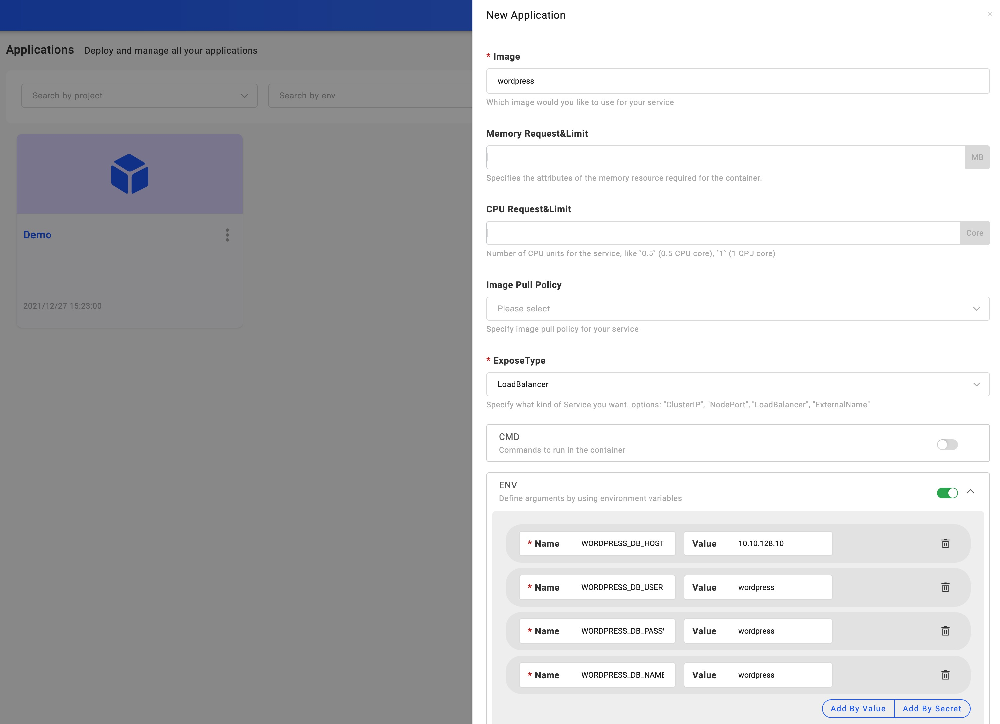

### 判断你的应用类别

我们大致把应用分为三种类型，普通业务应用、中间件（第三方开源应用）、云服务。对于普通业务应用，我们建议你采用 `webservice` 部署类型或你的自定义类型。对于中间件或第三方复杂应用建议直接采用 `helm` 部署类型，对于比较简单且直接提供了 Docker 镜像的第三方开源应用，比如 wordpress,也可以直接采用 `webservice` 类型。

### 设置应用基础信息

进入 `Applications` 页面，点击 `New Application` 按钮，进入应用基础信息设置页面。设置应用名称等基础信息，根据上一步判断的应用类型选择类型，根据你的实际情况选择部署的环境。设置完成后直接进入下一步。

### 设置应用部署参数

应用部署参数对于不同的类型差异较大，可根据 UI 提示的帮助信息进行信息输入。比如对于 `webservice` 类型的应用，他的输入参数如下图：

### 完成创建

根据提示完成部署参数的设置后，点击提交按钮即可完成应用创建。成功创建后进入应用管理页面，应用处于未部署状态。

### 下一步

* [绑定应用到环境](./bind-new-environment).