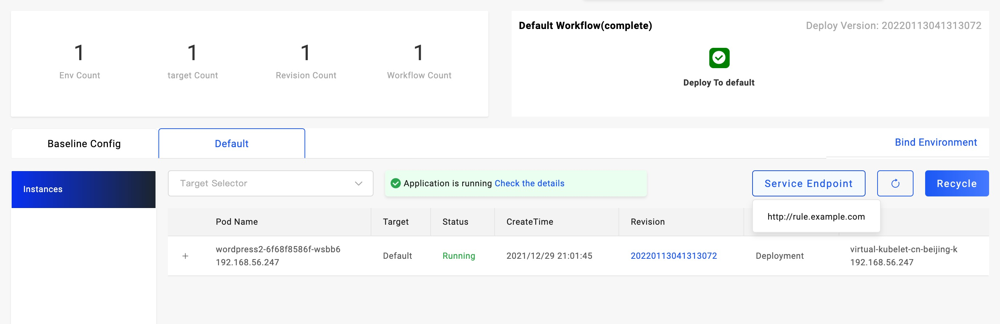

### 设置应用访问方式

交付的 Kubernetes 集群的应用需要设置访问方式即可生成访问地址，常见支持的方式如下：

1. 设置 Service 的暴露类型，比如 `LoadBalancer` 和 `NodePort`。适用于所有应用协议。
2. 设置 Ingress 策略，仅适用于 HTTP/HTTPs 协议。

#### `webservice` 类型的应用

在部署参数中可以修改 `ExposeType` 字段参数来设置其暴露方式，同时在 `Service Ports` 中设置应用的监听端口，并将 `Expose` 设置为 True。

如果你的集群中存在 `Ingress Controller`，在应用 `Baseline Config` 页面中，新增 `gateway` 运维特征来设置访问域名。

如上图所示，在 `Domain` 中配置你的域名，注意请将该域名 DNS 解析到目标集群的网关 IP 之上。在 `Http` 模块下配置路由规则，默认你需要设置 `/`:`80`，根据你的应用监听端口设置。

其他部署类型的应用，一般存在对应的部署参数设置选项，根据部署参数设置即可。

### 获取访问地址

设置完应用访问方式后，执行应用部署，然后切换到环境视图下即可看到 `Service Endpoint` 按钮，鼠标移动到上方即可显示该应用的访问地址。

