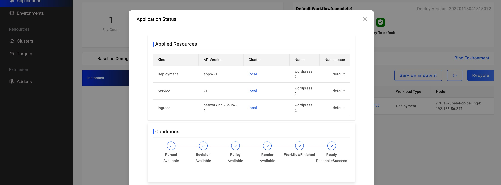

如果你希望查询应用在各集群部署了哪些资源，可通过下述操作方式查询。

进入应用实例列表页面，点击应用状态展示区域的 `Check the details` 文字按钮，即可弹出如下页面：

弹窗中展示了应用的 `Applied Resources` `Conditions` 和 `Component Status` 三方面信息，其中 `Applied Resources` 即是应用部署的资源列表。

在列表中呈现了包括资源类型、名称、所在集群和 Namespace 等信息。

### 下一步

* [查看应用部署版本](./get-application-revision)