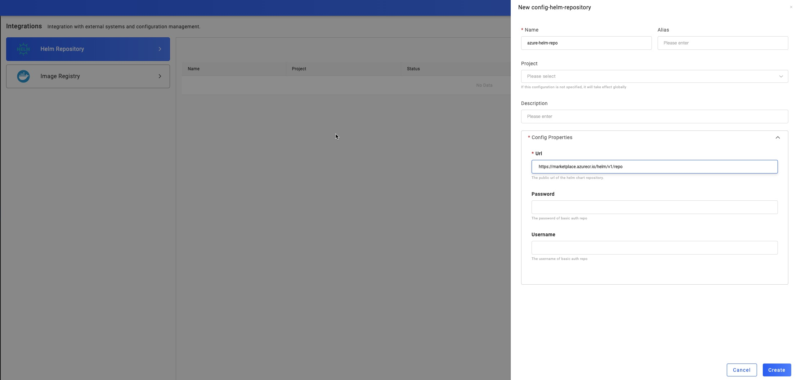
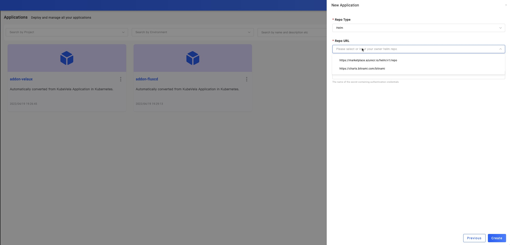

在本教程中，我们将会介绍如何通过集成配置，创建 helm 仓库，并在创建应用时使用该仓库。

请注意：在配置前你需要先启用 `fluxcd` 的插件。

## 创建一个 Helm 仓库

例如在本图中，你可以设置 helm 仓库的 url，并且如果你的仓库还开启了 `HTTP basic authentication` 你也可以为这个仓库设置 `username` 和 `paswword`。

在本例子中，我们使用 [bitnami](https://charts.bitnami.com/bitnami) 作为 helm 仓库。

## 创建应用并使用该 helm 仓库

你可以参考 [应用创建指南](../application/create-application) 在项目 `default` 中创建 helm 类型的应用。如下图所示：

接下来，你就可以在 `Repo URL` 的选择框中选择刚才创建的 helm 仓库。之后你就可以使用仓库中可用的 chart 来创建自己的应用了。 

