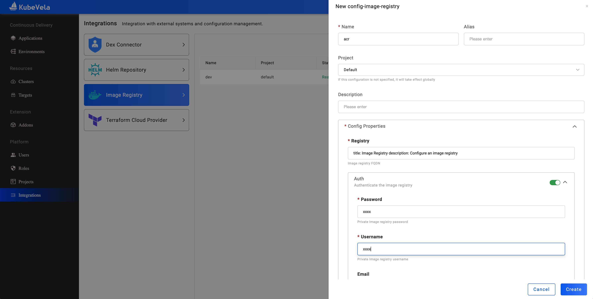
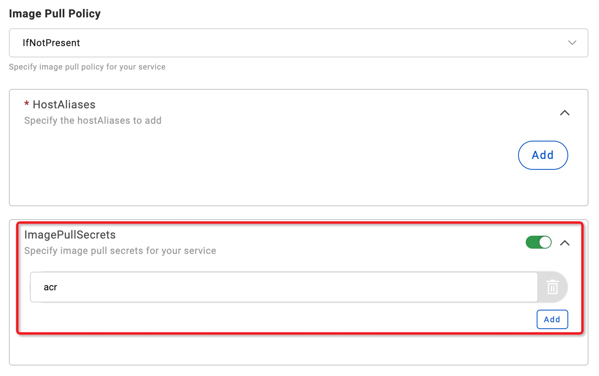

---
标题：镜像仓库
描述：配置镜像仓库
---

在本教程中，我们将介绍如何创建私有镜像仓库，以及如何创建镜像位于该镜像仓库中的应用。

## 创建镜像仓库

在镜像仓库页面中，我们创建一个私有镜像仓库 `acr`，其地址为 `registry.cn-beijing.aliyuncs.com`。

## 如何使用镜像仓库

让我们按照 [应用创建指南](../application/create-application.md) 在项目 `default` 中创建应用程序。

将容器镜像设置为位于私有镜像为 `acr` 中的镜像 `registry.cn-beijing.aliyuncs.com/vela/nginx:latest`。
并将 `ImagePullSecrets` 设置为 `acr`。

部署应用程序并等待一段时间。您可以看到应用程序正在运行，并且容器镜像已成功从私有镜像仓库中拉取。

