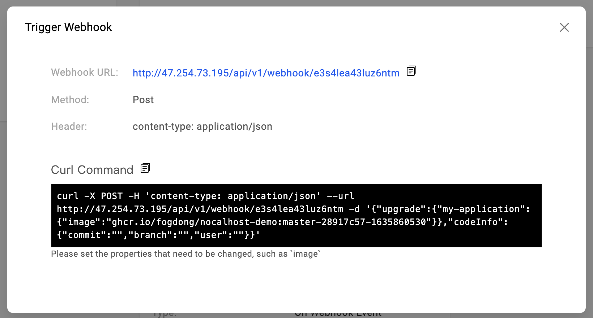
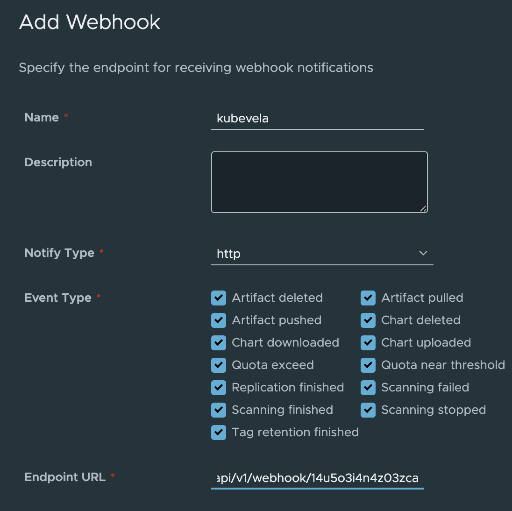
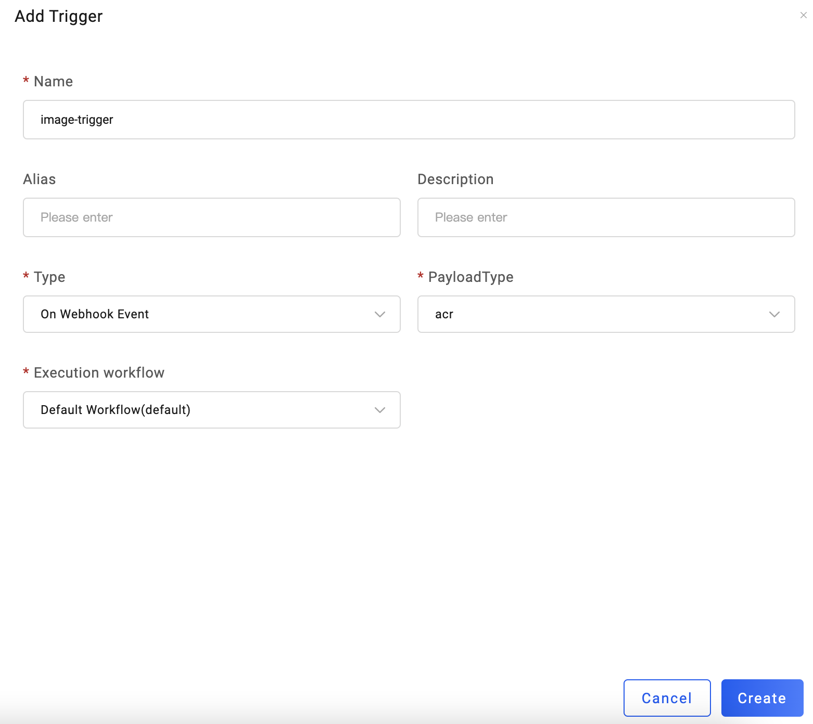

应用在创建完成后，会自动创建一个默认触发器，你可以删除或者创建新的触发器。


KubeVela 触发器可以对接不同类型的 CI 系统，在 CI 系统中添加触发器以此实现应用的自动部署。比如从制品仓库的镜像更新触发，通过 Jenkins Pipeline 触发等。

目前可以创建三种不同类型的触发器：Custom、ACR、Harbor，我们将分别介绍。

## Custom 触发器

Custom 为自定义类型的触发器，它提供一个 Webhook URL 以及指定的请求体格式，你可以用它来对接任意 CI 系统。

默认触发器是一个 Custom 类型的触发器，点击 `Manual Trigger`，可以查看触发器的详细信息：



Webhook URL 是这个触发器的触发地址，在 `Curl Command` 里，还提供了手动 Curl 该触发器的请求示例。我们来详细解析一下请求体：

```json
  {
    // 必填，此次触发的更新信息
    "upgrade": {
      // Key 为应用的名称
      "<application-name>": {
        // 需要更新的值，这里的内容会被 Patch 更新到应用上
        "image": "<image-name>"
      }
    },
    // 可选，此次触发携带的代码信息
    "codeInfo": {
      "commit": "<commit-id>",
      "branch": "<branch>",
      "user": "<user>",
    }
  }
```

`upgrade` 下是本次触发要携带的更新信息，在应用名下，是需要被 Patch 更新的值。默认推荐的是更新镜像 `image`，也可以扩展这里的字段来更新应用的其他属性。

`codeInfo` 中是代码信息，可以选择性地携带，比如提交 ID、分支、提交者等，一般这些值可以通过在 CI 系统中使用变量替换来指定。

下面是一个在 GitLab CI 中使用触发器的例子，里面所有的值都使用了变量替换：

```shell
webhook-request:
  stage: request
  before_script:
    - apk add --update curl && rm -rf /var/cache/apk/*
  script:
    - |
      curl -X POST -H "Content-Type: application/json" -d '{"upgrade":{"'"$ APP_NAME"'":{"image":"'"$BUILD_IMAGE"'"}},"codeInfo":{"user":"'"$CI_COMMIT_AUTHOR"'","commit":"'"$CI_COMMIT_SHA"'","branch":"'"$CI_COMMIT_BRANCH"'"}}' $WEBHOOK_URL
```

配置完成后，当 CI 中执行了该步骤，则能在 VelaUX 中看到应用已被成功部署，且能看到本次部署相关的代码信息。


## Harbor 触发器

Harbor 触发器可以对接 Harbor 镜像仓库。

首先来创建一个 Harbor 触发器，Payload Type 选择 Harbor，Execution Workflow 选择触发器需要触发的工作流：


新建完毕后，在 Harbor 中配置该触发器：



配置完成后，当 Harbor 中被推送了新镜像时，VelaUX 中会收到对应的触发请求，从而完成自动部署。


## ACR 触发器

ACR 触发器可以对接 ACR 镜像仓库。

首先来创建一个 ACR 触发器，Payload Type 选择 ACR，Execution Workflow 选择触发器需要触发的工作流：



新建完毕后，在 ACR 中配置该触发器：


配置完成后，当 ACR 中被推送了新镜像时，VelaUX 中会收到对应的触发请求，从而完成自动部署。


