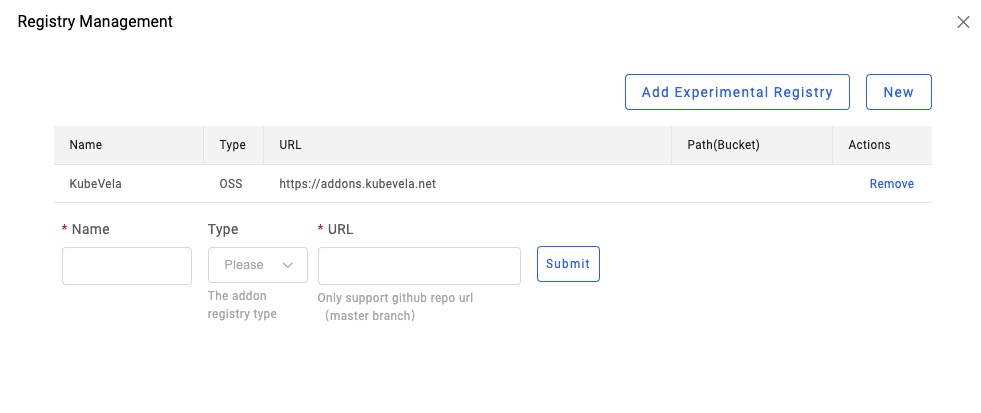
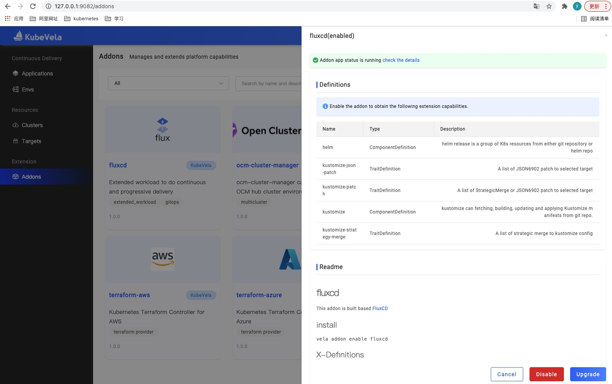
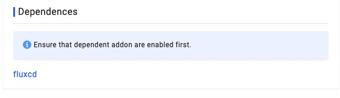
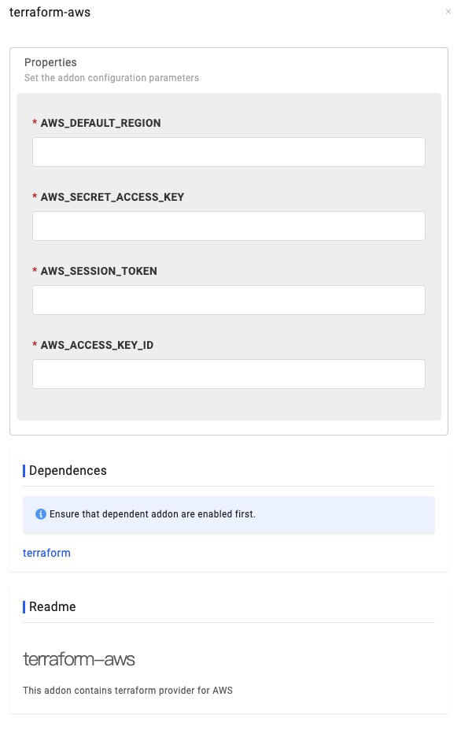

插件管理系统用于管理和扩展 KubeVela 的平台功能。
用户可以通过 UI/CLI 交互界面来启用或停用插件，从而安装或卸载 KubeVela 平台的扩展功能。
插件通过插件注册中心来存储、发现、分发等。

KubeVela 社区在 Github 上维护了一个官方的 [插件注册中心](https://github.com/oam-dev/catalog/tree/master/addons) ，里面有一些官方维护的插件。
此外，用户还可以自行定制和添加插件注册中心。

## 插件注册中心 (Addon Registry)

插件注册中心是一个上传和存储、发现和下载插件的地方。
插件注册中心的地址可以是一个 Git 仓库或者一个对象存储 Bucket。
一个插件注册中心的模样可以参考这个 [官方例子](https://github.com/oam-dev/catalog/tree/master/addons) 。

你可以通过 UI/CLI 来管理插件注册中心。下图展示如何通过 UI 来添加一个注册中心：

## 启用/停用插件 (Enable/Disable Addon)

你可以通过 UI/CLI 获取插件注册中心的插件列表，并启用/停用某个插件。

下面例子是一个插件在 UI 上的展示图：

如果某个插件需要依赖其他插件，只有当被依赖的的插件被启用之后，该插件才能被启用，如下图所示。

有些复杂的插件需要设置一些参数才能启用，如下图所示。

除了使用 KubeVela 维护的官方插件，你也可以按照下面的规范制作并添加一个插件到注册中心中。

## 插件规范 (Addon Format)

一个插件需要包括自描述文件、 基础的应用模版、组件资源、以及X-Definitions。 插件具体内容可以参考这个 [官方例子](https://github.com/oam-dev/catalog/tree/master/experimental/addons/example) 。

当启用一个 KubeVela 插件时，KubeVela 的 CLI / ApiServer 会负责将插件目录下的各个资源文件渲染成一个 KubeVela 应用并创建，最终由控制器完成资源下发。

一个插件目录下通常包含以下文件：

- `metadata.yaml` (必须): 包含了插件的自描述元信息。该文件中定义了该插件的名称、版本、描述、标签等基础信息，此外你可以通过设置以下字段来控制插件的安装行为：
    - `deployTo`: 表示插件是安装在控制平面还是子集群。
    - `dependencies`: 表示插件所依赖的其他插件，只有当所有依赖的插件均启用了，才能启用该插件。
    - `invisible`: 表示在拉取插件列表时，是否展示该插件。需要注意的是，当某个插件通过 `dependencies` 字段依赖了另一 `invisible` 字段为 true 的插件，启用插件时会自动启用其他所依赖插件。
    
- `template.yaml` (必须): 定义 KubeVela 应用模板，在启用插件时 KubeVela 会基于该模版渲染一个基础的 KubeVela 应用，你也可以在模版中增加更多的组件和工作流步骤。
  
- `resources/` (非必须): 该路径下的文件可以有 YAML 和 CUE 两种文件类型。
  
   - YAML 类型类型的文件是包含一个或多个 Kubernetes 对象的资源清单，这些对象在启用插件时会被渲染为 `k8s-object` 类型的组件并追加到上面提到的基础应用模版的组件列表当中。具体参考该[文件](https://github.com/oam-dev/catalog/tree/master/experimental/addons/example/resources/service) 。
   - CUE 类型的文件包含的是一个组件模版，在启用该插件时，该模版会从下面即将介绍的 `parameter.cue` 文件中读取启用参数，渲染出来一个组件定义追加到基础应用模版的组件列表当中。具体参考该[文件](https://github.com/oam-dev/catalog/blob/master/experimental/addons/example/resources/configmap.cue) 。

- `parameter.cue` (非必须) : 定义插件的启用参数，具体参考该[文件](https://github.com/oam-dev/catalog/blob/master/experimental/addons/example/resources/parameter.cue) 。
- `definitions/` (非必须): 包含 `X-Definitions` (组件/运维特征/工作流步骤定义) YAML 文件。需要注意的是，即使插件开启了子集群安装，`definitions/`中的资源也不会在子集群中创建。
- `schemas/` (非必须) :  包含 `X-Definitions` 所对应的 UI-schema 文件，用于在 UI 中展示 `X-Definitions` 所需要填写参数时增强显示效果`

## 已知局限 (Known Limits)

- 现在如果选择在集群中启用插件，KubeVela 会默认在所有子集群中安装，并且启用插件时所填的参数，会在所有集群中生效，之后计划完善多集群插件管理体系，包括支持集群差异化配置等特性。

- 尚缺少插件的版本管理，升降级等机制，之后计划完善这些特性。

- 尚不支持仅在子集群中安装插件。 如果不在控制平面安装插件，仅安装在子集群中，会遇到诸多已知问题。