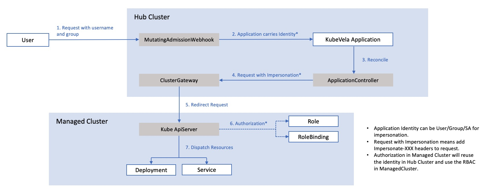
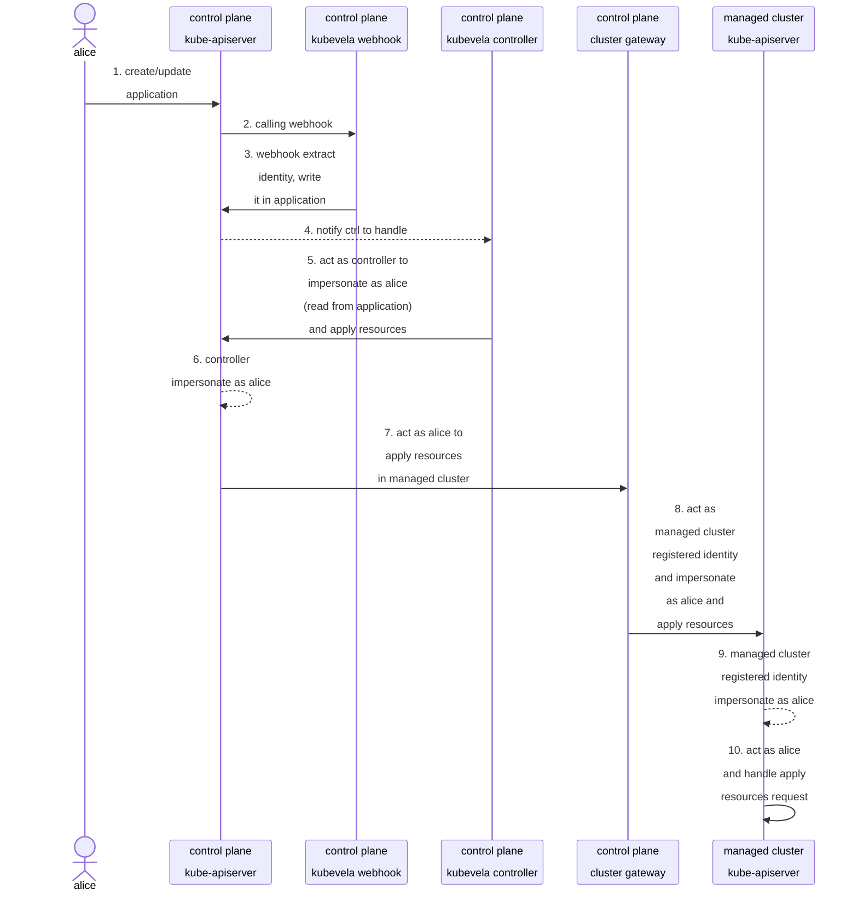

KubeVela 从 v1.4 版本引入认证和应用程序交付和管理授权。这篇文章将深入理解根本原理，并展示它如何运作。

> 这一基本机制主要侧重于KubeVela的应用。 VelaUX 在它上面构建了自己的认证和授权。

> 这篇文章讨论了范围较广的 KubeVela 认证和授权，包括设计、实现和高级用法。 阅读所有这些材料并了解这些材料，并不需要在实际中使用。

## 背景知识

KubeVela 身份认证和授权机制与 Kubernetes [Authentication mechanism](https://kubernetes.io/docs/reference/access-authn-authz/authentication/) and [RBAC Authorization mechanism](https://kubernetes.io/docs/reference/access-authn-authz/rbac/)一致。KubeVela 开发者和使用者可以直接重用 Kubernetes 的认证和访问控制，而无需学习或设置新的配置。

为了充分理解 KubeVela 认证和授权的机制，学习基本的 Kubernetes 概念是有帮助的。

### 身份

KubeVela主要用于两种身份认证，一种是用户/组，另一种是 ServiceAccount 。

通常用户/组信息嵌入在 X.509 证书，其中 [证书](https://kubernetes.io/docs/reference/access-authn-authz/authentication/#x509-client-certs) 中的CN (通用名称) 和 O (组织) 分别表示用户和组。

不同于 X.509 证书，ServiceAccount 通常由 KubeConfig 中的 Bearer Token来标识。 ServiceAccount 身份需要 Kubernetes 群组中的创建，而用户/组则不需要这么做。

如果您想要在 KubeVela 应用程序中使用 ServiceAccount 身份，您需要先在 Kubernetes 中创建 ServiceAccount。 如果使用用户/组，你只需要生成一个包含用户/组域的 X.509 证书的 KubeConfig。

通常当你通过 KinD/MINikube/K3s 等工具或云端供应商 EKS(Amazon) / ACK (Aliba) / GKE (Google) 设置您自己的 Kubernetes集群时，你将会得到基于X.509证书的 KubeConfig，包含默认的用户和组 `system:admin`, `kuberetes-amdin`, `system:users`, `system:masters` 等。 他们将被绑定到 `cluster-admin` ClusterRole 并赋予你管理 Kubernetes 集群的全部权限。

### 权限

KubeVela 中的访问控制完全基于原生的 Kubernetes RBAC（基于角色的访问控制）为基础。 这意味着 RoleBinding/ClusterRoleBinding 的定义了身份可以执行什么不可以执行什么。 你可以在本地使用 `kubectl` 来应用 YAML 文件，或者使用 Vela CLI 来将预定义的权限绑定到身份上。

无论你用哪种方式，实际上总是使用 Kubernetes 对象，包括Roles, RoleBindings, ClusterRoleBindings 并取决于你要使用的权限范围。 KubeVela 不会引入任何额外的权限对象。 因此 KubeVela 和 Kubernetes 之间不存在一致性问题。

## 通过 Vela CLI 管理

在 KubeVela 中 Vela CLI 提供了一系列方便的命令，能够帮助您管理这些身份及其权限。

### 生成 KubeConfig

如果您曾尝试使用 OpenSSL 或基于现有的 ServiceAccount 生成您自己的 KubeConfig 你会发现这个过程有点复杂和难记。 您可以写 shell 脚本自动化处理，但如果您还没有这个脚本或者不熟悉脚本，您可以尝试 Vela CLI 命令。

`vela auth gen-Kubeconconfig` 命令可以生成基于 X.509 的 KubeConfig 或 基于 ServiceAccount 令牌的 KubeConfig。

```bash
# This will generate a kubeconfig for user `new-user`
$ vela auth gen-kubeconfig --user new-user

# This will generate a kubeconfig for user `new-user` in group `kubevela:developer` and `my-org:my-team`
$ vela auth gen-kubeconfig --user new-user --group kubevela:developer --group my-org:my-team

# This will generate a kubeconfig for the ServiceAccount default in demo namespace
$ vela auth gen-kubeconfig --serviceaccount default -n demo
```

生成基于 X.509 的 KubeConfig，上面的命令将首先生成一对 RSA 公钥和私钥，并在 Kubernetes 中创建一个 CSR (证书签名请求)。 CSR 中使用 Kubernetes 用户作为证书中的 CN 和 Kubernetes 组作为证书中的组织。 在 CSR 创建后 Vela CLI 命令将自动批准证书，CSR 中的证书签名将被放到新生成的 KubeConfig。 最后，你将获得一个新的 KubeConfig ，它将被 Kubernetes 正确识别。

对于基于 ServiceAccount 的 KubeConfig，上面的命令将会找到目标 ServiceAccount 的密钥，并将其令牌嵌入到新生成的 KubeConfig中。 这个过程要简单一些，但需要先创建 ServiceAccount。

KubeVela 建议您使用基于用户/组的 KubeConfig，因为这个方法不会影响您创建或回收 ServiceAccount。

### 权限列表

在 Kubernetes 中，如果您想知道某人拥有的权限。 您需要查找 RoleBindings/ClusterRoleBindings 并找到所有绑定的 Roles/ClusterRoles。 然后您需要检查所有这些角色对象并查看其中的权限。 这个进程在 KubeVela 更加艰难，因为 KubeVela 支持多集群，这意味着必须重复这个过程。

幸运的是，为了减轻循环查找 role/rolebinding对象，Vela CLI 提供 `vvela auth list-privileges` 命令来帮助您检查多集群的权限。 您只需使用 `--cluster` 参数。 使用此命令，您不仅可以检查单个用户或 ServiceAccount 的权限， 它也可以在您的 KubeConfig 中检测身份并显示相关的权限。

```bash
# This will show all the privileges User alice has
$ vela auth list-privileges --user alice

# This will show all the privielges Group org:dev-team has
$ vela auth list-privileges --group org:dev-team

# This will show all the privileges User alice has in two managed clusters
$ vela auth list-privileges --user alice --cluster managedcluster1,managedcluster2

# This will show all the privileges ServiceAccount demo/default has
$ vela auth list-privileges --serviceaccount default -n demo

# This will show all the privileges for the given kubeconfig
$ vela auth list-privileges --kubeconfig ./example.kubeconfig
```

Vela CLI 命令将以树形结构显示 roles/rolebindings，它提供了直接和清晰的视图来显示所有用户权限。

```bash
$ vela auth list-privileges --kubeconfig ~/.kube/config
User=system:admin Groups=system:masters
└── [Cluster]  local
    └── [ClusterRole]  cluster-admin
        ├── [Scope]  
        │   └── [Cluster]  (ClusterRoleBinding cluster-admin)
        └── [PolicyRules]  
            ├── APIGroups:       *
            │   Resources:       *
            │   Verb:            *
            └── NonResourceURLs: *
                Verb:            *
```

### 授权

系统操作员管理用户的最常见方式之一是将群集资源按命名空间分配，并将用户分配给命名空间。 为了实现这一点，系统操作员通常先创建命名空间，然后在命名空间中为特定用户创建角色和角色绑定。 在多集群的情况下，这一过程也需要重复几次。 使用 `vela auth grant-privileges` 您可以使用这一命令自动将这些操作在多集群授予所有必需的权限。

```bash
# Grant privileges for User alice in the namespace demo in managed clusetrs, create demo namespace if not exist
$ vela auth grant-privileges --user alice --for-namespace demo --for-cluster managedcluster1,managedcluster2 --create-namespace

# Grant cluster-scoped privileges for Group org:dev-team
$ vela auth grant-privileges --group org:dev-team
```

`grant-privileges` 命令将首先检查目标命名空间是否存在。 使用 `--create-namespace` 在命名空间不存在时将被创建。 它将创建一个 ClusterRole 并允许用户对该命名空间中的任何资源进行读/写操作。 身份将通过 RoleBinding 或 ClusterRoleBinding 绑定到集群角色，具体使用哪个取决于授权范围。 最后，整个进程将在指定的集群中重复执行。

有时，您可能想要授予用户只读访问权限。 在这种情况下，您需要使用 `--readonly` 参数。

```bash
# Grant read privileges for ServiceAccount observer in test namespace
$ vela auth grant-privileges --serviceaccount observer -n test --for-namespace test --readonly
```

请注意，Vela CLI 只提供粗颗粒度的权限管理。 如果你想要更精细的权限管理，例如授予特定的资源权限，你可以参考原生的 Kubernetes RBAC。 KubeVela 也提供 `vela kube apply --cluster` 命令来帮助您将您的 YAML 对象文件传播到多个集群。

> Vela CLI 目前不提供撤销权限的命令。 如果您需要撤销权限，您可以编辑相应的 RoleBindings/ClusterRoleBindings 并从它们中移除绑定的身份。 如果你只想删除这些绑定, 你可以使用 `vvela kube delete --cluster` 来在多集群中快速删除。

## 深入应用

当应用认证在 KubeVela 启用时，应用将不会使用 KubeVela Controller 的权限来传输资源。 相反，它将使用最后创建或修改的身份权限。 它将防止用户通过创建包含自身权限之外的应用来提他们的特权。



完整的实现过程依赖于 Kubernetes [impersonation mechanism](https://kubernetes.io/docs/reference/access-authn-authz/authentication/#user-impersonation).

### 为应用绑定身份

当用户创建应用请求（例如创建一个新应用或修改现有应用） 请求将首先由 KubeVela 中的 Application MutatingAdmissionWebhook 处理。 Web 钩子将从请求中提取用户信息并将其记录到应用特性中。 Web 钩子将防止用户伪装成其他用户。

> 理论上，如果用户拥有与其他用户相同的权限，它可以通过 `kubectl apply --as=other-user`. 来创建应用。 身份将首先由 kube-apiserver 处理，在那里将伪装成其他用户。 然后Webhook 将收到从 kube-apiserver 的伪装请求，作为用户 `other-user`。同时，应用将绑定到 `other-user` ，而不是原来的用户。 当管理员用户想要作为其他用户进行调试/测试时，这将很有用。

### 模拟绑定身份

当处理资源时，KubeVela 控制器将发送带有模拟身份头信息的请求。 这意味着 kube-apiserver 将使用模拟身份处理这些资源请求。 在单集群情况下，目前这一请求会得到正确地处理。

对多群集场景，这一进程比较复杂。 在控制面板的 kube-apiserver 中模拟请求后，它将被重定向到集群网关服务。

然后，集群网关服务将在模拟头上再次带上请求的身份（从 kube-apiserver 带的模拟身份，也就是原始用户）。 这个从集群网关到管理集群的 kube-apiserver 的请求将被用于加入管理集群时使用的注册身份（这通常是管理集群中的管理身份）。 最后，该请求将在管理的群集中的 kube-apiserver 中被正确模拟和处理。

### 身份流

整个过程详见下表。



## 讨论

### 有限的控制器访问

在 KubeVela 启用应用认证时，KubeVela 的控制器的权限也受到限制。 在启用之前，KubeVela 控制器将使用绑定 cluster-admin ClusterRole 的 ServiceAccount。 它给予 KubeVela 控制器管理集群的所有权限。

启用应用认证后，KubeVela 控制器的权限也会降低。 因为所有资源调度操作将使用应用的身份， KubeVela 控制器只需要指定的身份权限来模拟。 除此之外，KubeVela 控制器仍然需要一些其他特权来管理系统级的资源，例如 ResourceTracker。

在细节上，对于 KubeVela 应用控制器的不同操作，有些需要模拟，有些则不是。 例如，访问所有 ResourceTracker 权限可能会过大，普通用户可能会有过大的权限。 因此，我们通常不给予用户这种特权，并保留对控制器的这种特权。 下面列表显示了是否需要模拟。

- Reading X-Definitions for Rendering: Not Impersonated 
- Reading Kubernetes Objects for Reference: Impersonated
- Dispatching and Managing Resources (Create/Update/Delete): Impersonated
- StateKeeping and Recycling Resources: Impersonated
- Collecting Resources Health Status: Impersonated
- Creating and Recycling ComponentRevisions: Impersonated
- Creating and Recycling ApplicationRevisions: Not Impersonated
- Creating, Updating and Recycling ResourceTrackers: Not Impersonated

没有模拟的操作仍将使用控制器的身份，而模拟的操作将在每个应用中使用绑定的身份。

### 身份渗透

KubeVela 的多集群应用模拟依赖于 ClusterGateway 的 ClientIdentityPeneration。 使用此功能，ClusterGateway 将始终从收到的请求中提取身份，并将其放在重定向到管理集群的请求的模拟头中。

这不仅有助于 KubeVela 应用在不同集群中使用相同的身份。 也防止任何未经授权通过 ClusterGateway 进入管理集群，并确保控制台上的管理集群访问权。

然而，这一特征有一些局限性，跨多集群所使用的身份必须是一致的。 例如，您不能让 KubeVela 应用在集群1中作为 alice，而是在集群2中作为 bob。 这将需要身份交换或投射，这些在 ClusterGateway 和 KubeVela 控制器中当前都不支持。

### 部分身份模拟

默认情况下，KubeVela 不会将所有身份信息传递给模拟头。 你可以通过控制器起始参数或 helm 值来控制它。

| Controller Flags             | Helm Values                  | Type    | Default            | Explanation                                                                                            |
| ---------------------------- | ---------------------------- | ------- | ------------------ | ------------------------------------------------------------------------------------------------------ |
| authentication-with-user     | .authentication.withUser     | boolean | false              | 如果此标志被设置为false，则身份中的用户字段将不会被传递到模拟头中。 只有选定的组才会传递。 在管理集群和控制台由不同的人操作的情况下，控制台操作者可能不想让管理下的集群知道其用户和群之间的对应关系。 |
| authentication-default-user  | .authentication.defaultUser  | string  | kubevela:vela-core | 如果身份中的用户字段不用于模拟，此字段将作为模拟的用户使用。                                                                         |
| authentication-group-pattern | .authentication.groupPattern | string  | kubevela:*         | 这个字段定义了从身份的模拟头中传递的组模式。 这将有助于控制台使用者限制哪些组应该传入请求到管理的集群。                                                   |

简而言之， 如果您的身份信息的透明度要求很低（如组集群和管理集群由同一团队操作）， 您可以设置 `--authentication-user=true` 和 `--authentication-group-pattern=*`。 默认配置使用最安全和最不透明的选项。

### 使用有限权限访问资源

KubeVela 的一些资源是数据敏感的。 例如，KubeVela 中的 ResourceTracker 对象记录了应用中发送的所有对象。 记录管理集群的密钥含有关键凭据信息。 通常，系统管理员可能不想向普通用户暴露所有这些信息。

[vela-prism](https://github.com/kubevela/prism) 是一个旨在解决这个问题的项目。 您可以通过在仓库中根据安装指南来安装它。

vela-prise 提供了访问 ResourceTrackers 和 Cluster Secrets 等敏感数据的替代途径。


原始的 KubeVela 中的 ResourceTracker 是一个集群资源，用于记录应用的所有资源并在应用更新和再回收过程中跟踪它们。

允许用户访问集群的 ResourceTracker 可能是危险的，因为用户将拥有读取其他用户应用发布的对象的权限。 ApplicationResourceTracker 是由 vela-prism 提供的，它提供了一个命名空间作用域来访问 ResourceTracker 对象，这意味着访问权限可以通过命名空间来限制。 使用 vela-prism 的好处之一是您可以运行 `vela status <appname> -n <namespace> --tree --detail` 查看应用的详细信息。 即使只有有限的特权。

这个vela-cluster 对象同样提供了获取群集密钥的其他途径。 它删除了敏感的凭据字段，用户可以查看哪些管理集群被加入，而不需要知道访问这些集群的凭据。 您可以在安装 vela prism 后运行 `kubectl get clusters` 获取所有加入的集群同样也可以使用 `vela cluster list` （这需要直接访问集群的权限）。

### 设计理念

KubeVela 在控制器中的身份认证的总体设计遵循了与本地 Kubernetes 一致的原则。 KubeVela 本身并不会进行额外的认证，因为这会增加 KubeVela 用户的学习负担。 相反，KubeVela控制器利用模拟机制，将权限检查推迟到 Kubernetes api-server，cluster-gateway 也是如此。

另一方面，VelaUX 中的身份验证则更多地侧重于上层实体的检查，如 Projects 和 Targets。它重用了底层应用和相关资源的权限检查。
