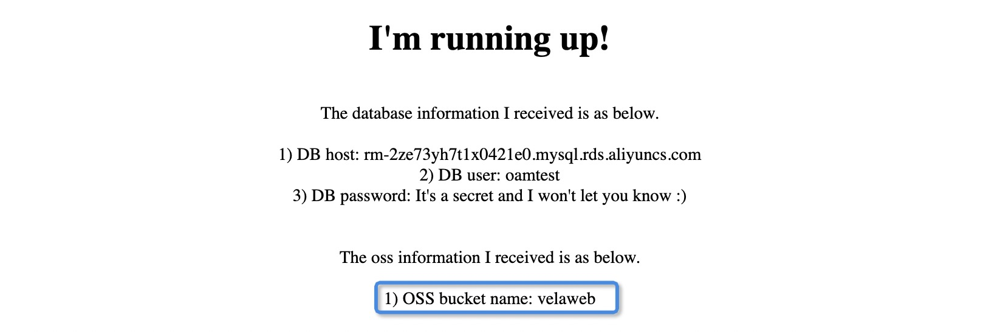

KubeVela 为云服务提供了统一的抽象。

## 云服务是 Component 还是 Trait?

可以考虑以下做法:
- 使用 `ComponentDefinition` 的场景:
  - 你想要允许最终用户明确声明云服务的实例并使用它，并在删除应用程序时释放该实例。
- 使用 `TraitDefinition` 的场景:
  - 你不想让最终用户拥有声明或发布云服务的任何控制权，而只想给他们消费云服务，甚至可以由其他系统管理的云服务的方式。在这种情况下，会广泛使用 `Service Binding` 特性。
	
在本文档中，我们将以阿里云的 RDS（关系数据库服务）和阿里云的 OSS（对象存储服务）为例。在单个应用程序中，它们是 Traits，在多个应用程序中，它们是 Components。此机制与其他云提供商相同。

## 安装和配置 Crossplane

KubeVela 使用 [Crossplane](https://crossplane.io/) 作为云服务提供商。请参阅 [Installation](https://github.com/crossplane/provider-alibaba/releases/tag/v0.5.0) 
安装 Crossplane Alibaba provider v0.5.0。

如果你想配置任何其他供应商的 Crossplane， 请参阅 [Crossplane Select a Getting Started Configuration](https://crossplane.io/docs/v1.1/getting-started/install-configure.html#select-a-getting-started-configuration).

```
$ kubectl crossplane install provider crossplane/provider-alibaba:v0.5.0

# 注意这里的 xxx 和 yyy 是你自己云资源的 AccessKey 和 SecretKey。
$ kubectl create secret generic alibaba-account-creds -n crossplane-system --from-literal=accessKeyId=xxx --from-literal=accessKeySecret=yyy

$ kubectl apply -f provider.yaml
```

`provider.yaml` 如下。

```yaml
apiVersion: v1
kind: Namespace
metadata:
  name: crossplane-system

---
apiVersion: alibaba.crossplane.io/v1alpha1
kind: ProviderConfig
metadata:
  name: default
spec:
  credentials:
    source: Secret
    secretRef:
      namespace: crossplane-system
      name: alibaba-account-creds
      key: credentials
  region: cn-beijing
```

注意：我们目前仅使用阿里提供的 Crossplane。 但是在不久的将来，我们将使用 [Crossplane](https://crossplane.io/) 作为 Kubernetes 的云资源供应商。

## 在单个应用程序 v1 中配置和使用云资源（单个云资源）

### 步骤 1: 注册 ComponentDefinition `alibaba-rds` 为 RDS 云资源提供者

首先, 将 工作负载类型 `alibaba-rds` 注册到KubeVela。

```yaml
apiVersion: core.oam.dev/v1beta1
kind: ComponentDefinition
metadata:
  name: alibaba-rds
  namespace: vela-system
  annotations:
    definition.oam.dev/description: "Alibaba Cloud RDS Resource"
spec:
  workload:
    definition:
      apiVersion: database.alibaba.crossplane.io/v1alpha1
      kind: RDSInstance
  schematic:
    cue:
      template: |
        output: {
        	apiVersion: "database.alibaba.crossplane.io/v1alpha1"
        	kind:       "RDSInstance"
        	spec: {
        		forProvider: {
        			engine:                parameter.engine
        			engineVersion:         parameter.engineVersion
        			dbInstanceClass:       parameter.instanceClass
        			dbInstanceStorageInGB: 20
        			securityIPList:        "0.0.0.0/0"
        			masterUsername:        parameter.username
        		}
        		writeConnectionSecretToRef: {
        			namespace: context.namespace
        			name:      parameter.secretName
        		}
        		providerConfigRef: {
        			name: "default"
        		}
        		deletionPolicy: "Delete"
        	}
        }
        parameter: {
        	engine:        *"mysql" | string
        	engineVersion: *"8.0" | string
        	instanceClass: *"rds.mysql.c1.large" | string
        	username:      string
        	secretName:    string
        }

```

### 步骤 2: 准备 TraitDefinition `service-binding` 作为 env-secret 的映射

至于应用程序中的数据绑定，KubeVela 建议定义一个 trait 以完成工作。我们已经准备了一个共同方便的 trait。此 trait 非常适合将资源的信息绑定到 pod spec 的环境变量中.

```yaml
apiVersion: core.oam.dev/v1beta1
kind: TraitDefinition
metadata:
  annotations:
    definition.oam.dev/description: "binding cloud resource secrets to pod env"
  name: service-binding
spec:
  appliesToWorkloads:
    - webservice
    - worker
  schematic:
    cue:
      template: |
        patch: {
        	spec: template: spec: {
        		// +patchKey=name
        		containers: [{
        			name: context.name
        			// +patchKey=name
        			env: [
        				for envName, v in parameter.envMappings {
        					name: envName
        					valueFrom: {
        						secretKeyRef: {
        							name: v.secret
        							if v["key"] != _|_ {
        								key: v.key
        							}
        							if v["key"] == _|_ {
        								key: envName
        							}
        						}
        					}
        				},
        			]
        		}]
        	}
        }

        parameter: {
        	envMappings: [string]: [string]: string
        }
```

借助这种 `service-binding` trait，开发人员可以显式设置参数 `envMappings`， 以映射所有环境变量。例子如下。

```yaml
...
      traits:
        - type: service-binding
          properties:
            envMappings:
              # environments refer to db-conn secret
              DB_PASSWORD:
                secret: db-conn
                key: password                                     # 1) If the env name is different from secret key, secret key has to be set.
              endpoint:
                secret: db-conn                                   # 2) If the env name is the same as the secret key, secret key can be omitted.
              username:
                secret: db-conn
              # environments refer to oss-conn secret
              BUCKET_NAME:
                secret: oss-conn
                key: Bucket
...
```

### 步骤 3: 创建一个应用程序使用云资源

创建具有云资源供应组件和消费组件的应用程序，如下所示。

```yaml
apiVersion: core.oam.dev/v1beta1
kind: Application
metadata:
  name: webapp
spec:
  components:
    - name: express-server
      type: webservice
      properties:
        image: zzxwill/flask-web-application:v0.3.1-crossplane
        ports: 80
      traits:
        - type: service-binding
          properties:
            envMappings:
              # environments refer to db-conn secret
              DB_PASSWORD:
                secret: db-conn
                key: password                                     # 1) If the env name is different from secret key, secret key has to be set.
              endpoint:
                secret: db-conn                                   # 2) If the env name is the same as the secret key, secret key can be omitted.
              username:
                secret: db-conn

    - name: sample-db
      type: alibaba-rds
      properties:
        name: sample-db
        engine: mysql
        engineVersion: "8.0"
        instanceClass: rds.mysql.c1.large
        username: oamtest
        secretName: db-conn

```

应用并验证应用程序。

```shell
$ kubectl get application
NAME     AGE
webapp   46m

$ kubectl port-forward deployment/express-server 80:80
Forwarding from 127.0.0.1:80 -> 80
Forwarding from [::1]:80 -> 80
Handling connection for 80
Handling connection for 80
```


## 在单个应用程序 v2 中配置和使用云资源（两个云资源）

基于 `在单个应用程序 v1 中配置和使用云资源（单个云资源）` 部分, 注册 KubeVela 的另一种云资源工作负载类型为 `alibaba-oss`。

```yaml
apiVersion: core.oam.dev/v1beta1
kind: ComponentDefinition
metadata:
  name: alibaba-oss
  namespace: vela-system
  annotations:
    definition.oam.dev/description: "Alibaba Cloud RDS Resource"
spec:
  workload:
    definition:
      apiVersion: oss.alibaba.crossplane.io/v1alpha1
      kind: Bucket
  schematic:
    cue:
      template: |
        output: {
        	apiVersion: "oss.alibaba.crossplane.io/v1alpha1"
        	kind:       "Bucket"
        	spec: {
        		name:               parameter.name
        		acl:                parameter.acl
        		storageClass:       parameter.storageClass
        		dataRedundancyType: parameter.dataRedundancyType
        		writeConnectionSecretToRef: {
        			namespace: context.namespace
        			name:      parameter.secretName
        		}
        		providerConfigRef: {
        			name: "default"
        		}
        		deletionPolicy: "Delete"
        	}
        }
        parameter: {
        	name:               string
        	acl:                *"private" | string
        	storageClass:       *"Standard" | string
        	dataRedundancyType: *"LRS" | string
        	secretName:         string
        }
```

更新应用程序以使用 OSS。

```yaml
apiVersion: core.oam.dev/v1beta1
kind: Application
metadata:
  name: webapp
spec:
  components:
    - name: express-server
      type: webservice
      properties:
        image: zzxwill/flask-web-application:v0.3.1-crossplane
        ports: 80
      traits:
        - type: service-binding
          properties:
            envMappings:
              # environments refer to db-conn secret
              DB_PASSWORD:
                secret: db-conn
                key: password                                     # 1) If the env name is different from secret key, secret key has to be set.
              endpoint:
                secret: db-conn                                   # 2) If the env name is the same as the secret key, secret key can be omitted.
              username:
                secret: db-conn
              # environments refer to oss-conn secret
              BUCKET_NAME:
                secret: oss-conn
                key: Bucket

    - name: sample-db
      type: alibaba-rds
      properties:
        name: sample-db
        engine: mysql
        engineVersion: "8.0"
        instanceClass: rds.mysql.c1.large
        username: oamtest
        secretName: db-conn

    - name: sample-oss
      type: alibaba-oss
      properties:
        name: velaweb
        secretName: oss-conn
```

应用并验证应用程序。

```shell
$ kubectl port-forward deployment/express-server 80:80
Forwarding from 127.0.0.1:80 -> 80
Forwarding from [::1]:80 -> 80
Handling connection for 80
Handling connection for 80
```



## 在不同的应用程序中提供和使用云资源

在本节中，将在一个应用程序中提供云资源，并在另一个应用程序中使用云资源。

### 提供云资源

在 [Application]（../ application.md）中使用工作负载类型 `alibaba-rds` 实例化 RDS 组件以提供云资源。

正如我们声明的 ComponentDefinition 名称为 `alibaba-rds` 的RDS 实例一样。应用程序中的组件应引用此类型。

```yaml
apiVersion: core.oam.dev/v1beta1
kind: Application
metadata:
  name: baas-rds
spec:
  components:
    - name: sample-db
      type: alibaba-rds
      properties:
        name: sample-db
        engine: mysql
        engineVersion: "8.0"
        instanceClass: rds.mysql.c1.large
        username: oamtest
        secretName: db-conn
```

将应用程序部署到 Kubernetes 中，将自动配置 RDS 实例（可能需要一些时间，约2分钟）。

同时将在与应用程序相同的命名空间中创建一个 secret `db-conn`。

```shell
$ kubectl get application
NAME       AGE
baas-rds   9h

$ kubectl get rdsinstance
NAME           READY   SYNCED   STATE     ENGINE   VERSION   AGE
sample-db-v1   True    True     Running   mysql    8.0       9h

$ kubectl get secret
NAME                                              TYPE                                  DATA   AGE
db-conn                                           connection.crossplane.io/v1alpha1     4      9h

$ ✗ kubectl get secret db-conn -o yaml
apiVersion: v1
data:
  endpoint: xxx==
  password: yyy
  port: MzMwNg==
  username: b2FtdGVzdA==
kind: Secret
```

### 使用云资源

在本节中，我们将展示在另一个组件如何使用 RDS 实例。

注意：如果该云资源具有独立的生命周期，我们建议声明云资源为独立的应用程序。

#### 步骤 1: 使用 Secret 定义 ComponentDefinition

```yaml
apiVersion: core.oam.dev/v1beta1
kind: ComponentDefinition
metadata:
  name: webconsumer
  annotations:
    definition.oam.dev/description: A Deployment provides declarative updates for Pods and ReplicaSets
spec:
  workload:
    definition:
      apiVersion: apps/v1
      kind: Deployment
  schematic:
    cue:
      template: |
        output: {
        	apiVersion: "apps/v1"
        	kind:       "Deployment"
        	spec: {
        		selector: matchLabels: {
        			"app.oam.dev/component": context.name
        		}

        		template: {
        			metadata: labels: {
        				"app.oam.dev/component": context.name
        			}

        			spec: {
        				containers: [{
        					name:  context.name
        					image: parameter.image

        					if parameter["cmd"] != _|_ {
        						command: parameter.cmd
        					}

        					if parameter["dbSecret"] != _|_ {
        						env: [
        							{
        								name:  "username"
        								value: dbConn.username
        							},
        							{
        								name:  "endpoint"
        								value: dbConn.endpoint
        							},
        							{
        								name:  "DB_PASSWORD"
        								value: dbConn.password
        							},
        						]
        					}

        					ports: [{
        						containerPort: parameter.port
        					}]

        					if parameter["cpu"] != _|_ {
        						resources: {
        							limits:
        								cpu: parameter.cpu
        							requests:
        								cpu: parameter.cpu
        						}
        					}
        				}]
        		}
        		}
        	}
        }

        parameter: {
        	// +usage=Which image would you like to use for your service
        	// +short=i
        	image: string

        	// +usage=Commands to run in the container
        	cmd?: [...string]

        	// +usage=Which port do you want customer traffic sent to
        	// +short=p
        	port: *80 | int

        	// +usage=Referred db secret
        	// +insertSecretTo=dbConn
        	dbSecret?: string

        	// +usage=Number of CPU units for the service, like `0.5` (0.5 CPU core), `1` (1 CPU core)
        	cpu?: string
        }

        dbConn: {
        	username: string
        	endpoint: string
        	password: string
        }

```

关键词是 annotation `// + insertSecretTo = dbConn`，KubeVela 将知道该参数是 K8s 的秘钥，它将解析该秘钥并将数据绑定到 CUE 接口 `dbConn` 中。

Then the `output` can reference the `dbConn` struct for the data value. The name `dbConn` can be any name. 
It's just an example in this case. The `+insertSecretTo` is keyword, it defines the data binding mechanism.
`output` 可以引用` dbConn` 获取数据。 名称 `dbConn` 可以是任何名称。
 关键字是 `+insertSecretTo`，它定义了数据绑定机制。这种情况只是一个例子。

现在创建应用程序以使用数据。

```yaml
apiVersion: core.oam.dev/v1beta1
kind: Application
metadata:
  name: webapp
spec:
  components:
    - name: express-server
      type: webconsumer
      properties:
        image: zzxwill/flask-web-application:v0.3.1-crossplane
        ports: 80
        dbSecret: db-conn
```

```shell
$ kubectl get application
NAME       AGE
baas-rds   10h
webapp     14h

$ kubectl get deployment
NAME                READY   UP-TO-DATE   AVAILABLE   AGE
express-server-v1   1/1     1            1           9h

$ kubectl port-forward deployment/express-server 80:80
```

我们可以看到云资源已被应用程序成功使用。


