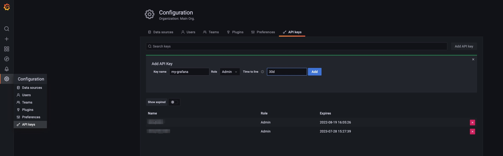
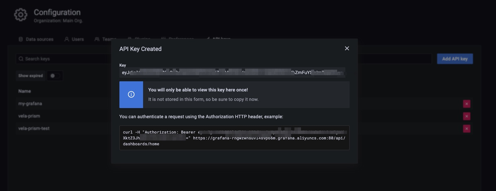

有时，你可能已经拥有 Prometheus 和 Grafana 实例。 它们可能由其他工具构建，或者来自云提供商。 按照以下指南与现有系统集成。

## 集成 Prometheus

如果你已经有外部 prometheus 服务，并且希望将其连接到 Grafana（由 vela 插件创建），你可以使用 KubeVela Application 创建一个 GrafanaDatasource 从而注册这个外部的 prometheus 服务。

```yaml
apiVersion: core.oam.dev/v1beta1
kind: Application
metadata:
  name: register-prometheus
spec:
  components:
    - type: grafana-datasource
      name: my-prometheus
      properties:
        access: proxy
        basicAuth: false
        isDefault: false
        name: MyPrometheus
        readOnly: true
        withCredentials: true
        jsonData:
          httpHeaderName1: Authorization
          tlsSkipVerify: true
        secureJsonFields:
          httpHeaderValue1: <token of your prometheus access>
        type: prometheus
        url: <my-prometheus url>
```

例如，如果你在阿里云（ARMS）上使用 Prometheus 服务，你可以进入 Prometheus 设置页面，找到访问的 url 和 token。


> 你需要确定你的 grafana 已经可以访问。你可以执行 `kubectl get grafana default` 查看它是否已经存在。

## 集成 Grafana

如果你已经有 Grafana，与集成 Prometheus 类似，你可以通过 KubeVela Application 注册 Grafana 的访问信息。

```yaml
apiVersion: core.oam.dev/v1beta1
kind: Application
metadata:
  name: register-grafana
spec:
  components:
    - type: grafana-access
      name: my-grafana
      properties:
        name: my-grafana
        endpoint: <my-grafana url>
        token: <access token>
```

要获得 Grafana 访问权限，你可以进入 Grafana 实例并配置 API 密钥。



然后将 token 复制到你的 grafana 注册配置中。



Application 成功派发后，你可以通过运行以下命令检查注册情况。

```shell
> kubectl get grafana
NAME         ENDPOINT                                                      CREDENTIAL_TYPE
default      http://grafana.o11y-system:3000                               BasicAuth
my-grafana   https://grafana-rngwzwnsuvl4s9p66m.grafana.aliyuncs.com:80/   BearerToken
```

现在，你也可以通过原生 Kubernetes API 在 grafana 实例上管理 dashboard 和数据源。

```shell
# 显示你拥有的所有 dashboard
kubectl get grafanadashboard -l grafana=my-grafana
# 显示你拥有的所有数据源
kubectl get grafanadatasource -l grafana=my-grafana
```

更多详情，你可以参考 [vela-prism](https://github.com/kubevela/prism#grafana-related-apis)。

## 使用配置管理进行集成

除了上述较为直接的对接方法，另一种方法是使用 KubeVela 中的配置管理能力来将已有 Prometheus 或 Grafana 连接到 KubeVela 系统中来。详见配置管理章节。

## 集成其他工具和系统

用户可以利用社区的各种工具或生态系统来构建自己的可观测性系统，例如 prometheus-operator 或 DataDog。 到目前为止，针对这些集成，KubeVela 并没有给出最佳实践。 未来我们可能会通过 KubeVela 插件集成那些流行的项目。 我们也欢迎社区贡献更广泛的探索和更多的联系。
