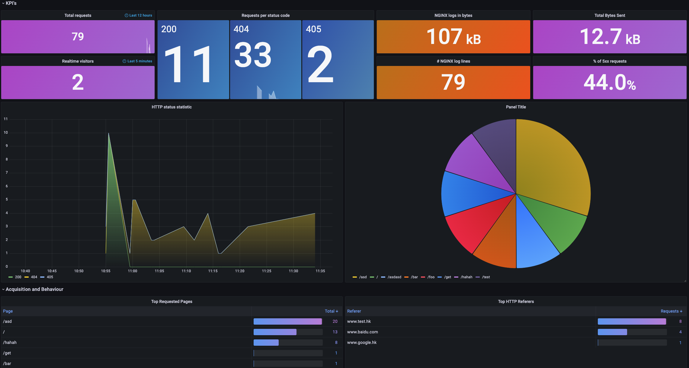

应用日志对于发现和排查线上问题至关重要，KubeVela 提供了专门的日志收集插件，帮助用户快速地构建应用的日志可观测的能力。本文档将介绍如何对应用日志进行采集，并在 grafana 大盘中对日志进行查看和分析。

:::tip
本文档将更聚焦于日志采集并用于实时分析。如果你想实时的获取日志排查问题，可以直接使用 `vela logs` 命令行或通过 `velaux` 插件提供的 UI 控制台查看。
:::

## 快速开始

你需要开启 `loki` 和 `grafana` 两个插件来获得本节描述的能力。

### 启用日志收集插件

日志收集插件可以通过两种模式启用：

- 定向采集：指定日志采集运维特征（Trait）使用。
- 全部采集：容器 stdout 日志自动化全部采集。


#### 定向采集模式

指定 `agent=vector` 参数启动 loki 插件。

```shell
vela addon enable loki agent=vector
```

:::caution
如果不指定 `agent=vector` 参数，默认 loki 插件只安装 loki 日志仓库，不做日志采集。
:::

启用该插件后会在管控集群部署一个 [loki](https://github.com/grafana/loki) 服务作为日志存储数据仓库，并会在当前各被管控集群的节点上部署日志采集 agent [vector](https://vector.dev/) 。

:::note
如果你只想指定部分集群安装 loki 插件，可以指定 `clusters` 参数启动插件。另外，新的集群被加入以后，你要重新运行一下插件启动命令来让这个集群生效。
:::

启动日志收集之后，默认不会对应用的日志进行采集，需要应用配置专门的运维特征来开启。系统中会增加以下两个日志收集运维特征：

- `file-logs`
- `stdout-logs`

你需要为应用组件配置上述特征，同时该运维特征也支持配置 vector 处理脚本（VRL）对日志内容做自定义解析处理，下面的章节将详细介绍这部分内容。

#### 默认全部采集模式（全采模式）

```shell
vela addon enable loki agent=vector stdout=all
```

启用该插件后，日志采集 agent [vector](https://vector.dev/) 会自动采集宿主机上实例的标准输出日志。收集的日志会被传输到管控集群的 loki 数据仓库。

这种方式启用的日志收集服务。不需要应用配置任何运维特征，即可对应用的标准输出日志进行采集，并将日志到汇总到控集群的 loki 服务当中。优点是配置简单。

:::caution
请注意，日志全采的方式也存在如下缺点：
1. 对所有运行的容器进行采集，当应用很多时会对运行在管控集群的 loki 服务造成很大的压力。一方面太多的日志需要被持久化，占用大量硬盘资源。另一方面各个集群的 vector agent 都需要把采集到的日志传输至 loki 服务，会消耗大量系统带宽。
2. 全采模式只能以统一的方式对日志进行收集，无法对不同应用的日志内容做特殊的处理。
:::


### 启用 grafana 插件

```shell
vela addon enable grafana
```

:::caution
即使你已经按照 [自动化可观测性文档](../observability) 的介绍启用过了 grafana 插件，仍需要重新启用一次 grafana 插件从而让 loki 插件的数据源注册到 grafana 中。
:::

## Kubernetes 系统事件日志

loki 插件开启后会在各个集群装中安装一个专门的组件，负责采集各个集群中的 Kubernetes 事件并转换成日志的形式存储在 loki 中。你还可以通过 grafana 插件中专门的 Kubernetes 事件分析大盘对系统的事件进行汇总分析。


<details>
    KubeVela Events dashboard 系统中各个集群的 Kubernetes 事件日志

    ---

    **Kubernetes Event overview** 以时间为维度，展示系统中各个时间段内新增的 Kubernetes 事件数目。

    ---

    **Warning Events** 统计系统中出现 `Warning` 类型的事件数目。

    ---

    **Image Pull Failed/Container Crashed .../Pod Evicted** 统计最近十二小时内，镜像拉取失败，实例被驱逐等各类标志应用失败的事件个数。

    ---

    **TOP 10 Kubernetes Events** 统计系统中最近十二小时内出现次数最高的十类事件

    ---

    **Kubernetes Events Source** 产生这些事件的控制器分布的饼状图。

    ---

    **Kubernetes Events Type** 与事件相关的资源对象类型的分布饼状图。

    ---

    **Kubernetes Live Events ** 最近的事件日志。

</details>

## 应用标准输出日志

上面已经提到如果在启用插件时选择的是全采模式，不需要应用做任何特殊配置，即可完成对容器的标准输出日志的采集。本节主要介绍，日志收集插件开启定向采集的模式下如何完成标准输出日志的采集。

在组件中配置 `stdout-logs` 运维特征完成对组件容器日志的收集，如下所示：

```yaml
apiVersion: core.oam.dev/v1beta1
kind: Application
metadata:
  name: app-stdout-log
  namespace: default
spec:
  components:
    - type: webservice
      name: comp-stdout-log
      properties:
        image: busybox
      traits:
        - type: command
          properties:
            command:
              - sh
              - -c
              - |
                while :
                do
                  now=$(date +"%T")
                  echo "stdout: $now"
                  sleep 10
                done
        - type: stdout-logs
```

应用创建之后你可以在对应 grafana 应用大盘中找到该应用创建的 deployment 资源，从而点击跳转到 deployment 资源大盘，并在下面找到采集上来的日志数据。如下：


### nginx 网关日志日志分析

如果你的应用是一个 nginx 网关应用，`stdout-logs` 运维特征所提供的 parser 能力可以将 nginx 日志输出 [combined](https://docs.nginx.com/nginx/admin-guide/monitoring/logging/) 格式的日志文件转换成 json 格式，并提供专门的分析大盘对 nginx 的网关访问请求进行进一步的分析。如下：

```yaml
apiVersion: core.oam.dev/v1beta1
kind: Application
metadata:
  name: nginx-app-2
spec:
  components:
    - name: nginx-comp
      type: webservice
      properties:
        image: nginx:1.14.2
        ports:
          - port: 80
            expose: true
      traits:
        - type: stdout-logs
          properties:
            parser: nginx
```

我们可以通过 grafana 中的应用大盘跳转到专门的 nginx 日志分析大盘。如下：



<details>
    KubeVela nginx application dashboard nginx 网关应用的访问日志分析大盘

    ---

    **KPI's** 包含网关的核心关键指标，例如，最近十二小时的总请求访问量，和 5xx 请求的百分占比。

    ---

    **HTTP status statistic** 时间维度上网关的各个请求码的请求数量统计。

    ---

    **Top Request Pages** 被访问最多的页面统计。


</details>

### 自定义日志处理脚本

除了使用通过在运维特种中设定参数 `parser: nginx` 对日志内容做处理，你还可以通过设置自定义的日志处理脚本对日志做自定义的处理。如下：

```yaml
apiVersion: core.oam.dev/v1beta1
kind: Application
metadata:
  name: nginx-app-2
spec:
  components:
    - name: nginx-comp
      type: webservice
      properties:
        image: nginx:1.14.2
        ports:
          - port: 80
            expose: true
      traits:
        - type: stdout-logs
          properties:
            parser: customize
            VRL: |
              .message = parse_nginx_log!(.message, "combined")
              .new_field = "new value"
```

该例子中，除了将 nginx 输出的 `combinded` 日志转换成 json 格式，并为每条日志增加一个 `new_field` 的 json key ，json value 的值为 `new value`。具体 vector VRL 如何编写请参考[文档](https://vector.dev/docs/reference/vrl/)。
如果你针对这种处理方式，制作了专门的日志分析大盘，可以参考 [文档](./dashboard) 提供的三种方式将其导入到 grafana 中。

## 应用文件日志

日志收集插件除了可以对容器标准输出日志进行收集，也可以对容器写到某个目录下的文件日志进行收集。如下：

```yaml
apiVersion: core.oam.dev/v1beta1
kind: Application
metadata:
  name: app-file
  namespace: default
spec:
  components:
    - type: webservice
      name: file-log-comp
      properties:
        image: busybox
      traits:
        - type: command
          properties:
            command:
              - sh
              - -c
              - |
                while :
                do
                  now=$(date +"%T")
                  echo "file: $now" >> /root/verbose.log
                  sleep 10
                done
        - type: file-logs
          properties:
            path: /root/verbose.log
```

在上面的例子中，我们把 `my-biz` 组件的业务日志输出到了容器内的 `/data/daily.log` 路径下。应用创建之后，你就可以通过应用下的 `deployment` 大盘查看到对应的文件日志结果。

:::tip
需要注意的是需要被收集的日志最好专门放在存储日志的路径下面，避免与镜像自身的功能目录冲突，尤其不能存放在容器的根目录当中，否则可能会导致容器启动失败。
:::


