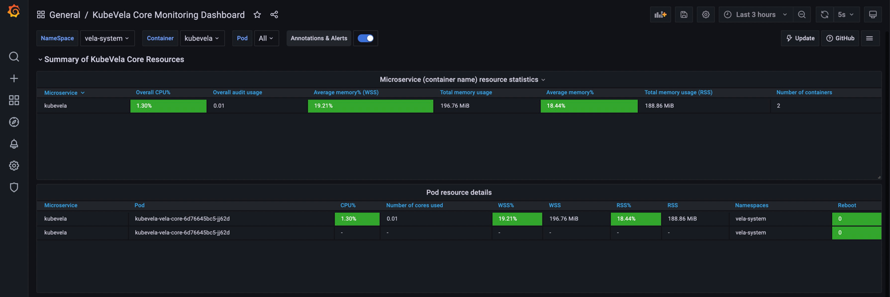
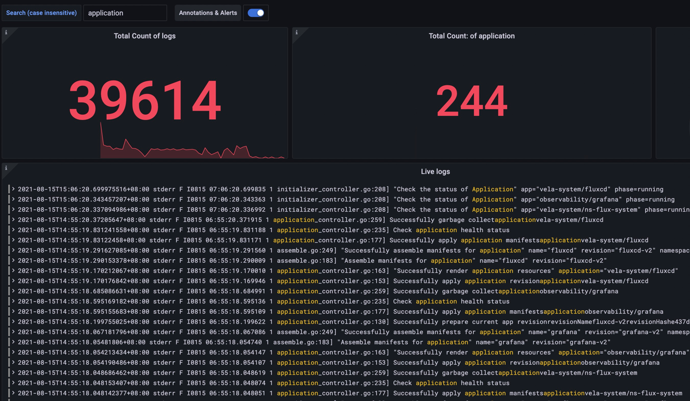

可观测性插件（Observability addon）基于 metrics、logging、tracing 数据，可以为 KubeVela core 提供系统级别的监控，也可以为应用提供业务级别的监控。

下面详细介绍可观测能力，以及如何启用可观测性插件，并查看各种监控数据。

## 可观测能力介绍

KubeVela 可观测能力是通过 [Grafana](https://grafana.com/) 展示的，提供系统级别和应用级别的数据监控。

### 内置的指标类别一：KubeVela Core 系统级别可观测性

- KubeVela Core 资源使用情况监控

1）CPU、内存等使用量和使用率数据



2）CPU、内存随着时间变化（如过去三小时）的使用量和使用率、以及每秒网络带宽的图形化展示


### 内置的指标类别二：KubeVela Core 日志监控

1）日志统计

可观测页面会显示KubeVela Core 日志总量，以及默认情况下，`error` 出现的数量、频率、出现的所有日志概览和详情。


还会展示随着时间变化，`error` 日志出现的总量、频率等。


2）日志过滤

在最上方填写关键词，还可以过滤日志。



## 安装插件

可观测性插件是通过 `vela addon` 命令安装的。因为本插件依赖了 Prometheus，Prometheus 依赖 StorageClass，
不同 Kubernetes 发行版，StorageClass 会有一定的差异，所以，在不同的 Kubernetes 发行版， 安装命令也有一些差异。

### 自建/常规集群

执行如下命令安装可观测性插件，KinD 等测试集群的安装步骤同理。

```shell
$ vela addon enable observability alertmanager-pvc-enabled=false server-pvc-enabled=false grafana-domain=example.com
```

### 云服务商提供的 Kubernetes 集群

#### 阿里云 ACK

```shell
$ vela addon enable observability alertmanager-pvc-class=alicloud-disk-available alertmanager-pvc-size=20Gi server-pvc-class=alicloud-disk-available server-pvc-size=20Gi grafana-domain=grafana.c276f4dac730c47b8b8988905e3c68fcf.cn-hongkong.alicontainer.com
```

其中，各个参数含义如下：

- alertmanager-pvc-class

Prometheus alert manager 需要的 pvc 的类型，也就是 StorageClass，在阿里云上，可选的 StorageClass 有：

```shell
$ kubectl get storageclass
NAME                       PROVISIONER     RECLAIMPOLICY   VOLUMEBINDINGMODE   ALLOWVOLUMEEXPANSION   AGE
alicloud-disk-available    alicloud/disk   Delete          Immediate           true                   6d
alicloud-disk-efficiency   alicloud/disk   Delete          Immediate           true                   6d
alicloud-disk-essd         alicloud/disk   Delete          Immediate           true                   6d
alicloud-disk-ssd          alicloud/disk   Delete          Immediate           true                   6d
```

此处取值 `alicloud-disk-available`。

- alertmanager-pvc-size

Prometheus alert manager 需要的 pvc 的大小，在阿里云上，最小的 PV 是 20GB，此处取值 20Gi。

- server-pvc-class

Prometheus server 需要的 pvc 的类型，同 `alertmanager-pvc-class`。

- server-pvc-size

Prometheus server 需要的 pvc 的大小，同 `alertmanager-pvc-size`。

- grafana-domain

Grafana 的域名，可以使用您自定义的域名，也可以使用 ACK 提供的集群级别的泛域名，`*.c276f4dac730c47b8b8988905e3c68fcf.cn-hongkong.alicontainer.com`，
如本处取值 `grafana.c276f4dac730c47b8b8988905e3c68fcf.cn-hongkong.alicontainer.com`。

#### 其他云服务商提供的 Kubernetes 集群

请根据不同云服务商 Kubernetes 集群提供的 PVC 的名字和大小规格，以及域名规则，对应更改以下参数：

- alertmanager-pvc-class
- alertmanager-pvc-size
- server-pvc-class
- server-pvc-size
- grafana-domain

## 查看监控数据

### 获取监控控制台访问路径

- 自建/常规集群

```shell
$ kubectl get svc grafana -n vela-system
NAME      TYPE        CLUSTER-IP       EXTERNAL-IP   PORT(S)   AGE
grafana   ClusterIP   192.168.42.243   <none>        80/TCP    177m

$ sudo k port-forward service/grafana -n vela-system 80:80
Password:
Forwarding from 127.0.0.1:80 -> 3000
Forwarding from [::1]:80 -> 3000
```

通过浏览器访问 [http://127.0.0.1/dashboards](http://127.0.0.1/dashboards)，点击相应的 Dashboard ，查看前面介绍的各种监控数据。


- 云服务商提供的 Kubernetes 集群

直接访问上面设置的 Grafana 域名，查看前面介绍的各种监控数据。

### 查看各种类别的监控数据

在 Grafana 主页上，点击如图所示的控制台，可以访问相应类别的监控数据。

KubeVela Core System Monitoring Dashboard 是 KubeVela Core 系统级别监控控制台。
KubeVela Core Logging Dashboard 是 KubeVela Core 日志监控控制台。


