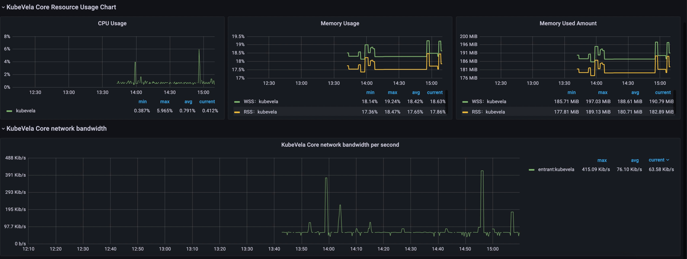
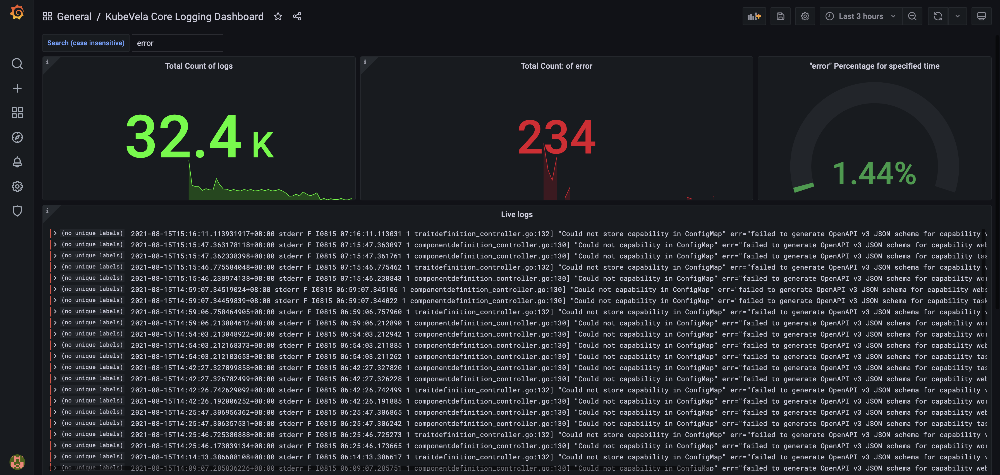
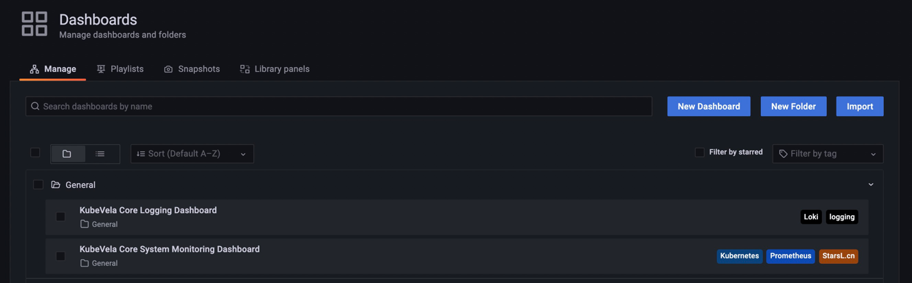

可观测性插件（Observability addon）基于 metrics、logging、tracing 数据，可以为 KubeVela core 提供系统级别的监控，也可以为应用提供业务级别的监控。

下面详细介绍可观测能力，以及如何启用可观测性插件，并查看各种监控数据。

## 可观测能力介绍

KubeVela 可观测能力是通过 [Grafana](https://grafana.com/) 展示的，提供系统级别和应用级别的数据监控。

### 内置的指标类别一：KubeVela Core 系统级别可观测性

- KubeVela Core 资源使用情况监控

1）CPU、内存等使用量和使用率数据


2）CPU、内存随着时间变化（如过去三小时）的使用量和使用率、以及每秒网络带宽的图形化展示



### 内置的指标类别二：KubeVela Core 日志监控

1）日志统计

可观测页面会显示KubeVela Core 日志总量，以及默认情况下，`error` 出现的数量、频率、出现的所有日志概览和详情。



还会展示随着时间变化，`error` 日志出现的总量、频率等。


2）日志过滤

在最上方填写关键词，还可以过滤日志。


## 安装插件

可观测性插件是一款实验插件，首先需要[开启实验插件仓库](../addon/intro.md)，其依赖了 Prometheus，Prometheus 的 alert manager 和 server
依赖 PersistentVolume，所以，需要设置 PV 的大小，也就是 `vela addon enable observability` 命令行里的 `disk-size` 参数，默认为 20GB，并且依赖 StorageClass，需要设置默认的
StorageClass。

### 自建/常规集群

执行如下命令安装可观测性插件，KinD 等测试集群的安装步骤同理。

```shell
$ vela addon enable observability disk-size=2Gi
```

### 云服务商提供的 Kubernetes 集群

#### 阿里云 ACK

首先从 StorageClass 列表里选择一个合适的作为默认的 StorageClass。

```shell
$ kubectl get storageclass
NAME                       PROVISIONER     RECLAIMPOLICY   VOLUMEBINDINGMODE   ALLOWVOLUMEEXPANSION   AGE
alicloud-disk-available    alicloud/disk   Delete          Immediate           true                   6d
alicloud-disk-efficiency   alicloud/disk   Delete          Immediate           true                   6d
alicloud-disk-essd         alicloud/disk   Delete          Immediate           true                   6d
alicloud-disk-ssd          alicloud/disk   Delete          Immediate           true                   6d

$ kubectl patch storageclass $StorageClass -p '{"metadata": {"annotations":{"storageclass.kubernetes.io/is-default-class":"true"}}}'
```


安装可观测性 Addon，使用默认的 PV 大小 20GB。

```shell
$ vela addon enable observability
```

#### 其他云服务商提供的 Kubernetes 集群

请根据不同云服务商 Kubernetes 集群，设置默认的 StorageClass 和需要的 PV 大小。

## 查看监控数据

### 获取访问监控控制台的账号

```shell
$ kubectl get secret grafana -o jsonpath="{.data.admin-password}" -n vela-system | base64 --decode ; echo
<密码显示在这里>
```

使用 `admin` 和上面的密码登陆下面的监控控制台。

### 获取监控控制台访问路径

- 自建/常规集群

```shell
$ sudo vela port-forward addon-observability -n vela-system 80:80
```

通过访问上述命令行打开的浏览器页面的可观测性控制台 ，查看前面介绍的各种监控数据。



- 云服务商提供的 Kubernetes 集群

直接访问上面设置的 Grafana 域名，查看前面介绍的各种监控数据。

### 查看各种类别的监控数据

在 Grafana 主页上，点击如图所示的控制台，可以访问相应类别的监控数据。

KubeVela Core System Monitoring Dashboard 是 KubeVela Core 系统级别监控控制台。
KubeVela Core Logging Dashboard 是 KubeVela Core 日志监控控制台。


