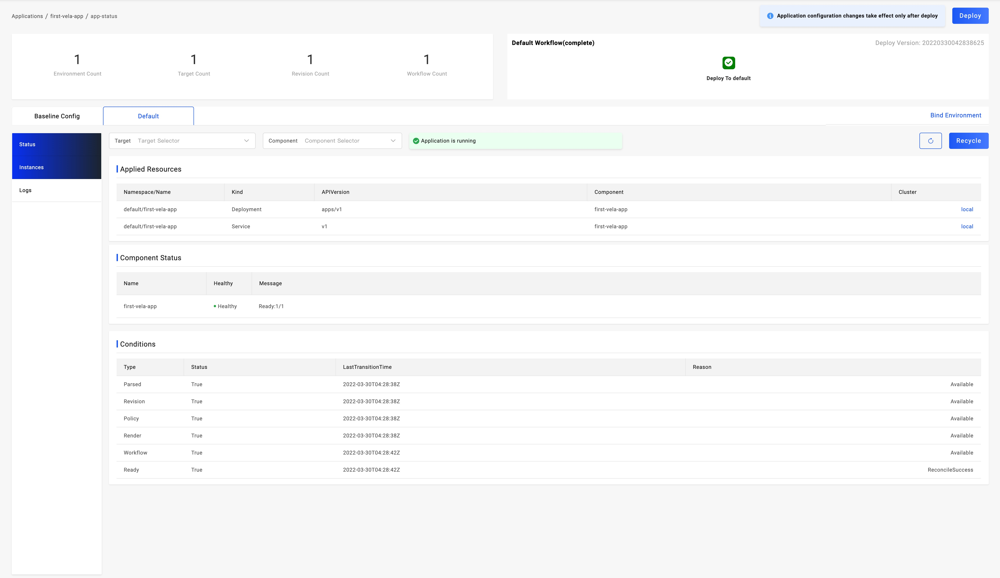
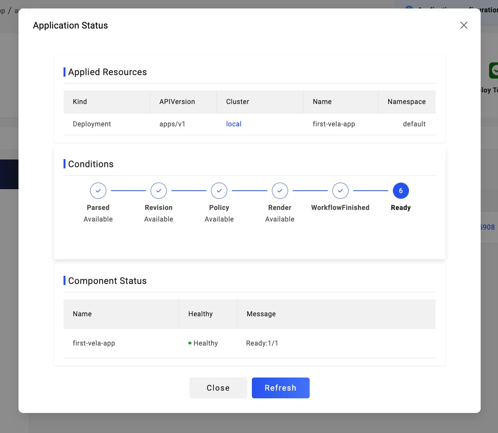

> 在实践之前，请确保你已经按照 [从 Kubernetes 集群安装](./install.mdx) 文档，在你的控制平面集群中安装了 KubeVela 和 VelaUX Dashboard。

欢迎来到 KubeVela！在本小节中，我们会向你介绍如何使用 VelaUX Dashboard 来交付一个简单的应用。

你将会操作的步骤有：

1. 使用一个简单的镜像： [crccheck/hello-world](https://hub.docker.com/r/crccheck/hello-world)；
2. 创建基于上一步镜像的无状态应用 `webservice` 的 `Application`，指向自带的 local 集群、local `Target` 所在的环境； 
3. 设置应用配置，通过 LoadBalancer 的方式把服务以外网 IP 加端口暴露出去；
4. 测试访问服务是否成功，应用交付完毕。

你将学习到内容的有：

- 初步接触 `Cluster`、`Target` 和 `Project` 等核心概念。
- 通过操作 VelaUX Dashboard 完整交付一个应用。

## 一个简单的示例

我们首先打开启动页面，点击左侧导航栏里的 `Application` 来到应用创建页面：

然后点击右上角的 `New Application` 开始创建应用。在 `Name` 输入框内，键入名称：first-vela-app；选择一个 `Type` 为 webservice 的应用；选择 `dev` 环境和 local `Target`；最后点击 `Next Step` ：

接下来看到应用的配置页面，我们对应的配置 Image 地址和 `ExposeType` 后点击 `Create`：

创建成功后，点击右上角的 `Deploy` 进行部署，成功后如下：

在部署的过程中，你可以点击 `Check the details` 来查看相关信息：

## 下一步

- 查看 [`交付你的应用`](./deliver-app/kustomize)，交付更多的 Kubernetes 原生资源、Helm Chart 和云资源等等。同时掌握，如何使用多集群工作流和多集群。
- 查看 [`管理你的应用`](./manage-app/autoscaler)，使用调整实例数量、配置网关规则等常用的应用管理操作。
- 加入 KubeVela 中文社区钉钉群，群号：23310022。