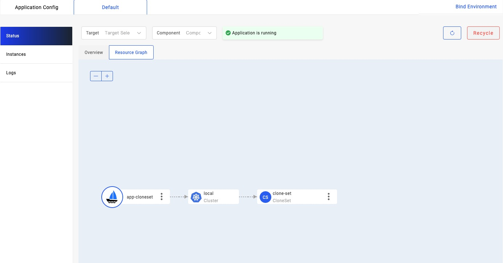

---
title: 资源关联规则
--- 

`资源关联规则`主要规定了：一个类型的 Kubernetes 资源可能包含哪些类型的子资源。它的主要作用是帮助 KubeVela 建立应用所纳管资源的拓扑关系。举例来说，系统中已经内置了这样的一条关系规则：[Deployment](https://kubernetes.io/docs/concepts/workloads/controllers/deployment/) 类型的资源下面的子资源只可能是 [ReplicaSet](https://kubernetes.io/docs/concepts/workloads/controllers/replicaset/)，而 ReplicaSet 的子资源只可能是 [Pod](https://kubernetes.io/docs/concepts/workloads/pods/)。
这样当创建了一个 Deployment 为工作负载的 KubeVela 应用后，在 VelaUX 的资源拓扑图页面查看该应用的拓扑关系视图，KubeVela 就会根据上面的`资源关联规则`，先列出和 Deployment 同一 namespace 的所有 ReplicaSet 并过滤掉 OwnerReference 不是该 Deployment 的结果，进一步经过一样的过程找出 ReplicaSet 下面的 Pod，从而建立起整个应用下面纳管资源的拓扑层级关系。

总体上这些`资源关联规则`主要会在以下场景中被用到：

- 在 VelaUX 的资源拓扑视图中用来展示资源之间的拓扑关系。下面就是一个资源拓扑图的例子：


  
- 通过 cli 使用 `vela port-forward`, `vela logs`, `vela exec` 以及 `vela status --endpoint` 或者在 VelaUX 上查看应用下实例的日志或访问端口等功能时，用来发现应用下面的 pod 或 service。

## 为自定义资源添加关系规则

系统所内置的`资源关联规则`是有限的，如果系统中添加了新的自定义资源（Kubernetes CustomResource），你可以创建一个 Kubernetes `configmap` 来为这个类型资源添加关系规则。

接下来我们通过一个实际的例子来讲解资源关系规则的作用。

你可以先通过下面的命令，启用一个尚在实验阶段的插件 [kruise](https://github.com/kubevela/catalog/tree/master/experimental/addons/kruise)。

```shell
vela addon registry add experimental --type=helm --endpoint=https://addons.kubevela.net/experimental/
vela addon enable kruise
```

插件启用成功之后，我们就可以看到一个 `cloneset` 的 componentDefinition，而这个 Definition 创建出来的工作负载是一个 `clonesets.apps.kruise.io`，最终这个 `clonset` 会创建出来具体的 pod。

```shell
$ vela componets
NAME                    DEFINITION                      DESCRIPTION                                                 
cloneset                autodetects.core.oam.dev        Describes long-running, scalable, containerized services    
                                                        that have a stable network endpoint to receive external     
                                                        network traffic from customers. If workload type is skipped 
                                                        for any service defined in Appfile, it will be defaulted to 
                                                        `webservice` type.
```

接下来，创建一个 `cloneset` 的应用如下所示：

```yaml
cat <<EOF | vela up -f -
apiVersion: core.oam.dev/v1beta1
kind: Application
metadata:
  name: app-cloneset
spec:
  components:
    - name: clone-set
      type: cloneset
      properties:
        cmd:
          - ./podinfo
          - stress-cpu=1
        image: stefanprodan/podinfo:4.0.3
        port: 8080
        updateStrategyType: InPlaceOnly
EOF
```

应用创建成功之后，我们在 VelaUX 页面查看该应用时，在资源拓扑页面发现 `cloneset` 资源下面没有关联任何的资源，并且通过实例列表页面查看到应用下面的 Pod，如下所示：




同时，如果我们通过 `vela logs` 和 `vela exec` 时同样会遇到无法找到实例的问题。如下所示：

```shell
$ vela logs app-cloneset
Error: no pod found in your application
```

```shell
$ vela exec app-cloneset
Error: no pod found in your application
```

其实以上问题的原因都是由于系统添加了一个 `cloneset` 的自定义资源之后，并没有与之相关的资源关系规则来定义它下面可能有那些类型的子资源。进而在展示资源拓扑图时 KubeVela 不知道该去查找哪些资源类型，也无法找到相应的实例。如果我们通过 `kubectl` 的命令查看由这个 `cloneset` 创建 pod 的详细信息会看到这样的结果：

```yaml
apiVersion: v1
kind: Pod
metadata:
#...
  name: clone-set-vsrj9
  namespace: default
  ownerReferences:
  - apiVersion: apps.kruise.io/v1alpha1
    blockOwnerDeletion: true
    controller: true
    kind: CloneSet
    name: clone-set
    uid: 817f55d2-a0d8-4efd-be0d-0021e1710dea
spec:
#...
```

可见，该 pod 的 OwnerReference 就是应用所创建出来的 `cloneset`。接下来我们为系统添加定义了一个资源关系规则的 `configmap` 如下所示：

```yaml
apiVersion: v1
kind: ConfigMap
metadata:
  name: clone-set-relation
  namespace: vela-system
  annotations:
   "rules.oam.dev/resource-format": "yaml"
  labels:
    "rules.oam.dev/resources": "true"
data:
  rules: |-
    - parentResourceType:
        group: apps.kruise.io
        kind: CloneSet
      childrenResourceType:
        - apiVersion: v1
          kind: Pod
```

我们看到，首先这个 configmap 包含了一个特殊的标签 `"rules.oam.dev/resources": "true"`。只有包含一个这样标签的 configmap 才会被 KubeVela 识别为是一个关于`资源关联规则`的定义。同时在这个例子中我们还通过一个 `"rules.oam.dev/resource-format": "yaml"` 注解定义了下面 `data.rules` 字段所定义的具体规则是通过 YAML 的格式定义的，除了使用 YAML 格式，你还可以使用 JSON 格式来定义这些规则，如下所示：

```yaml
apiVersion: v1
kind: ConfigMap
metadata:
  name: clone-set-relation
  namespace: vela-system
  annotations:
   "rules.oam.dev/resource-format": "json"
  labels:
    "rules.oam.dev/resources": "true"
data:
  rules: |-
   [
     {
       "parentResourceType": {
           "group": "apps.kruise.io",
           "kind": "CloneSet"
       },
       "childrenResourceType": [
           {
               "apiVersion": "v1",
               "kind": "Pod"
           }
       ]
     }
  ]
```

上面两个 configmap 作用完全等价。

在这个`资源关联规则` configmap 的数据字段（`data.rules`） 中定义的必须是一个规则列表，单个规则包含了一个父资源类型和一组可能的子资源类型。 在这个例子中，我们定义了一个 `apps.kruise.io` 组下的 `CloneSet` 类型资源的子资源是 `v1/Pod`，这样在展示 CloneSet 的子资源时，就会定向去查找 pod 。 

这个 `configmap` 创建成功之后，再次查看资源拓扑视图和实例列表如下所示：


我们再次使用 `vela logs` 和 `vela exec`  等命令时就不会再遇到的错误，如下所示：

```shell
$ vela logs app-cloneset
+ clone-set-vsrj9 › clone-set
clone-set 2022-08-22T11:53:46.005267600Z {"level":"info","ts":"2022-08-22T11:53:46.002Z","caller":"podinfo/main.go:123","msg":"Starting podinfo","version":"4.0.3","revision":"a2f9216fe43849c3b4844032771ba632307d8738","port":"9898"}
```

同样的，如果你的某个自定义资源会创建 Kubernetes service ，你也可以为系统添加一个资源关系规则，从而支持查找应用的访问端点的功能： `vela status --endpoints`。

## 集成在插件当中

经过上面的介绍相信你应该已经想到，如果一个 KubeVela [插件](../platform-engineers/addon/intro)中安装了某种自定义资源，你就可以通过在插件中添加一个这样的 configmap 来建立这个它与其他资源的关系规则。 具体方法是在插件的应用模版文件中的 `outputs` 定义一个资源关联规则的 configmap。例如：

```cue
package main

output: {
	apiVersion: "core.oam.dev/v1beta1"
	kind:       "Application"
	spec: {
		
	}
	... 
}

outputs: resourceTree: {
	apiVersion: "v1"
	kind:       "ConfigMap"
	metadata: {
		name:      "resource-tree"
		namespace: "vela-system"
		labels: {
			"rules.oam.dev/resources":       "true"
			"rules.oam.dev/resource-format": "json"
		}
	}
	data: rules: json.Marshal(_rules)
}

_rules: {...}
```

具体请参考[文档](../platform-engineers/addon/addon-cue#auxiliary-resources) 。