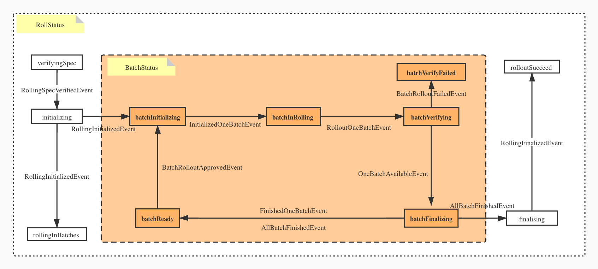

在任何应用中，灰度发布、或者说应用升级，都是应用部署完成以后最主要的运维事项之一。KubeVela 作为“以应用为中心”的平台，旨在提供定制的解决方案来减轻应用运维人员的负担。

## 概述

在云原生社区中，有几种尝试解决渐进式灰度发布问题的尝试。但是没有一种提供了真正的滚动式升级。例如，flagger 只支持蓝绿发布，金丝雀发布 和 A/B 测试等模式。因此，我们决定把对基于批处理的滚动升级功能作为我们在KubeVela 中支持的第一种模式。

### 设计原则和目标

我们在设计 KubeVela 的 rollout 解决方案时会始终保证以下原则：

- 第一，我们希望所有类型的 rollout controllers 共享相同的核心 rollout 相关逻辑。Trait 和 应用相关的逻辑可以很轻松地把它们封装到其自己的代码包里。
- 第二，rollout 的核心逻辑应该能够通过非常简单的扩展就能做到支持不同类型的工作负载，比如 Deployment，CloneSet，Statefulset，DaemonSet，或甚至是自定义的工作负载。
- 第三，rollout 的核心逻辑应当包含一个具有完备文档的状态机，其中的每一步状态转换都应当是明确的。
- 第四，这些 rollout controllers 可以支持应用在生产环境灰度发布/升级所需的所有场景，包括蓝绿发布，金丝雀发布 和 A/B 测试等模式。

## AppRollout 示例

这里是一个简单的 `AppRollout` 的示例，它分三个批次（batch）把一个应用从 v1 升级到 v2。第一个批次只升级 1 个 pod，然后剩下的批次平分剩下的实例。

```yaml
apiVersion: core.oam.dev/v1beta1
kind: AppRollout
metadata:
  name: rolling-example
spec:
  sourceAppRevisionName: test-rolling-v1
  targetAppRevisionName: test-rolling-v2
  componentList:
    - metrics-provider
  rolloutPlan:
    rolloutStrategy: "IncreaseFirst"
    rolloutBatches:
      - replicas: 1
      - replicas: 50%
      - replicas: 50%
    batchPartition: 1
```

## 用户体验工作流

这里是一个基于 [CloneSet](https://openkruise.io/en-us/docs/cloneset.html) 的端到端的用户体验

1. 安装 CloneSet 并为其创建一个 `ComponentDefinition`。

```shell
helm install kruise https://github.com/openkruise/kruise/releases/download/v0.7.0/kruise-chart.tgz
```

```yaml
apiVersion: core.oam.dev/v1beta1
kind: ComponentDefinition
metadata:
  name: clonesetservice
  namespace: vela-system
  annotations:
    definition.oam.dev/description: "Describes long-running, scalable, containerized services that have a stable network endpoint to receive external network traffic from customers.
    If workload type is skipped for any service defined in Appfile, it will be defaulted to `webservice` type."
spec:
  workload:
    definition:
      apiVersion: apps.kruise.io/v1alpha1
      kind: CloneSet
  schematic:
    cue:
      template: |
        output: {
            apiVersion: "apps.kruise.io/v1alpha1"
            kind:       "CloneSet"
            metadata: labels: {
              "app.oam.dev/component": context.name
            }
            spec: {
                if parameter["replicas"] != _|_ {
                    replicas: parameter.replicas
                }
                selector: matchLabels: {
                    "app.oam.dev/component": context.name
                }

                template: {
                    metadata: labels: {
                      "app.oam.dev/component": context.name
                    }

                    spec: {
                        containers: [{
                          name:  context.name
                          image: parameter.image

                          if parameter["cmd"] != _|_ {
                              command: parameter.cmd
                          }

                          if parameter["env"] != _|_ {
                              env: parameter.env
                          }

                          if context["config"] != _|_ {
                              env: context.config
                          }

                          ports: [{
                              containerPort: parameter.port
                          }]

                          if parameter["cpu"] != _|_ {
                              resources: {
                                  limits:
                                      cpu: parameter.cpu
                                  requests:
                                      cpu: parameter.cpu
                              }
                          }
                      }]
                    }
                }
                if parameter["updateStrategyType"] != _|_ {
                    updateStrategy: {
                      type: parameter.updateStrategyType
                    }
                }
            }
        }
        parameter: {
            // +usage=Which image would you like to use for your service
            // +short=i
            image: string

            // +usage=Commands to run in the container
            cmd?: [...string]

            // +usage=Which port do you want customer traffic sent to
            // +short=p
            port: *80 | int
            // +usage=Define arguments by using environment variables
            env?: [...{
                // +usage=Environment variable name
                name: string
                // +usage=The value of the environment variable
                value?: string
                // +usage=Specifies a source the value of this var should come from
                valueFrom?: {
                    // +usage=Selects a key of a secret in the pod's namespace
                    secretKeyRef: {
                        // +usage=The name of the secret in the pod's namespace to select from
                        name: string
                        // +usage=The key of the secret to select from. Must be a valid secret key
                        key: string
                    }
                }
            }]
            // +usage=Number of CPU units for the service, like `0.5` (0.5 CPU core), `1` (1 CPU core)
            cpu?: string
            // +usage=Cloneset updateStrategy, candidates are `ReCreate`/`InPlaceIfPossible`/`InPlaceOnly`
            updateStrategyType?: string
            // +usage=Number of pods in the cloneset
            replicas?: int
        }
  ```

2. 部署一个应用到集群

```yaml
apiVersion: core.oam.dev/v1beta1
kind: Application
metadata:
  name: test-rolling
  annotations:
    "app.oam.dev/rolling-components": "metrics-provider"
    "app.oam.dev/rollout-template": "true"
spec:
  components:
    - name: metrics-provider
      type: clonesetservice
      properties:
        cmd:
          - ./podinfo
          - stress-cpu=1
        image: stefanprodan/podinfo:4.0.6
        port: 8080
        updateStrategyType: InPlaceIfPossible
        replicas: 5
```

3. 使用下面的 rollout 来升级应用到 v1

```yaml
apiVersion: core.oam.dev/v1beta1
kind: AppRollout
metadata:
  name: rolling-example
spec:
  # application (revision) reference
  targetAppRevisionName: test-rolling-v1
  componentList:
    - metrics-provider
  rolloutPlan:
    rolloutStrategy: "IncreaseFirst"
    rolloutBatches:
      - replicas: 10%
      - replicas: 40%
      - replicas: 50%
```

用户可以查看 ApplicationRollout 的状态并等待 rollout 完成。

4. 用户可以继续修改应用镜像标签并部署。

```yaml
apiVersion: core.oam.dev/v1beta1
kind: Application
metadata:
  name: test-rolling
  annotations:
    "app.oam.dev/rolling-components": "metrics-provider"
    "app.oam.dev/rollout-template": "true"
spec:
  components:
    - name: metrics-provider
      type: clonesetservice
      properties:
        cmd:
          - ./podinfo
          - stress-cpu=1
        image: stefanprodan/podinfo:5.0.2
        port: 8080
        updateStrategyType: InPlaceIfPossible
        replicas: 5
```

5. 使用应用 rollout 把应用从 v1 升级到 v2

```yaml
apiVersion: core.oam.dev/v1beta1
kind: AppRollout
metadata:
  name: rolling-example
spec:
  # application (revision) reference
  sourceAppRevisionName: test-rolling-v1
  targetAppRevisionName: test-rolling-v2
  componentList:
    - metrics-provider
  rolloutPlan:
    rolloutStrategy: "IncreaseFirst"
    rolloutBatches:
      - replicas: 1
      - replicas: 2
      - replicas: 2
```

用户可以检查 ApplicationRollout 的状态并看到 rollout 完成了。此时 ApplicationRollout 的 `Rolling State` 变成了`rolloutSucceed`。

## 状态转移

下图是更高层面的状态转移图



## Roadmap

Our recent roadmap for progressive rollout is [here](./roadmap.md).
