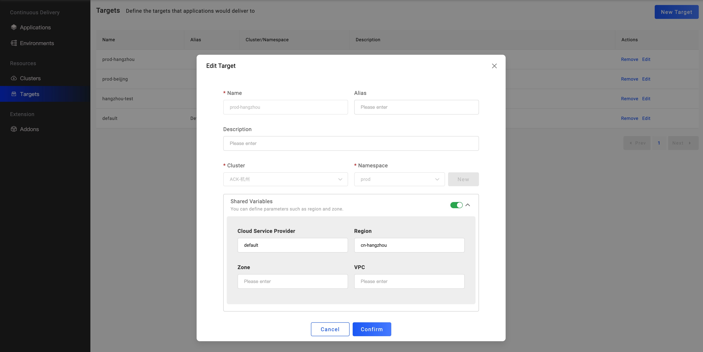
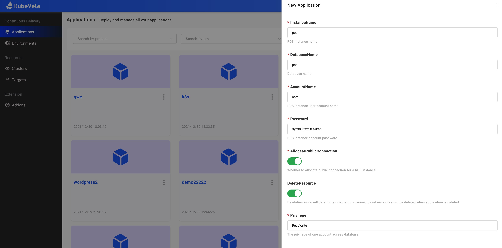

集成云服务是实际开发中最频繁的使用需求之一。从基础的对象存储、云数据库到负载均衡、云缓存，再到基于业务的搜索引擎等等，快速的接入云服务并便捷的使用它们可以大大降低开发成本。与此同时，由于可供选择的云服务厂商非常多，多云交付已成为未来必然形态，如何管理好接入混合云环境时各类资源之间的关系，也成为必须解决的最大挑战。

在本文中，我们以交付阿里云 RDS 服务为例，为大家介绍 KubeVela 交付云服务的使用方式。

## 开始之前

- 开通云厂商账户，根据权限最小化原则，分配好可获取 AK/SK 的子账号。阿里云请参考 [创建 RAM 用户](https://help.aliyun.com/document_detail/121941.html)。

- 确保云账号具有足够的费用。

- 对接一个处在同一个云上的 Kubernetes 集群，用以验证云服务的正常开通与使用。

## 开启对应云服务商的插件

首先我们打开 VelaUX Dashboard，选择左侧第四个选项卡 `Addon` ，点开 terraform-alibaba：

接着填入你的 ALICLOUD_ACCESS_KEY，ALICLOUD_REGION 和 ALICLOUD_SECRET_KEY 来 Enable 它。

> 注意：KubeVela 会加密存储以上所有的密钥信息，不用担心泄漏风险

`terraform-alibaba` 插件依赖 `terraform` 插件，如果后者未启用，它会自动被启用。云资源的创建过程需要从 Github 中获取云服务配置文件，如果你的管控集群所在网络访问 Github 受限，你可以打开 `terraform` 插件管理页面开启 `GithubBlocked` 选项。

`terraform-alibaba` 插件提供了以下类型资源的支持，并持续增加中：

- alibaba-rds
- alibaba-ack
- alibaba-ask
- alibaba-oss
- alibaba-rds
- alibaba-redis

## 设置交付目标参数

云资源的交付模型与其他应用不同，它的控制器只会在管控集群运行，创建多云/多可用区的云服务。因此，我们需要在交付目标中设置每一个目标所处的云厂商和区域参数。
进入交付目标管理页面，选择你需要使用云资源的目标区域，点击 `Edit` 进入编辑窗口，或直接创建新的交付目标。

交付目标首先主要描述的是 Kubernetes 集群的 Namespace，然后通过设置共享变量的方式描述该集群所处的云厂商和区域。

- Cloud Service Provider: 云服务提供商，与 AK/SK 绑定，`terraform-alibaba` 默认生成的名称是 `default`，因此这里填入 default 即可。
- Region: 地域，创建云服务时基于此参数选择地域。你应该填写当前交付目标所描述的 Kubernetes 集群所在地域，以便 Kubernetes 中的应用可直接访问交付的云服务。

## 创建你需要的云资源应用

设置完交付目标后，让我们点击左侧第一个 `Applications` 选项卡进入应用管理页面，点击右上角的 `New Application` 开始创建应用。与其他类型的应用一样，你仅需要选择你想要部署的云服务类型，比如我们选择 `alibaba-rds`，选择环境，请注意，选择的环境包括的交付目标必须都设置了 `Cloud Service Provider` 和 `Region` 参数。

点击 `Next Step` 按钮进入部署参数设置页面，对于不同的云服务有不同的设置参数，以 `alibaba-rds` 为例，支持以下参数：

- InstanceName: 实例名称
- DatabaseName: 数据库名称
- AccountName: 默认生成的账号名称
- Password: 默认生成的账号密码
- AllocatePublicConnection: 是否分配公网访问地址
- DeleteResource: 是否在应用删除时删除对应的云服务
- Privilege: 默认生成的账号权限

对于其他云资源，可直接阅读每个字段的说明即可。按照你的需求设置以上参数，点击 `Create` 进入应用管理页面后，点击部署按钮即可开始云服务的部署。

## 查看云资源创建状态

与普通应用一样，云服务应用也是需要切换到对应环境页面下查看实例信息。默认情况下一个环境下有几个交付目标，云服务即会生成对应数量的实例。

在实例列表中，展示实例名称、状态、资源类型和所在地域。初始情况下，名字为空，因为云服务实例的生成需要一定时间，当实例正常生成后名称即可出现。点击名称即可进入资源对应的云厂商控制台页面。

点击 `Check the detail` 按钮，查看应用详情，你会发现每一个实例对应生成了 Secret 资源，该资源一般记录的该服务的访问地址和密钥等信息。Secret 资源会在管控集群存在同时分发到交付目标所处的集群和 Namespace。因此处在同一个环境下的其他应用可以直接在环境变量中直接应用该资源获取通信地址和密钥。

## 常见错误

- 云服务实例处在 ProviderNotReady 状态

> 首先需要确定是否按照文档指引正确设置了交付目标的参数。然后确定 AK/SK 是正确且对应用户具有创建该资源的权限。

- 云服务一直处在 ProvisioningAndChecking 状态，且无名称。

> 云服务的创建一般需要一定时间，请等候或者进入云厂商控制台查看创建进度。