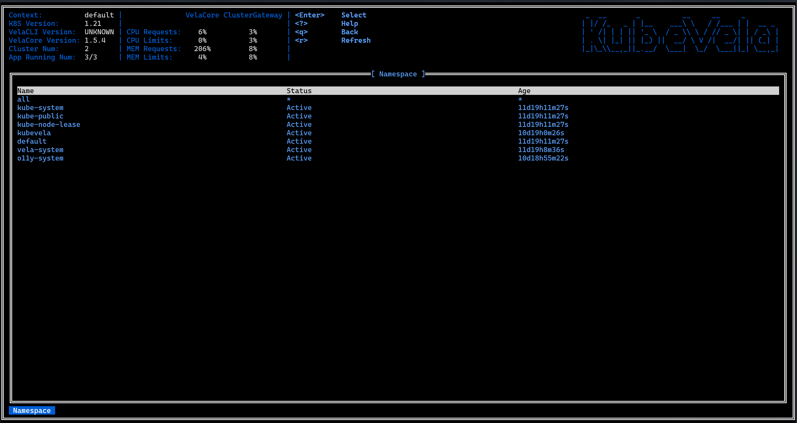
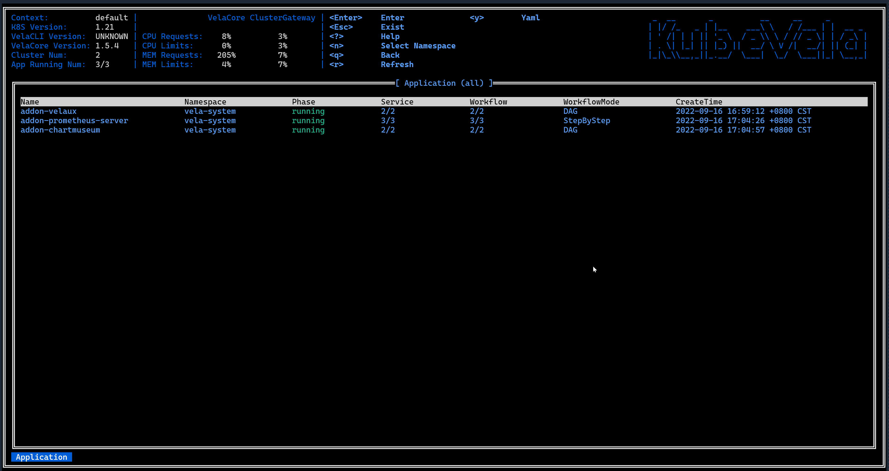
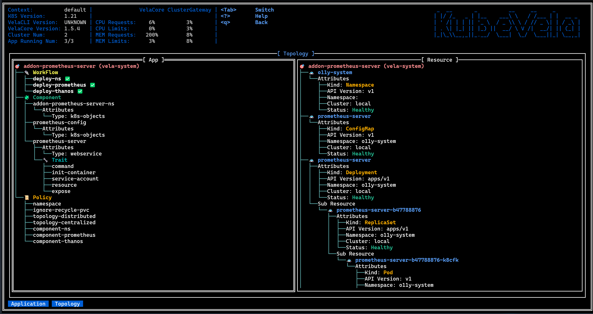
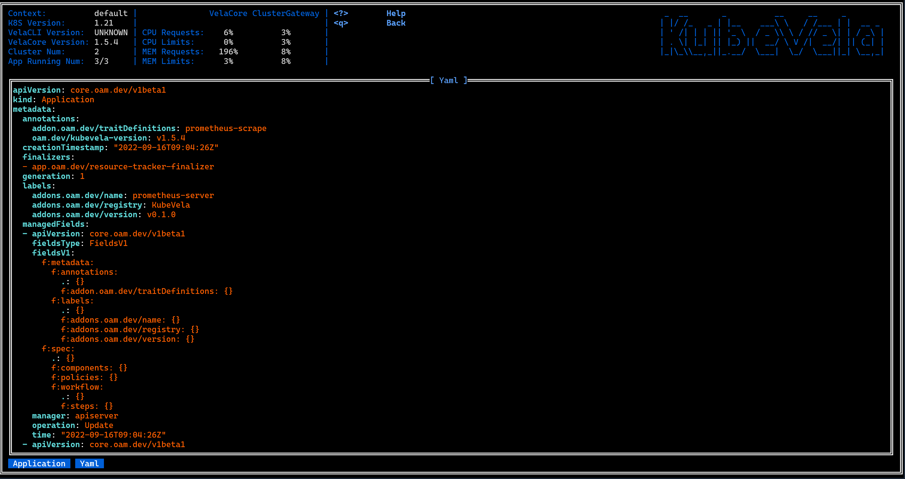

在这篇指南中，我们想向你介绍 KubeVela 中 vela top 工具的使用方法，该工具是 KubeVela 中提供的基于 UI 的 CLI 工具，通过使用它你可以获取平台的概览信息以及对应用程序的资源状态进行诊断。

目前在该工具已经提供了以下的功能：

- 平台信息概览
- Application、Managed Resource、Pod 三种层级资源状态信息的展示
- Appliation 资源拓扑
- 资源 YAML 文本展示

### 启动工具

在启动工具时我们可以指定首页：Application 视图中所展示 Application 所在的 Namespace。

- 默认 Namespace
    ```shell
  vela top
  ```

- 指定 Namespace
    ```shell
  vela top -n <namespace>
  ```

- 指定全部 Namespace
  ```shell
  vela top -A
  ```

启动工具后，我们会进入到首页：Application 视图，如下所示：


该工具整体分为三个部分，如图所示，分别为包含基础信息、平台系统信息、菜单与 Logo 的 Header 部分，资源视图所在的 Body 部分，指示资源层级的面包屑组件所在的 Footer 部分。

### 平台信息概览


这个信息面板组件会展示 KubeVela 系统的性能信息包括 Vela Core 与 Vela CLI 的版本、KubeVela 系统中运行 Application 占全部 Application 的比例、Vela 控制器（Vela Core）与 Vela 网关（Vela Cluster GateWay） 的性能信息（CPU 与 内存当前使用量分别占 request 与 limit 两个设定值的比例）。

这里对于 Vela 控制器与 Vela 网关的性能信息，实际来自于它们所在 Pod 的性能信息。 需要注意的是采集 Pod 的性能信息，需要在集群中安装 [metrics server](https://github.com/kubernetes-sigs/metrics-server)，否则会无法正确获取到 Pod 的性能信息。


### 多层级资源状态展示

#### Application 视图


这个视图会展示平台中所在 Namespace 下的全部 Application 的状态信息，这些信息包括：

- 名称
- Namespace
- Phase
- Workflow Mode
- 正常工作流数量 / 工作流数量
- 健康服务数量 / 服务数量
- 创建时间

在这个视图可以通过按键 N，重新选择展示哪个 Namespace 的 Application：



还可以通过按键 ↑ 或者 ↓ 选中某一个 Application 后可以通过按键 T，展示该 Application 的资源拓扑。

如果你想要对这个 Application 做资源穿透查看属于他的资源有哪些，可以通过 ENTER 键进入下一资源层级。


#### Managed Resource 视图


Managed Resource 视图展示的是 Application 的下一层资源，该资源视图会展示目标 Application 部署从而产生的资源，包括：Deployment、ConfigMap、Service、Helm Release 等，我们称这些资源为应用所管理的资源。

对于 Application 管理的资源，我们会对其展示以下这些信息：

- 名称
- Namespace
- Kind
- API Version
- 所在集群
- 所属组件
- Status

应用所管理的资源十分庞杂，因此在这个视图我们提供了一些筛选视图的方式，你可以根据资源所在 Namespace 与所在集群对资源进行筛选，所对应的按键为 N 与 C，如下所示：


视图顶部的标题部分会指示，当前显示资源所在 Namespace 与所在集群。

此外在该视图你还可以使用 Q 键回退到之前的 Application 视图，以及在选中某个资源后按下 ENTER 键，进入 Pod 视图展示该属于资源的 Pod 资源。

#### Pod 视图


Managed Resource 的部署会产生 Pod 资源的部署，Pod 视图展示目标 Managed Resource 进一步产生的 Pod 资源。对于 Pod 资源，这个视图会展示 Pod 的如下信息：

- 名称
- Namespace
- 是否就绪
- 状态
- CPU 用量
- 内存用量
- CPU 使用量占 Request 的比例
- CPU 使用量占 Limit 的比例
- 内存使用量占 Request 的比例
- 内存使用量占 Limit 的比例
- IP 地址
- 所在节点
- 存活时常

在该视图你依然可以使用 Q 键回退到之前的视图。

#### 容器视图
![vela top container view]（../resources/vela top-container view.png）
在通一个 Pod 中会存在多个容器一同运行的情况，Container 视图显示了在所选 Pod 中运行的容器信息。对于 Container 资源，此视图显示有关 Container 的以下信息：
- 姓名
- 镜像
- 是否就绪
- 状态
- CPU 用量
- 内存用量
- CPU 使用量占 Request 的比例
- CPU 使用量占 Limit 的比例
- 内存使用量占 Request 的比例
- 内存使用量占 Limit 的比例
- 终止消息
- 重新启动次数

在该视图你依然可以使用 Q 键回退到之前的视图。

### 资源层级切换

在上面我们已经对三种视图进行了介绍，下面我们会向你展示如何在多个视图见进行切换，来获取你想要的资源状态信息。



### Application 资源拓扑

也许你想了解一个应用完整的资源拓扑是怎样的，在 VelaUX 我们已经提供了这样的功能，实际上在 vela top 中我们也为你提供类似的功能，在 Application 视图中，你可以选中某个应用后按下 T 键，我们就会以两种形式展示该 Application 的资源拓扑：



背后的应用交付模型是 [Open Application Model](https://kubevela.io/zh/docs/platform-engineers/oam/oam-model)，每一个应用部署计划都由四个部分组成，分别是组件、运维能力、部署策略和工作流。关于这部分的内容可以参照 [KubeVela 核心概念](https://kubevela.io/zh/docs/getting-started/core-concept)，因此我们展示的第一个拓扑即是按照这种形式展示一个应用的四个组成部分，这个拓扑被我们称为 App 拓扑

另外这些组成部分实际上最终会被加载为 Kubernetes 中的原生资源或者 CRD，这些资源之间又构成了另外一种资源拓扑结构，作为用户你一定想要了解你的应用是否按照要求正确部署了子资源，从这个拓扑中你就可以获得答案，这个拓扑被我们成为资源拓扑。

### 通用功能
#### 资源 YAML 展示



在 Application、Managed Resource、Pod 三种资源视图中，你都可以通过选中某一资源后按下 Y 键的方式，查看该资源对应的 YAML 文本，文本会以高亮形式展示。

#### 日志


在 Pod 视图中，你可以使用 L 键进入日志视图，日志视图将打印所选容器的日志。
在 Container 视图中，进入日志视图的方法与在 Pod 视图相同。不同的是，打印的日志是属于所选 Pod 中的多个容器的。


#### 帮助界面

在任意一个界面可以通过 ? 键进入帮助界面，该界面会向你简单介绍 vela top 的相关功能与使用方法。

