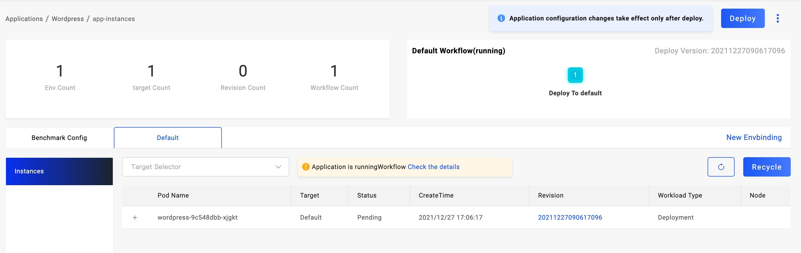
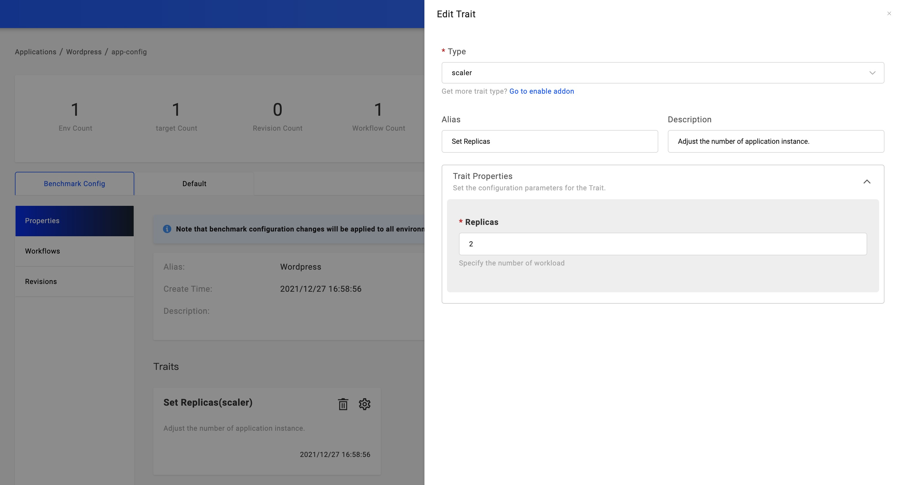

本文介绍企业基于 KubeVela 通过容器镜像交付业务应用的操作方式，通过该方式交付应用无需你学习过多的 Kubernetes 领域知识。

## 开始之前

- 完成你的业务容器化，无论你的业务使用何种开发语言，请先将其通过 CI 系统或在本地完成运行镜像打包。

- 将你的业务镜像存放于镜像仓库中，KubeVela 管理的集群可以正常获取该镜像。

- 启用了 VelaUX 插件，如果你仅是 CLI 用户，直接参考 [通过 CLI 部署](#deploy-via-cli)

## 创建应用

进入应用管理页面，点击右上方的 `新建应用` 按钮，进入应用创建弹窗页面，输入应用名称等基础信息，选择 `webservice` 主组件类型，并选择需要部署的环境。点击下一步进入组件部署属性配置页面，如图所示，填写镜像名称、启动命令，端口等信息。根据你的集群支持情况选择合适的服务暴露方式。


确认提交后即完成应用初始化配置。

## 部署应用

应用创建后默认不会自动部署，需要点击页面右上方的部署按钮，并选择需要执行的工作流，每一个工作流对应部署一个环境。部署开始后可以点击 `基础配置` 旁边的不同 Tab 即进入不同环境的管理页面。



每一个环境视图目前提供了部署资源状态、应用实例和应用日志的查询页面。部署资源状态页面展示了该应用实际分发的底层资源列表即各组件状态；应用实例页面中展示该应用部署的所有实例信息，点击实例行即可查询该实例的详细信息；日志页面可以查询该应用所有运行实例的标准输出日志。

## 更新镜像版本

当我们完成初始部署后，后续随着我们业务开发和升级需要变更镜像版本或其他部署参数。

回到基础配置页面，点击需要修改的组件名称即可进入组件设置弹窗页面，在该页面中你可以修改部署镜像、环境变量等部署参数，也可以变更组件别名或描述等基础信息。

## 更新副本数

如果你的业务需要扩大或减小规模，我们使用调整副本数的运维特征来设置副本数量，在控制台中创建的应用该运维特征会自动创建。点击组件卡片上的`Scaler`运维特征即可进入配置页面，你可以手动设置需要的副本数量。



## 升级应用

上述两个步骤我们只是修改了应用的配置参数，但其不是立即在部署环境中生效的，我们可以再次点击部署按钮选择需要升级的环境对应的工作流执行，即可完成指定环境的升级。

## 通过 CLI 部署应用

如果你不使用 UI，通过 CLI 也可以完成业务应用示例的部署，通过执行下述命令即可：

```yaml
cat <<EOF | vela up -f -
# YAML begins
apiVersion: core.oam.dev/v1beta1
kind: Application
metadata:
  name: webservice-app
spec:
  components:
    - name: frontend
      type: webservice
      properties:
        image: oamdev/testapp:v1
        cmd: ["node", "server.js"]
        ports:
          - port: 8080
            expose: true
        exposeType: LoadBalancer
        cpu: "0.5"
        memory: "512Mi"
      traits:
        - type: scaler
          properties:
            replicas: 1
# YAML ends
EOF
```

> 目前，通过 CLI 部署的应用会同步到控制台中，但其为只读状态。

你也可以复制上述的应用配置并创建一个 YAML 文件 `webservice-app.yaml`，然后使用命令 `vela up -f webservice-app.yaml` 来完成部署。

接下来你可以通过 `vela status webservice-app` 命令获取应用的部署状态。

```
About:

  Name:      	test-app
  Namespace: 	default
  Created at:	2022-04-21 12:03:42 +0800 CST
  Status:    	running

Workflow:

  mode: DAG
  finished: true
  Suspend: false
  Terminated: false
  Steps
  - id:y4n26n7uql
    name:frontend
    type:apply-component
    phase:succeeded
    message:

Services:

  - Name: frontend
    Cluster: local  Namespace: default
    Type: webservice
    Healthy Ready:1/1
    Traits:
      ✅ scaler
```

## 下一步

[学习基于 Helm Chart 部署应用](./helm)
