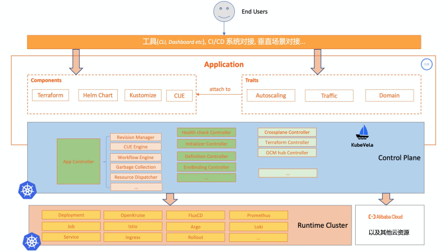
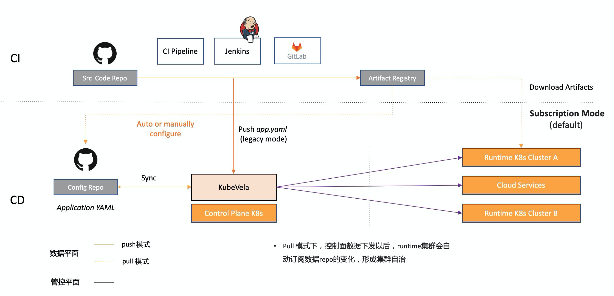

KubeVela 的系统在默认安装的模式下，是一个只包含“控制平面”的架构，通过插件机制与各种运行时系统进行紧密配合。其中 KubeVela 核心控制器工作在管控 Kubernetes 集群。
如下图所示，自上而下看，用户只与 KubeVela 所在的控制面 Kubernetes 集群发生交互。

## 默认安装的控制器

在控制面集群中，默认就安装的组件为深绿色框，其中最核心的是 Application Controller，也就是 KubeVela 的应用控制器。

### 应用（Application）控制器

应用控制器是 KubeVela 的核心控制器，也是 KubeVela 唯一一个必须要安装且不可替换的控制器，负责应用的全生命周期管控，主要包含应用版本化、模块渲染引擎、工作流引擎、资源回收等模块，即图中淡红色部分框图。

* 版本化控制（Revision Manager）：对于 KubeVela 而言，应用的每一次变动都会生成两种类型的版本，一个是应用的版本（AppRevision），一个是组件版本（Component Revision）。应用版本主要作为应用的快照记录，可以方便的进行应用修改的审计。组件的版本主要用于组件的滚动升级与回滚，也可以指定不同的组件版本同时运行，并做发布时的流量控制。
* 交付模型引擎（CUE Engine）：KubeVela 采用 Open Application Model（OAM）作为应用交付模型，并通过 [CUE](https://cuelang.org/) 配置语言来实现该模型，从而以可编程的方式（IaC）对待交付组件、运维能力、用户输入和交付工作流进行统一的编排和管理。
* 工作流引擎（Workflow Engine）：工作流是一次应用部署执行过程的描述，用户可以通过工作流自己定义部署的完整流程，或者灵活的插入各种步骤。举例来说，用户可以在工作流的最开始加入一个环境初始化的节点，这个工作流节点可以是创建一个运行时 Kubernetes 集群，或者是在一个环境上安装某种系统组件。然后再将应用部署到刚刚初始化完成的部署环境中。简而言之，**KubeVela 的工作流使得应用部署的完整流程可以通过一份声明式配置文件完成描述**。
* 资源回收引擎（Garbage Collection）：负责资源的记录和删除，声明式应用描述只记录终态时的资源情况，而实际有些已经存在的资源若不存在于终态，就需要通过这个模块来做自动化的垃圾回收。

### 模块定义（Definition）控制器

模块定义（Definition）控制器管理各 OAM 模块对象的生命周期，比如组件定义模块（ComponentDefinition）、运维特征模块（TraitDefinition）等等。模块定义控制器会为这些模块的修改生成不同的版本，自动生成操作文档，对接的 OpenAPI Schema 等辅助信息，方便其他系统对接。

### 环境初始化（Initializer）控制器

环境初始化（Initializer）控制器可以帮助用户自定义“什么构成一个环境”，将构成环境所需的资源完整的创建起来。举例来说，一个环境可能是一个 Kubernetes 集群同时加上一些 Ingress 之类的系统插件，那么环境初始化控制器就可以帮助你快速创建一个 Kubernetes 集群，同时在集群中安装这些系统插件。

环境初始化控制器同样使用 KubeVela 自身来交付所有的系统插件，由于 KubeVela 的天然具备高可扩展以及“交付一切“的能力，所以环境初始化控制器的功能非常灵活，可以满足任何环境的初始化需求。

### 健康检查（Health Scope）控制器

健康检查（Health Scope）控制器是默认的健康检查组件，提供应用资源的部署拓扑图，并周期性的进行部署状态健康检查，健康检查规则同样可以基于 CUE 配置语言进行自定义。健康检查（Health Scope）是 OAM 里的标准概念，其实现也是可插拔的，平台构建者也可以定制实现自己的健康检查控制器，并自定义健康检查逻辑。

### 环境差异化配置（EnvBinding）控制器

环境差异化配置（EnvBinding）控制器提供了针对不同的环境做差异化配置（patch）的能力，同时可以结合多集群组件，根据用户声明的策略将应用组件分发调度到不同的目标集群（环境）。

除了默认安装的控制器外，KubeVela 提供了包括多集群在内的一系列开箱即用的插件功能，只需要激活这些插件功能，就可以使用。

## 一键安装的插件化控制器

### 云资源 Terraform 控制器

如今 Terraform 已经逐渐成为了云资源创建的主流方式，涵盖了几乎所有云厂商的资源模块。而这里的 Terraform 控制器则是将 Terraform 客户端的功能与 Kubernetes 控制器相结合，在服务端面向终态的持续管理云资源，为 KubeVela 创建可以持续维护和管理的云资源。这个模块也是可插拔的，可以替换成 Crossplane 等其他云资源创建方案。

### 多集群（OCM）控制器

OCM（Open Cluster Management）是 KubeVela 默认的多集群管理引擎，包含集群注册、集群管理、证书自动更新、多集群资源分发等核心功能。这个模块也是可插拔的，可以换成 Karmada 等多集群控制器。

除了控制面的组件以外，KubeVela 还需要与实际运行时 Kubernetes 集群的各种工作负载和运维能力联动。主要方式是通过 OAM 模型是将他们作为 Component 和 Trait 背后的实际执行器。除了 Kubernetes 的默认资源外，也有一些是 KubeVela 通过插件机制一键就能安装的。

### OpenKruise 控制器

[OpenKruise](https://openkruise.io/) 控制器工作在运行时集群，提供了多种面向无状态、有状态应用管理的高级工作负载功能，通过 OpenKruise 中的各种高级工作负载，可以实现原地升级、镜像预热等高级功能。

### 灰度发布（Rollout）控制器

灰度发布（Rollout）控制器工作在运行时集群，可以结合 KubeVela 不同的组件版本进行灰度发布，包含的功能有分批发布、发布暂停、发布回滚、按百分比发布等。可以对接的工作负载包括 Kubernetes 的 Deployment、StatefulSet 等原生能力，以及 OpenKruise 中的 [Cloneset](https://openkruise.io/zh-cn/docs/cloneset.html)。结合 Istio 等 Service Mesh 组件还可以实现蓝绿发布等高级发布功能。

### FluxCD 控制器

KubeVela 通过 FluxCD 控制器来实现 Pull 模式的应用组件交付。

## 系统数据流

KubeVela 的系统数据流如下图所示，其中黄色的实线和虚线为用户数据流向；紫色实线为控制面的数据流向。

### 控制面

KubeVela 多集群模式下，控制面的数据流动是由运行时集群主动拉取管控集群数据的。所以 Kubernetes 多集群网络连通性方面，只需要保证控制面集群的 Kubernetes 可被运行时集群单向访问即可。

云资源是由管控集群的控制器主动调用云的 API 完成。

### 数据面

KubeVela 的用户数据面数据流动采用 Pull 模式（订阅模式），KubeVela 会主动监听应用元数据变化来驱动后续的应用交付与管理流程。

对于传统的 CI 驱动应用交付模式，用户也可以选择 Push 模式将应用制品从 CI 流程打包生成后直接通过 CI 脚本推给 KubeVela，KubeVela 负责后续的应用交付与管理流程。

**为什么 KubeVela 数据面采用 Pull 模式？**

应用资源通过 Pull 模式下发逐渐成为了云原生社区的主流方式，主要有如下优点：

* 弱网环境下的自治能力
  - Pull 模型在管控数据下发以后，能够形成单个集群（环境）的自治，在与管控集群发生网络联通故障时依然能够正常运行。在边缘场景下是刚需。
  - 可以就近拉取数据，具备更好的性能。
* 可以做到环境独立的隔离性和安全性
  - 管控集群和运行时集群可以做到数据隔离。比如运行时集群使用独立的镜像仓库、Helm 仓库、秘钥仓库等，实际的秘钥渲染在单集群中执行。在混合云场景下是刚需。
* 更好的scale能力，支撑更大的规模
  - Pull模式下只有管控数据需要统一下发，数据面信息可以分散在不同的repo中，减少了大量单点
  - 在首次管控数据下发后，后续持续的发布可以由运行时集群自动化的进行持续交付，没有管控集群的限制，可以支撑更大的规模
* 更好的容灾能力
  - 管控面的故障不影响运行时集群的持续运行

## 下一步

后续步骤:

- 加入 KubeVela 中文社区钉钉群，群号：23310022。
- [阅读**用户手册**基于开箱即用功能，构建你的应用部署计划](../end-user/components/helm)。
- [阅读**管理员手册**了解 KubeVela 的扩展方式和背后的原理](../platform-engineers/oam/oam-model)。
