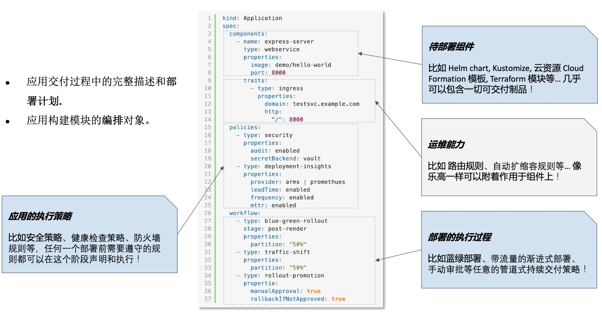

KubeVela 背后的应用交付模型是 OAM（Open Application Model），即：开放应用模型。开放应用模型允许用户把一个现代微服务应用部署所需的所有组件和各项运维动作，描述为一个统一的、与基础设施无关的“部署计划”（这个过程称作“建模”），进而实现在混合环境中进行标准化和高效率的应用交付。具体来说：

* 用户通过一个叫做应用部署计划（Application）的对象来声明一个微服务应用的完整交付流程，这其中包含了待交付组件、关联的运维动作、交付流水线等内容。
* 所有的待交付组件、运维动作和流水线中的每一个步骤，都遵循 OAM 规范设计为独立的可插拔模块，允许用户按照自己的需求进行组合或者定制。
* OAM 模型也会负责规范各个模块之间的协作接口。



## 应用部署计划（Application）

**Application** 对象是用户唯一需要了解的 API，它表达了一个微服务应用的部署计划。

遵循 OAM 规范，一个应用部署计划（Application）由“待部署组件（Component）”、“运维动作（Trait）”、“应用的执行策略（Policy）”，以及“部署工作流（Workflow）”这四部分概念组成。

而无论待交付的组件是 Helm chart 还是云数据库、目标基础设施是 Kubernetes 集群还是云平台，KubeVela 都通过 Application 这样一个统一的、上层的交付描述文件来同用户交互，不会泄露任何复杂的底层基础设施细节，真正做到让用户完全专注于应用研发和交付本身。

具体而言，一个应用部署计划的整体结构如下所示：

```yaml
apiVersion: core.oam.dev/v1beta1
kind: Application
metadata:
  name: <应用名称>
spec:
  components:
    - name: <组件名称1>
      type: <组件类型1>
      properties:
        <组件参数>
      traits:
        - type: <运维特征类型1>
          properties:
            <运维特征类型>
        - type: <运维特征类型2>
          properties:
            <运维特征类型>
    - name: <组件名称2>
      type: <组件类型2>
      properties:
        <组件参数>
  policies:
  - name: <应用策略名称>
    type: <应用策略类型>
    properties:
      <应用策略参数>
  workflow:
    - name: <工作流节点名称>
      type: <工作流节点类型>
      properties:
        <工作流节点参数>   
```

在实际使用时，用户通过上述 Application 对象来引用预置的组件、运维特征、应用策略、以及工作流节点模块，填写这些模块暴露的用户参数即可完成一次对应用交付的建模。

> 注意：上诉可插拔模块在 OAM 中称为 X-Definitions，Application 对象负责引用 X-Definitions 并对用户输入进行校验，而各模块具体的可填写参数则是约束在相应的 X-Definition 文件当中的。具体请参考： [模块定义（X-Definition）](./x-definition) 章节。

## 组件（Component）

组件（Component）是构成微服务应用的基本单元，比如一个 [Bookinfo](https://istio.io/latest/docs/examples/bookinfo/) 应用可以包含 Ratings、Reviews、Details 等多个组件。

KubeVela 内置即支持多种类型的组件交付，包括 Helm Chart、容器镜像、CUE 模块、Terraform 模块等等。同时，KubeVela 也允许平台管理员以 CUE 语言的形式增加其它任意类型的组件。

## 运维特征（Trait）

运维特征（Trait）负责定义组件可以关联的通用运维行为，比如服务发布、访问、治理、弹性、可观测性、灰度发布等。在 OAM 规范中，一个组件可以绑定任意个运维特征。

与组件系统的可扩展性类似，KubeVela 允许平台管理员在系统中随时增加新的运维特征。

## 应用的执行策略（Policy）

应用的执行策略（Policy）负责定义应用级别的部署特征，比如健康检查规则、安全组、防火墙、SLO、检验等模块。

应用执行策略的扩展性和功能与运维特征类似，可以灵活的扩展和对接所有云原生应用生命周期管理的能力。相对于运维特征而言，应用执行策略作用于一个应用的整体，而运维特征作用于应用中的某个组件。

## 部署执行工作流（Workflow）

部署执行工作流（Workflow）定义了从部署开始到达到部署终态的一条完整路径，KubeVela 会按这个流水线执行工作流中定义的各个步骤来完成整个应用交付。除了常规的组件依赖编排、数据流传递等功能，KubeVela 的工作流还支持面向多环境/多集群的部署过程与策略描述。

> 注意：如果用户没有定义工作流，KubeVela 默认会自动按照组件和运维特征数组的顺序进行部署，并把 KubeVela 所在的当前集群作为目标集群。

KubeVela 当前内置的工作流步骤节点包括了创建资源、条件判断、数据输入输出等。同组件等系统类似，KubeVela 所支持的工作流节点也允许平台管理员自行定义和扩展。

## 避免配置漂移

在具体实现上，KubeVela 采用了脱胎于 Google Borg 系统的 [CUE 配置语言](https://cuelang.org/) 作为模型层实现，从而以 IaC (Infrastructure-as-Code) 的方式实现了 OAM 各个模块之间的高效协作和灵活扩展。但另一方面，常规的 IaC 技术往往会引入“配置漂移”（Infrastructure/Configuration Drift）的问题，即：当用户声明的应用部署配置和生产环境实际运行的实例状态发生不一致时，IaC 就无能为力了。

所以 KubeVela 在采用 IaC 技术实现的同时，还同时通过 [Kubernetes 控制循环](https://kubernetes.io/docs/concepts/architecture/controller/) 来管控整个 IaC 模型的渲染和执行，从而以完全自动化的方式保证了应用配置和终态的一致性，同时在模块定义、封装、扩展过程中保留了完整的 IaC 的使用体验。简介明了的 CUE 模板语法是平台管理员自行扩展 KubeVela 时唯一需要学习的一项技术。

## 下一步

- [X-Definition](x-definition) 对接标准化模型：在这些概念的背后，平台管理员可以利用 OAM 的扩展功能，通过自定义的方式对接自己的基础设施能力到开发模型中，以统一的方式暴露用户功能。而这些扩展的对接方式，就是[X-Definition](x-definition)。